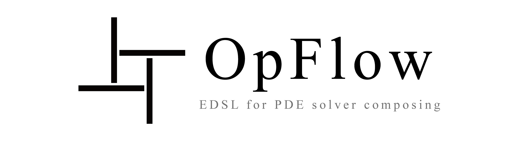
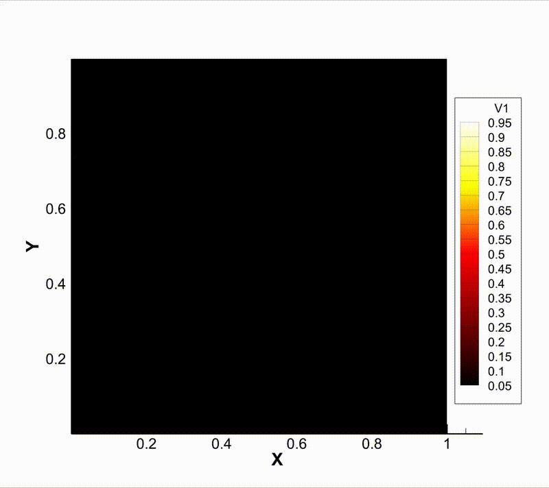
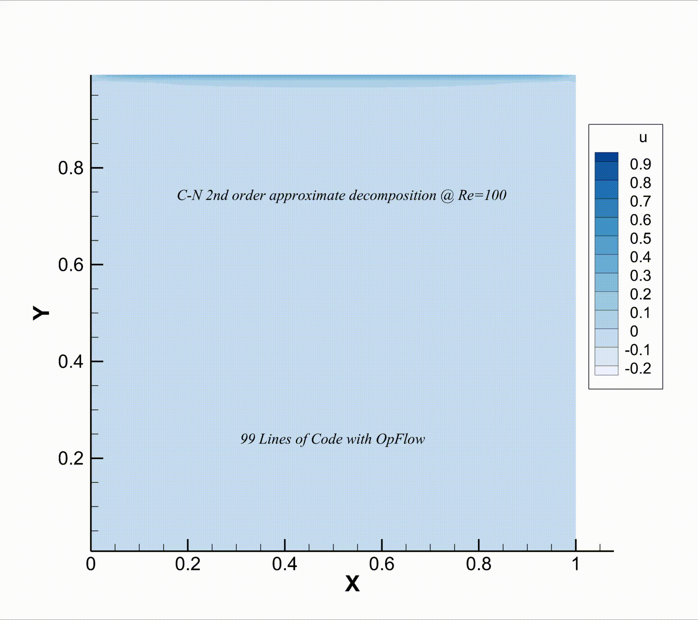

<div align="center">
  
  <h3> <a href="https://opflow.cc/"> 主页 </a> | <a href="https://opflow.cc/doc"> 文档 </a> | <a href="README.md"> English </a> </h3>
</div>

[](https://github.com/OpFlow-dev/OpFlow/releases/latest)
[](https://github.com/OpFlow-dev/OpFlow/blob/master/LICENSE)
[](https://github.com/OpFlow-dev/OpFlow/releases/latest)

## 概述

**OpFlow** (运筹) 是一个面向偏微分方程(PDE)求解器开发的嵌入式领域特定语言(EDSL)。它深度应用现代C++元编程技术，提供富有表现力的前端接口。通过**表达式模板**和**模板元编程**技术，OpFlow支持**显式**表达式求值与**隐式**线性系统求解。通过解耦表达式、算子及求值引擎的实现，OpFlow实现了算法、数据结构与执行调度的完全分离。其核心优势包括：

- **完全静态**：关键路径零动态调度开销
- **零成本抽象**：所有操作在编译期明确定义并强制内联
- **自动并行化**：基于用户定义策略自动并行化表达式分区与求值
- **隐式方程求解**：支持任意定义良好的隐式方程求解
- **仅头文件 & 原生C++嵌入**：纯头文件实现，与C++生态无缝集成
- **数学化API设计**：前端接口高度贴近数学表示法，最小化语言噪声
- **精准抽象层级**：在避免底层编码的同时，保持所有转换操作在前端可见，离散化过程直观透明

## 示例
[](examples/CONV1D/CONV1D.cpp)
[](examples/FTCS2D/FTCS-OMP.cpp)
[](examples/LidDriven/LidDriven2D.cpp)
[](examples/LevelSet/AMRLS.cpp)

## 快速开始

0. 安装依赖：

- Linux：（以Ubuntu为例）
```bash
sudo apt install -y gcc-10 g++-10
```
- macOS：（使用Homebrew）
```bash
brew install gcc
```
1. 配置项目：
```bash
mkdir build && cd build && cmake -DCMAKE_C_COMPILER=gcc-10 -DCMAKE_CXX_COMPILER=g++-10 -DOPFLOW_BUILD_EXAMPLES=ON ..
```
2. 构建与运行：
```bash
cmake --build . -t CONV1D && ./examples/CONV1D/CONV1D
```

## 安装

完整安装指南请参阅文档。

## 致谢
特别感谢JetBrains提供免费的[开源开发许可证](https://jb.gg/OpenSourceSupport)支持OpFlow开发。CLion是优秀的跨平台C/C++ IDE，强烈推荐用于OpFlow开发。


