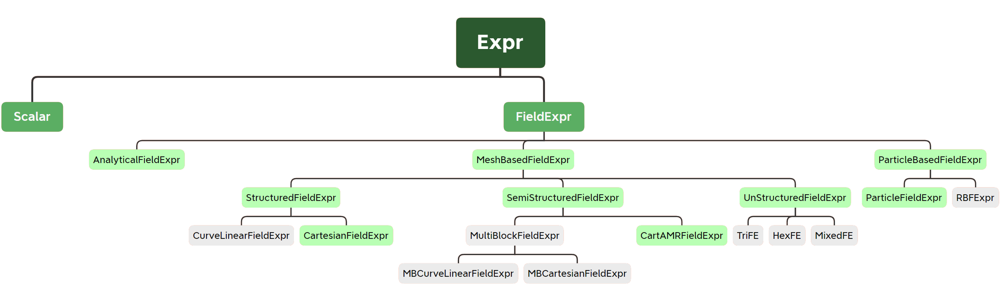

Expr
++++

Expr concept & OpFlow type system
---------------------------------

The first concept we meet in OpFlow is the expression type ``Expr``. It's the first-class citizen
in OpFlow throughout the whole computational pipeline. The following is identified as an ``Expr``:

- Numerical scalar type
- All field types
- The result of an expression composed of Exprs and operators

Briefly, all the **computable objects** are of type ``Expr``. To examine if a variable is an Expr,
one can introduce the following static assertion:

.. code-block:: cpp

    static_assert(ExprType<decltype(<var>)>, "Not an Expr.");

.. note::
    Unless otherwise specified, all symbols in this documentation are under the namespace `OpFlow`.

The above ``ExprType<T>`` is a concept introduced in ``Core/Expr/ExprTrait.hpp``. Concept is
introduced in C++20 standard and is used to constrain template parameters in meta-programming.
It greatly releases the burden of developers to use tricks like SAFINE to introduce compile time
error for the wrong template parameter. We won't detail features of concept here, but if you are
new to concept, it's recommended (not necessary for using OpFlow) to explore this revolutional
language feature. [`Cpp Reference <https://en.cppreference.com/w/cpp/language/constraints>`_]
[`Bjarne's talk @ Cppcon 18 <https://youtu.be/HddFGPTAmtU>`_]

``Expr`` itself is the base concept for all computational objects in OpFlow. To catagroy expressions
into finer categroies and provide more type information to operators, we use curiously recurring
template pattern (CRTP) to build the type system of OpFlow. Currently, OpFlow's expression type system
is organized as following:

The green boxed types have already been implemented, while the gray ones are on the plan. Typically,
for each type of expression, we define a judging concept named ``<ExprTypeName>Type``. For example:

.. code-block:: cpp

    template <...>
    struct CartesianFieldExpr;

    template <typename T>
    concept CartesianFieldExprType = ...;

    // during usage
    // foo requires a CartesianFieldExpr typed expression as its argument
    void foo(CartesianFieldExprType auto f);

    // Foo requires a CartesianFieldExpr type as its template parameter
    template <typename T> requires CartesianFieldExprType<T>
    struct Foo;

Also, each type is also of its parent type on the type tree. For example:

.. code-block:: cpp

    using T = CartesianField<...>;
    // CartesianField is a CartesianFieldExprType
    static_assert(CartesianFieldExprType<T>);
    // CartesianField is also a StructuredFieldExprType
    static_assert(StructuredFieldExprType<T>);
    // Finally, CartesianField is an ExprType
    static_assert(ExprType<T>);

In this way, we can precisely control the expression arguments' types when implementing functions
and operators on them. By elevate the API constraint to the proper level, we can achieve both
generality and speciality at the same time.

Build an Expr
-------------

For simple expression such as ``ScalarExpr`` can be directly built via the constructor:

.. code-block:: cpp

    // init via constant
    auto one = ScalarExpr<int>(1);
    // init via a variable
    double v = 2;
    auto two = ScalarExpr<double>(v);

But for general field expressions, there will be stuff like mesh, boundary condition and
dynamic sized array. The common way to build such an expression is by using ``ExprBuilder``:

.. code-block:: cpp

    // build via the Builder pattern
    auto f = ExprBuilder<CartesianField>()
             .set(...)
             .build();

For derived expressions, you can directly declare with assignments:

.. code-block:: cpp

    // construct a intermediate expression of an addition expression
    CartesianField u, v, w = ...;
    auto t = u + v; // t here is an intermediate expression
    w = w + t;

