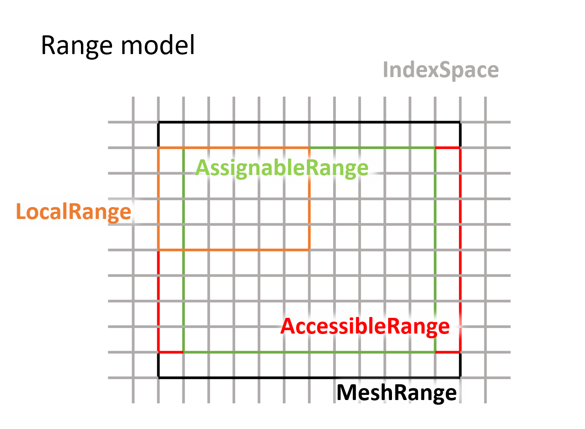

Index, Range & RangeModel
+++++++++++++++++++++++++

OpFlow adopts dimension independent programming paradigm throughout the design of fields & operators.
Therefore, it's necessary to know how to access elements using a unified index and how to make sure
the current index is valid. For these requirements, OpFlow has implemented the index & range families.
Also, a four-range model for field expressions is designed for bounded access.

Index
-----

For each type of multi-dimensional field expressions, there is an type of Index corresponding to its
data structure. For structured field expressions, we use the multi-dimensional index type ``MDIndex<d>``
to index the field:

.. code-block:: cpp

    // MDIndex is under the DS namespace. It takes a int as the dimension
    DS::MDIndex<2> index;

    // you can use MDIndex just like a fixed sized array
    auto i = index[0], j = index[1];

    // the default value of index is all zero
    assert(i == 0 && j == 0);

    // you can set the index's value by any bracket indexable object (e.g., std::vector, std::array)
    index.set(std::array {1, 2});

    // it can also be constructed by integers or a std::array
    auto offset = DS::MDIndex<2>{-1, -1};

    // indexes can be compared with total ordering
    assert(offset < index);

    // indexes can do arithmetic calculations
    index += offset; // index == {0, 1};

    // you can use next & prev to get a copy of the moved index
    auto zero = index.prev<1>(1); // dim == 1, step == 1 (default, can be omitted)

    // finally, you can use toString() to serialize the index
    OP_INFO("index = {}", index.toString()); // print "index = {0, 1}"

For other types of fields such as semi-structured and unstructured fields, there are other types of
indexes for usage.

Range
-----

Range is a concept upon the index. It defines the legal zone of an index, therefore is often used
when we want to traverse a field. The corresponding range type for ``MDIndex`` is ``Range``. It
has three members, the ``start``, the ``end`` and the ``stride``. You can construct a range
and access it as:

.. code-block:: cpp

    // construct a range by the end, use 0 as the default start
    auto r0 = DS::Range<2>{std::array {10, 10}}; // [0, 10) x [0, 10)

    // construct a range by start and end
    auto r1 = DS::Range<2>{std::array {5, 5}, std::array {15, 15}};

    // use check to test the validity of a range
    assert(r0.check() && r1.check());

    // use getExtends to get the extend of a range
    auto ext = r0.getExtends(); // ext == std::array {10, 10};

    // use getBCRanges to get the boundary ranges
    auto bc_ranges = r0.getBCRanges(1); // bc_ranges = std::vector { 6 1-layer-thick ranges };

    // use getInnerRange to get the internal range
    auto in_range = r0.getInnerRange(1); // in_range = [1, 9) x [1, 9)

    // use commonRange to get the intersection of ranges
    auto r2 = DS::commonRange(r0, r1); // r2 = [5, 10) x [5, 10)

    // use toString() to serialize a range
    OP_INFO("r0 = {}", r0.toString()); // print "r0 = {(0, 0) - (10, 10) by (1, 1)}"

Range model
-----------

A field expression in OpFlow has 4 ranges with it: the ``accessibleRange``, ``assignableRange``,
``localRange`` and mesh range. These 4 ranges are determined by the underlying mesh's shape,
boundary conditions, accessibility and parallelization. Together they describe the detailed
shape of the field expression. Each field expression must pre-calculate these 4 properties,
which is called :ref:`shape deducing<Shape deducing>`. We briefly take the CartesianField
as an example to show how this model works:

The largest range is the mesh's range, which can be get via ``f.getMesh().getRange()``. For
multiple fields locating at different positions of a mesh cell (e.g., MAC velocity fields),
they share the same base mesh and use ``loc`` to record their position in each dimension:

.. code-block:: cpp

    // build a 2d MAC velocity field
    auto u = builder.setLoc(std::array {LocOnMesh::Corner, LocOnMesh::Center}).build();
    auto v = builder.setLoc(std::array {LocOnMesh::Center, LocOnMesh::Corner}).build();

The location on mesh will affect the start and end index of the expression, which is shown in
the ``accessibleRange``. The index rule in a cell is: all locations inside a cell share the
same index except the higher rank faces:

.. image:: assets/index_in_cell.png
    :width: 300
    :alt: index in cell
    :align: center

The ``assignableRange`` is affected by both the boundary condition and the expression's
accessibility. For fields with Dirichlet boundary conditions, the corresponding range
will shrink by 1. Also, for all intermediate expressions, the ``assignableRange`` will
be set to empty to forbid writing to them. The ``localRange`` stands for the process
local accessible range. It differes from the ``accessibleRange`` only when distributed
memory parallelization is enabled. The other corresponding local ranges can be deduced from
the former ranges, e.g.:

.. code-block:: cpp

    // the local assignable range is the intersection of localRange and assignableRange
    auto localAssignableRange = DS::commonRange(f.localRange, f.assignableRange);

    // the local mesh range is the intersection of localRange and mesh range
    auto localMeshRange = DS::commonRange(f.localRange, f.getMesh().getRange());

    // the local inner range is the intersection of localRange and inner range
    auto localInnerRange = DS::commonRange(f.localRange, f.accessibleRange.getInnerRange(width));

With the 4-range model, the operators can know the accurate location of any intermediate
expression's boundary, internal and assignable ranges. This makes the whole pipeline to work
properly without global shape information.