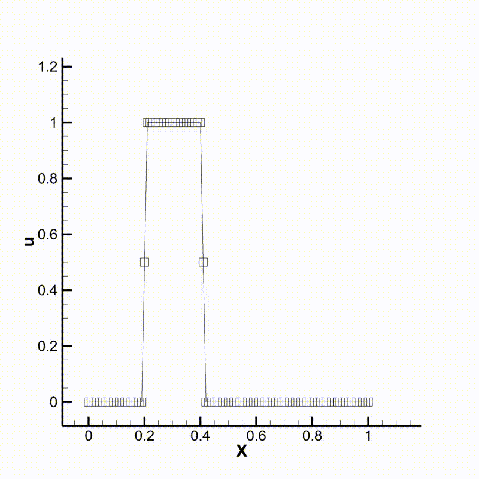
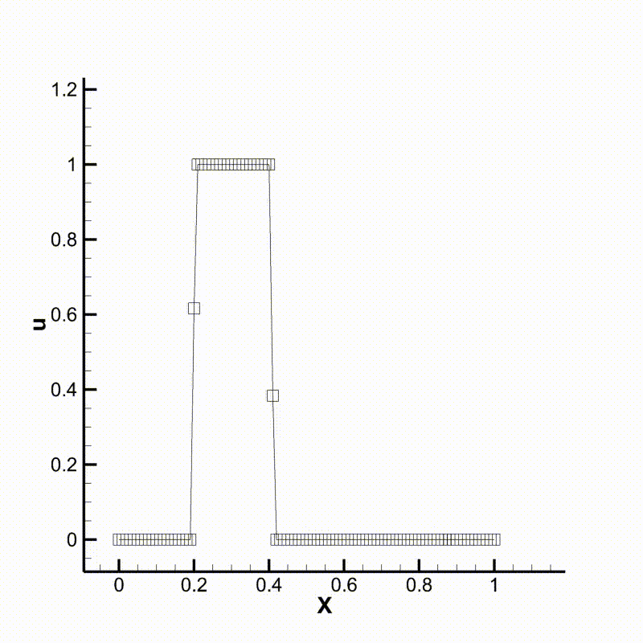

Example 01: Conv 1D
===================

Definition
----------

This section will introduce the first concrete example of a numerical solver, which solves an
1D convection problem with constant convection velocity. The governing equation of the
problem is:

.. math::
    \frac{\partial u}{\partial t} + c\frac{\partial u}{\partial x} = 0, \quad x\in[0, 1]

It is well known that the solution to this problem is:

.. math::
    u(x, t) = u(x - ct, 0), \quad \text{for }x\in[0, 1], t>0

We integrate the system with zero boundary conditions and a square wave initial condition:

.. math::
    u(x, 0) = \left\{
        \begin{aligned}
            &1, &0.2\le x \le 0.4 \\
            &0, &otherwise
        \end{aligned}\right.

Numerical method
----------------

We test two numerical schemes here different in their spatial discretization schemes.
The first is a simple first order upwind scheme, i.e.:

.. math::
    \frac{\partial u}{\partial x}\bigg|_i = \frac{u_{i}-u_{i-1}}{x_i - x_{i-1}}

This scheme is robust yet highly dissipative. The other scheme we use here is the
5th order WENO scheme proposed by `Jiang & Peng 2000 <https://doi.org/10.1137/S106482759732455X>`_.
This scheme is 5th order at smooth area and degenerates to 3rd order ENO scheme at
the discontinuity. We omit the details of the WENO scheme here and you may find them
in the original paper.

Implementation
--------------

The implementation for the current example can be found in ``examples/CONV1D/CONV1D.cpp``.
The first step is to build & initialize the mesh & field we used for calculation.
We first define a uniform 1D mesh on the interval :math:`[0, 1]` with 100 intervals:

.. code-block:: cpp

    auto mesh = MeshBuilder<Mesh>().newMesh(101).setMeshOfDim(0, 0., 1.).build();

Then we define a field ``u`` on our mesh and initialize it:

.. code-block:: cpp

    auto u = ExprBuilder<Field>()
                 .setMesh(mesh)
                 .setName("u")
                 .setBC(0, DimPos::start, BCType::Dirc, 0.)
                 .setBC(0, DimPos::end, BCType::Dirc, 0.)
                 .setLoc(LocOnMesh::Corner)
                 .build();

    u.initBy( { return 0.2 <= i[0] && i[0] <= 0.4 ? 1.0 : 0.0; });

We then define the time step ``dt`` and convection velocity ``c``

.. code-block:: cpp

    const Real dt = 0.5e-2;
    const Real c = 1.0;

and the output stream for results

.. code-block:: cpp

    Utils::TecplotASCIIStream uf("u.tec");

Now we have done all the preparation works. We then start the main loop

.. code-block:: cpp

    for (auto i = 0; i < 100; ++i) {
        // the main body
    }

For each time step, we make the following update

.. math::

    u^{n+1} = u^n - c\Delta t \partial u/\partial x

By introducing the aforementioned schemes for the spatial derivative, we get the
fulling discretized schemes:

.. code-block:: cpp

    // Scheme 1: 1st order upwind scheme
    u = u - dt * c * dx<D1FirstOrderBiasedDownwind>(u);

.. code-block:: cpp

    // Scheme 2: 5th order WENO (3rd order at jump) scheme, use 1st order upwind at boundary
    u = u - dt * c * d1<DecableOp<D1WENO53Downwind<0>, D1FirstOrderBiasedDownwind<0>>>(u);

We can then run the program and compare the results. Following are animations of the
two different cases. We can see that the behavior of the two schemes meet our expectation.

Convection using upwind scheme

Convection using WENO scheme
