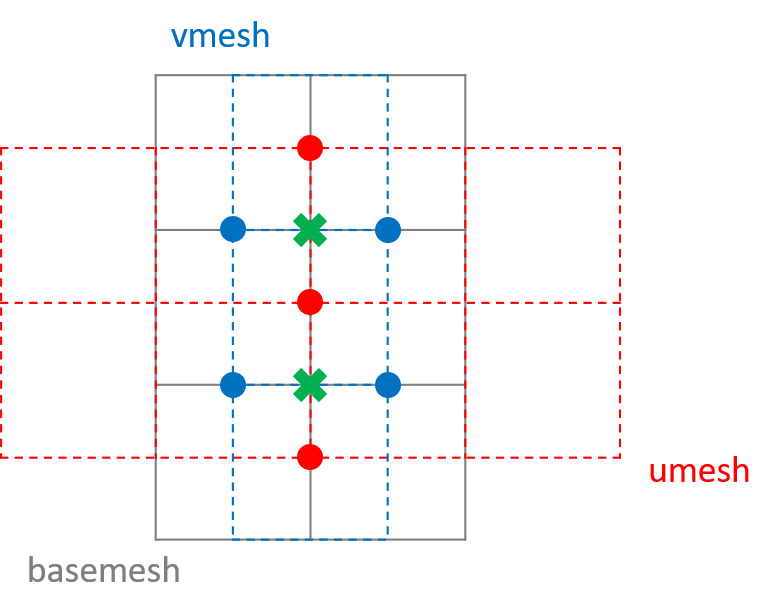

Example 04: Lid-driven cavity flow
++++++++++++++++++++++++++++++++++

Description
-----------

This section will introduce the lid-driven cavity flow example, which is a real case in Computational Fluid
Dynamics (CFD). The lid-driven cavity problem tries to solve the incompressible viscous flow in a unit square
domain with no-slip walls, where only the upper lid has a constant velocity from left to right. The governing
equation is the Navier-Stokes equation:

.. math::
    \frac{\partial u}{\partial t} + u\frac{\partial u}{\partial x} + v\frac{\partial u}{\partial y}
    = -\frac{\partial p}{\partial x} + \frac{1}{Re}(\frac{\partial^2 u}{\partial x^2}
        + \frac{\partial^2 u}{\partial y^2})

    \frac{\partial v}{\partial t} + u\frac{\partial v}{\partial x} + v\frac{\partial v}{\partial y}
    = -\frac{\partial p}{\partial y} + \frac{1}{Re}(\frac{\partial^2 v}{\partial x^2}
        + \frac{\partial^2 v}{\partial y^2})

with the incompressibility condition:

.. math::
    \frac{\partial u}{\partial x} + \frac{\partial v}{\partial y} = 0

We assume the velocity to be zero at :math:`t=0`, together with the lid's boundary condition:

.. math::
    u = v = p = 0\quad at\ t=0,\quad u\big|_{y=1}=1

We adopt the 2nd order fully implicit projection method developed by `Kim et al. (2002) <https://doi.org/10.1002/fld.205>`_
. This method uses Crank-Nicolson scheme both for convection and viscosity terms, leading to a fully implicit method
which can use a CFL number as large as 2.0. The discretized equations can be written as:

.. math::
    \begin{aligned}
    &\frac{\delta u^{* *}}{\Delta t}+\frac{\partial\left(u^{n} \delta u^{* *}\right)}{\partial x}+\frac{1}{2}
    \frac{\partial\left(v^{n} \delta u^{* *}\right)}{\partial y}\\&=-\frac{\partial p^{n-\frac{1}{2}}}{\partial x}
    +v \Delta u^{n}+\frac{1}{2} v \Delta \delta u^{* *}-\frac{\partial\left(u^{n} u^{n}\right)}{\partial x}
    -\frac{\partial\left(u^{n} v^{n}\right)}{\partial y}\\
    &\frac{\delta v^{* *}}{\Delta t}+\frac{1}{2} \frac{\partial\left(u^{n} \delta v^{* *}\right)}{\partial x}
    +\frac{\partial\left(v^{n} \delta v^{* *}\right)}{\partial y}\\&=-\frac{\partial p^{n-\frac{1}{2}}}{\partial y}
    +v \Delta v^{n}+\frac{1}{2} v \Delta \delta v^{* *}-\frac{\partial\left(u^{n} v^{n}\right)}{\partial x}
    -\frac{\partial\left(v^{n} v^{n}\right)}{\partial y}-\frac{1}{2} \frac{\partial\left(\delta u^{* *}
    v^{n}\right)}{\partial x}
    \end{aligned}

.. math::
    \begin{aligned}
    &\delta v^{*}=\delta v^{* *} \\
    &\delta u^{*}=\delta u^{* *}-\Delta t \frac{\partial\left(u^{n} \delta v^{* *}\right)}{\partial y} \\
    &u^{*}=u^{n}+\delta u^{*} \\
    &v^{*}=v^{n}+\delta v^{*} \\
    &\Delta \delta p=\frac{1}{\Delta t}\left(\frac{\partial u^{*}}{\partial x}+\frac{\partial v^{*}}{\partial y}\right) \\
    &u^{n+1}=u^{*}-\Delta t \frac{\partial \delta p}{\partial x} \\
    &v^{n+1}=v^{*}-\Delta t \frac{\partial \delta p}{\partial y} \\
    &p^{n+\frac{1}{2}}=p^{n-\frac{1}{2}}+\delta p
    \end{aligned}

We won't explain in detail how this method works. Please to the original paper for better knowledge. Writing your
algorithm in the discretized form is always the first thing you need to do before using OpFlow.

Implementation
--------------

Now we show how the above equations are translated into OpFlow statements. To begin with, we need to discover how many
types of operators we need. Since we have already solve the heat transfer equation and Poisson equation on Cartesian mesh,
the viscosity term and Poisson equation is not longer an issue. The major problem is the convection term, who's stencil
pattern is like:

The figure above shows how the term :math:`\partial (uv)/\partial y` is calculated. We need to interpolate the
:math:`u` field to corner in :math:`y`-direction and the :math:`v` field to corner in :math:`x`-direction. Then,
multiply the two interpolated field and calculate its 1st order derivative in :math:`y`-direction. This can be done
with the ``d1IntpCenterToCorner`` operator:

.. code-block:: cpp

    auto conv_xy = [&](auto&& _1, auto&& _2) {
      return dy<D1FirstOrderCenteredUpwind>(d1IntpCenterToCorner<1>(_1) * d1IntpCenterToCorner<0>(_2));
    };

The above code defines a functor doing this calculation. Defining functors for sub-expressions are very useful for
composing complex expressions. Just as intermediate expressions, they add zero cost to the actual computation.
Following the same pattern, we can define other convection functors ``conv_xx``, ``conv_yx`` and ``conv_yy``.

Since we have all the operators we need, we can start to composing the main algorithm. We start with defining the
three implicit solvers for the :math:`u`, :math:`v` and :math:`p` equations:

.. code-block:: cpp

    StructSolverParams<StructSolverType::GMRES> params; params.tol = 1e-10; params.maxIter = 100;
    StructSolverParams<StructSolverType::GMRES> poisson_params = params;
    StructSolverParams<StructSolverType::PFMG> p_params {.useZeroGuess = true, .relaxType = 1, .rapType = 0,
             .numPreRelax = 1, .numPostRelax = 1, .skipRelax = 0}; p_params.tol = 1e-10;
    auto solver = PrecondStructSolver<StructSolverType::GMRES, StructSolverType::PFMG>(params, p_params);
    auto u_handler = makeEqnSolveHandler(
            [&](auto&& e) {
              return e / dt + conv_xx(u, e) + 0.5 * conv_xy(e, v)
                     == nu * (d2x<D2SecondOrderCentered>(u) + d2y<D2SecondOrderCentered>(u))
                        + 0.5 * nu * (d2x<D2SecondOrderCentered>(e) + d2y<D2SecondOrderCentered>(e))
                        - (conv_xx(u, u) + conv_xy(u, v)) - dx<D1FirstOrderCenteredDownwind>(p);
            },
            du, solver);
    auto v_handler = makeEqnSolveHandler(
            [&](auto&& e) {
              return e / dt + conv_yy(v, e) + conv_yy(v, v) + conv_yx(u, v) + 0.5 * conv_yx(u, e)
                     + 0.5 * conv_yx(du, v)
                     == nu * (d2x<D2SecondOrderCentered>(v) + d2y<D2SecondOrderCentered>(v))
                        + 0.5 * nu * (d2x<D2SecondOrderCentered>(e) + d2y<D2SecondOrderCentered>(e))
                        - dy<D1FirstOrderCenteredDownwind>(p);
            },
            dv, solver);
    poisson_params.staticMat = true; poisson_params.pinValue = true;
    auto p_solver = PrecondStructSolver<StructSolverType::GMRES, StructSolverType::PFMG>(poisson_params, p_params);
    auto p_handler = makeEqnSolveHandler(
            [&](auto&& e) {
              return d2x<D2SecondOrderCentered>(e) + d2y<D2SecondOrderCentered>(e)
                     == (dx<D1FirstOrderCenteredUpwind>(du) + dy<D1FirstOrderCenteredUpwind>(dv)) / dt;
            },
            dp, p_solver);

Recall that in example :ref:`Poisson equation<Construct the solver>` we mentioned that by explicitly constructing
solver handlers, we can reuse the generated solver & matrix repeatedly. Also note that since the Poisson equation
is not well defined when all boundaries use zero Neumann conditions, we pin the left corner of pressure to be zero.
This is done by specifying ``poisson_params.pinValue=true`` for the Poisson solver.

We now define some field streams for data saving:

.. code-block:: cpp

    Utils::TecplotASCIIStream uf("u.tec"), vf("v.tec"), pf("p.tec");

Finally, we start the main loop:

.. code-block:: cpp

    for (auto i = 0; i < 1000; ++i) {
        u_handler.solve();
        v_handler.solve();
        du = du - dt * conv_xy(u, dv);
        u = u + du;
        v = v + dv;
        p_handler.solve();
        u = u - dt * dx<D1FirstOrderCenteredDownwind>(dp);
        v = v - dt * dy<D1FirstOrderCenteredDownwind>(dp);
        p = p + dp;
        uf << Utils::TimeStamp(i) << u; vf << Utils::TimeStamp(i) << v; pf << Utils::TimeStamp(i) << p;
        OP_INFO("Current step {}", i);
    }

The complete code for this example can be found in ``examples/LidDriven/LidDriven2D.cpp``. Also checkout the MPI version
& 3D version in ``LidDriven2D-MPI.cpp`` and ``LidDriven3D.cpp``. As you can see, composing a numerical solver in OpFlow
is concise and straightforward. You can easily write a implicit solver within 99 lines of code, with intuitive mathematical
semantics. Meanwhile, all the computational details can be explicit shown in the code, without writing tedious
differential & interpolation schemes over and over again. With OpFlow's evaluation engine, the unified field operations
are translated into element-wise operations automatically. Together with inlining, auto vectorization and other powerful
optimizations provided by modern compilers, the final compiled program can be run on both multi-thread workstations
& distributed memory clusters, giving users decent performance comparable with hard coded solvers. This is the original
aspiration of OpFlow, and a major advantage over other similar languages & software.

Visualization
-------------

Run the above example and plot the result with any compatible tools, you can get some fields plots like:

.. image:: assets/liddriven.gif
    :width: 800
    :alt: lid driven u velocity

