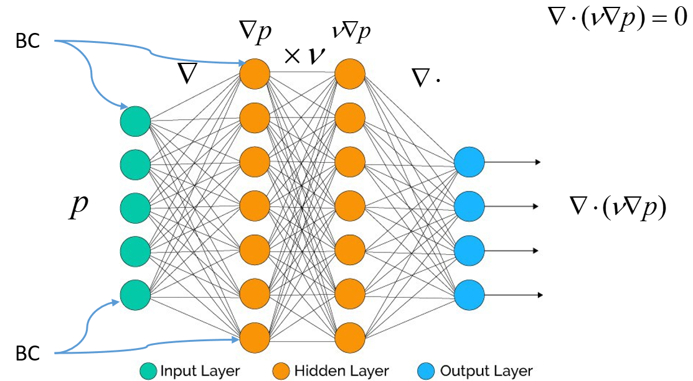
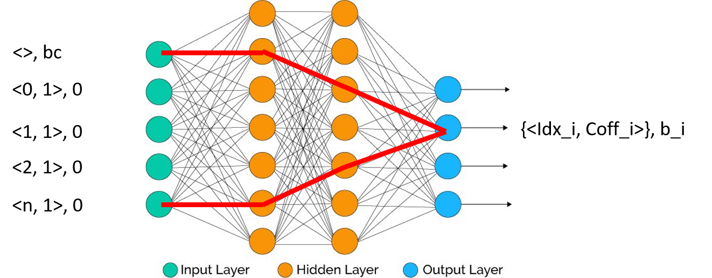

Linear system generation
++++++++++++++++++++++++

There are two common ways to solve implicit linear systems in currently popular software & frameworks.
One is to implement the forward pass of the linear operator, and warp it with a matrix-free iterative
solver such as GMRES. The other is to classify all the possible equations into several models, and
provide each of them with a dedicate highly optimized solver. The first approach doesn't make any
assumptions on the equation's form, thus is of great flexibility to solve any kinds of linear equations.
But little knowledge about the equation structure usually means little optimizations that the solver
can make. General iterative solvers' convergence rates are largely depend on the systems' condition numbers.
Even preconditioners can be applied, the performance of the base solver still limits the overall performance.
On the contrary, dedicated solvers can provide the extreme performance for a type of equations. Almost
every platforms have implemented their best math kernel libraries containing routines to solve systems
such as the Poisson equation, eigenvalue and etc. But the weakness of this approach is the lack of
generality. When we want to add extra terms to our, for example, Poisson equation, we have to fallback
to manually generating the matrix coefficients and invoke the general either direct or iterative linear
solvers. Or, fallback to the first approach. Worse still, mesh topology, boundary condition and discretization
schemes may all cause the dedicated solver to fail, which is a very common case in the development of
numerical schemes.

To overcome these shortcomings, OpFlow proposed the explicit coefficient generation based linear system solving
framework. As mentioned before, the target field will firstly generate a proxy field called ``StencilField``:

.. code-block:: cpp

    auto st = f.getStencilField();

The stencil field is a field of ``StencilPad`` s, which consists of a coefficient map and a bias:

.. code-block:: cpp

    template <typename F>
    struct StencilField {
        using index_type = typename internal::ExprTrait<F>::index_type;
        std::map<index_type, Real> coeff;

        Real bias;
    }

The ``StencilPad`` just acts as a real number, with operator ``+``, ``-`` and ``*`` with numbers overloaded.

.. code-block:: cpp

    auto StencilField<F>::operator+(const StencilField<F>& other) {
        // merge the two coefficient maps; add values with the same key
        StencilField<F> ret = *this;
        for (const auto& [k, v] : other.coeff) {
            if (this->find(k)) ret[k] += v;
            else ret[k] = v;
        }
        // add the bias
        ret.bias += other.bias;
        return ret;
    }

Therefore, a ``StencilField`` can naturally join a linear expression, and the result is also a ``StencilField``.
To see how ``StencilField`` works, we can refer to the following diagram:

Imagine we are solving a 1D Poisson equation. A normal forward-pass of the linear operator is shown in the diagram
above. On the input side is the target field, consisting of inner values and boundary conditions. The gradient,
multiply and divergence operator performs three linear operations upon the ``p`` field. The sequence generates
two hidden layers and one output layer containing the current residual. If we replace the ``p`` field with its
stencil field,

where the initial value of each inner point is the reference to itself, we'll get on the output side a stencil field,
with each element recording all dependent indexes and their coefficients, together with biases. This is exactly the
sparse form of the linear system. Therefore, by one forward-pass with ``StencilField``, we can generate the sparse
matrix & rhs corresponding to the original equation. With such information, we can choose the best linear solver
to further solve the system. For example, for structured fields, we can calculate the common stencil's topology, and
adopt a multigrid solver/preconditioner to solve the system efficiently; for unstructured fields, we can translate the
stencil field into a real sparse matrix and invoke a suitable iterative solver; for even meshless fields, as long as
the topology information is at hand, we can still generate a sparse matrix and solve it with methods like AMG. Furthermore,
by setting ``params.staticMat = true``, the solver will only generate the rhs upon every invocation, which minimize
the computational cost during the preparing phase.

It's always better to have more knowledge of the equation than none. OpFlow successfully acquires this knowledge
**on-the-fly** with only **one forward-pass** calculation. This feature, together with the template expression based
explicit expression evaluation, makes OpFlow ideal for composing general PDE algorithms.