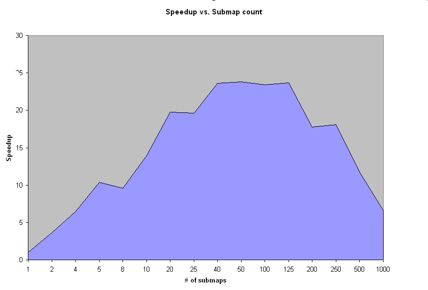

# Polygon_overlay sample

Polygon Overlay example that demonstrates the use of `parallel_for`.

This example is a simple implementation of polygon overlay, as described in Parallelizing
the [Polygon Overlay Problem Using Orca, by H.F. Langendoen](http://citeseerx.ist.psu.edu/viewdoc/summary?doi=10.1.1.46.9538)
.

The solution was implemented in three forms:

* The naive serial solution.
* The naive parallel solution, by splitting list of polygons from one map and intersecting each sub-list against the
  entire list of polygons from the second map.
* A parallel solution where each map is split into submaps, with each resulting submap being intersected against the
  corresponding submap from the other map. This solution requires some redundancy (some polygons are members of more
  than one submap). To prevent multiple copies of a polygon from being placed in the solution map, if both polygons are
  duplicated (that is, if they both appear in more than one map), they are intersected but the result is not placed in
  the solution map.

The only optimization in each solution is that the area of the generated sub-polygons are subtracted from the original
area of one of the source polygons. When the remaining area is zero, the intersection process is halted.

A word about the speedup of the submap case. One may get superlinear speedup in this case (for instance a laptop with
Intel® Core(TM) Duo processor got a speedup of about 20 percent over serial.) This results from two effects:

* the number of threads used, and
* the fact that for each submap, the number of polygons is smaller than that for the other two cases.

If there are, say, 400 polygons in each map, then on average the number of intersections calculated is approximately
80,000 (400 * 200, where 200 is the average number of polygons examined before stopping.) If the maps are split into 2
submaps, the time for each submap is about 200*100, or 20,000. So even comparing the two sets of submaps serially should
result in a speedup somewhere around 2. This number is affected by the number of redundant polygons being compared; this
effect would eventually swamp the gain from comparing smaller numbers of polygons per submap. And remember the submaps
are created by intersecting each map with a rectangular polygon covering the submap being generated, which is additional
work taking about `N * O(400)` in the case above, where `N` is the number of submaps generated, that can be done in
parallel.

Running the default release pover while varying the number of submaps from 1 to 1000, the speedup on the submap case for
a 2-processor system looks like



One further optimization would be to sort one map, say map1, by maxY, and sort the other map (map2) by minY. For p1 in
map1, start testing for intersection at the first p2 in map2 that intersected the last polygon tested in map1. This
would speed up the intersection process greatly, but the optimization would apply to all the methods, and the sort would
have to be accounted for in the timing.

The source maps are generated pseudo-randomly in the manner described in the paper above. That is, if we need `N`
polygons, then `N` "boxes" are chosen at random, then one-at-a-time the areas are expanded in one of fours directions
until the area hits an adjacent polygon. When this process is finished, the resulting map is inspected and any remaining
unoccupied "boxes" are made into additional polygons, as large as possible in each case. So the actual number of
polygons in each map will in general be larger than the number of polygons requested (sometimes by 10% or more.)

One limitation of the program is that if the number of polygons in the source map is greater than the number of "
boxes" (pixels in the GUI case), the maps cannot be generated.

## Building the example

```
cmake <path_to_example> [EXAMPLES_UI_MODE=value]
cmake --build .
```

### Predefined CMake variables

* `EXAMPLES_UI_MODE` - defines the GUI mode, supported values are `gdi`, `d2d`, `con` on Windows, `x`,`con` on Linux
  and `mac`,`con` on macOS. The default mode is `con`. See the [common page](../../README.md) to get more information.

## Running the sample

### Predefined make targets

* `make run_polygon_overlay` - executes the example with predefined parameters.
* `make light_test_polygon_overlay` - executes the example with suggested parameters to reduce execution time.

### Application parameters

Usage:

```
polygon_overlay [threads[:threads2]] [--polys npolys] [--size nnnxnnn] [--seed nnn] [--csv filename] [--grainsize n] [--use_malloc]
```

* `-h` - prints the help for command line options.
* `threads[:threads2]` - number of threads to run.
* `--polys npolys` - number of polygons in each map.
* `--size nnnxnnn` - size of each map (X x Y).
* `--seed nnn` - initial value of random number generator.
* `--csv filename` - write timing data to CSV-format file.
* `--grainsize n` - set grainsize to n.
* `--use_malloc` - allocate polygons with malloc instead of scalable allocator.
