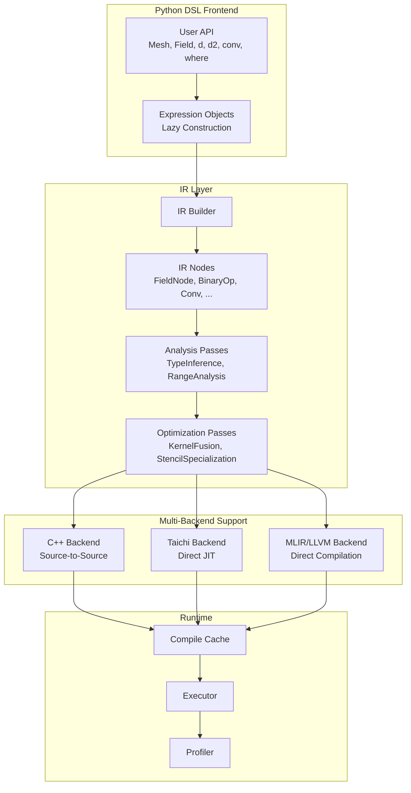
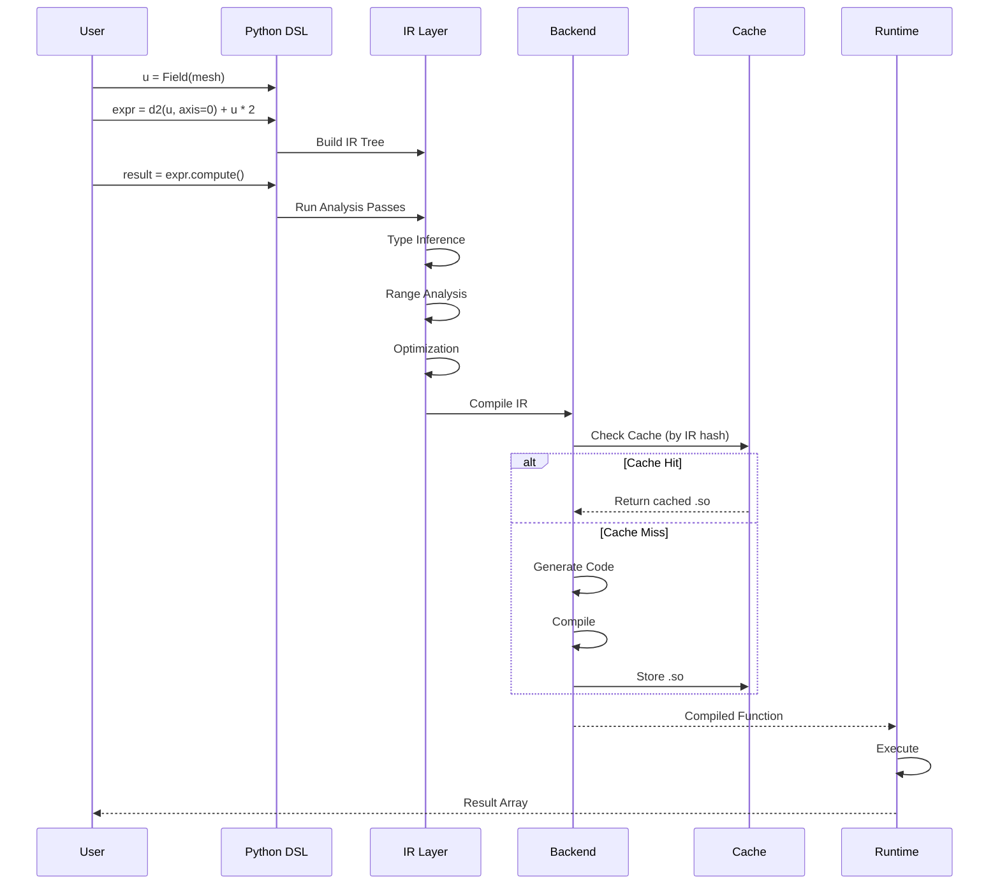

# OpFlow Python DSL JIT 迁移设计方案
- [OpFlow Python DSL JIT 迁移设计方案](#opflow-python-dsl-jit-迁移设计方案)
  - [1. 目标与范围](#1-目标与范围)
    - [1.1 总体目标](#11-总体目标)
    - [1.2 迁移阶段](#12-迁移阶段)
    - [1.3 第一阶段范围](#13-第一阶段范围)
  - [2. 现有 C++ DSL 分析](#2-现有-c-dsl-分析)
    - [2.1 语法要素映射表](#21-语法要素映射表)
    - [2.2 编译单元：从表达式到 Kernel 函数](#22-编译单元从表达式到-kernel-函数)
    - [2.3 算子定义：从模板结构体到 `@op.operator`](#23-算子定义从模板结构体到-opoperator)
    - [2.4 语义要素](#24-语义要素)
    - [2.5 类型系统](#25-类型系统)
  - [3. Python DSL 设计](#3-python-dsl-设计)
    - [3.1 Mesh 类型层次设计](#31-mesh-类型层次设计)
      - [使用示例](#使用示例)
    - [3.1.3 MDIndex 多维索引类型](#313-mdindex-多维索引类型)
      - [mesh.dx 索引接口（支持 MDIndex）](#meshdx-索引接口支持-mdindex)
    - [3.2 `@op.operator` 算子定义](#32-opoperator-算子定义)
      - [3.2.1 C++ Operator 概念映射](#321-c-operator-概念映射)
      - [3.2.2 `@op.operator` 接口规范](#322-opoperator-接口规范)
      - [3.2.3 Operator 元数据](#323-operator-元数据)
      - [3.2.4 使用 Operator](#324-使用-operator)
      - [3.2.5 Operator 与 `@op.kernel` 的关系](#325-operator-与-opkernel-的关系)
      - [3.2.6 内置 Operator 库](#326-内置-operator-库)
      - [3.2.7 LocOnMesh 处理](#327-loconmesh-处理)
      - [3.2.8 多轴 Operator](#328-多轴-operator)
      - [3.2.9 Operator 编译与 IR 表示](#329-operator-编译与-ir-表示)
      - [3.2.10 Operator 约束检查](#3210-operator-约束检查)
    - [3.3 条件表达式 - Python 三元运算符](#33-条件表达式---python-三元运算符)
    - [3.4 归约操作 - `op.reduce()` + Param](#34-归约操作---opreduce--param)
    - [3.5 Kernel 函数设计](#35-kernel-函数设计)
      - [3.5.1 `@op.kernel` 装饰器接口](#351-opkernel-装饰器接口)
      - [3.5.2 Kernel 函数 vs 普通 Python 函数](#352-kernel-函数-vs-普通-python-函数)
      - [3.5.3 Kernel 函数约束](#353-kernel-函数约束)
      - [3.5.4 编译期约束检查机制](#354-编译期约束检查机制)
      - [3.5.5 Kernel 编译流程](#355-kernel-编译流程)
      - [3.5.6 Kernel 函数与普通函数互操作](#356-kernel-函数与普通函数互操作)
    - [3.6 核心 API 示例（整合版）](#36-核心-api-示例整合版)
    - [3.7 IR 设计](#37-ir-设计)
    - [3.8 AST → IR 构建流程](#38-ast--ir-构建流程)
    - [3.9 类型推导](#39-类型推导)
    - [3.10 Range 分析](#310-range-分析)
      - [3.10.1 BC ↔ Range 交互规则](#3101-bc--range-交互规则)
    - [3.11 求值路径设计（Phase 1: eval only）](#311-求值路径设计phase-1-eval-only)
    - [3.12 边界条件 IR 表示](#312-边界条件-ir-表示)
  - [4. JIT 编译架构](#4-jit-编译架构)
    - [4.1 Phase 1: C++ 源到源编译](#41-phase-1-c-源到源编译)
      - [4.1.1 代码生成器框架](#411-代码生成器框架)
      - [4.1.2 Ghost Cell 预填充代码生成](#412-ghost-cell-预填充代码生成)
      - [4.1.3 assign() 完整代码生成流程](#413-assign-完整代码生成流程)
    - [4.2 Phase 2: Taichi 后端](#42-phase-2-taichi-后端)
    - [4.3 Phase 3: MLIR/LLVM 后端](#43-phase-3-mlirllvm-后端)
  - [5. 表达式示例对比](#5-表达式示例对比)
    - [5.1 Poisson 方程求解](#51-poisson-方程求解)
    - [5.2 对流扩散方程](#52-对流扩散方程)
  - [6. 优化 Pass 设计](#6-优化-pass-设计)
    - [6.0 Pass 框架](#60-pass-框架)
    - [6.1 Kernel 融合（Phase 2）](#61-kernel-融合phase-2)
    - [6.2 Stencil 特化](#62-stencil-特化)
    - [6.3 内存访问优化](#63-内存访问优化)
  - [7. 多后端支持](#7-多后端支持)
    - [7.1 后端抽象接口](#71-后端抽象接口)
    - [7.2 后端能力矩阵](#72-后端能力矩阵)
  - [8. 缓存与热加载](#8-缓存与热加载)
    - [8.1 编译缓存](#81-编译缓存)
    - [8.2 热重载](#82-热重载)
  - [9. 测试策略](#9-测试策略)
    - [9.1 单元测试](#91-单元测试)
    - [9.1.3 Ghost Cell 与边界条件测试](#913-ghost-cell-与边界条件测试)
    - [9.2 与 C++ 结果对比测试](#92-与-c-结果对比测试)
    - [9.3 性能基准测试](#93-性能基准测试)
  - [10. 工程落地计划](#10-工程落地计划)
    - [10.1 里程碑](#101-里程碑)
    - [10.2 依赖](#102-依赖)
    - [10.3 目录结构](#103-目录结构)
  - [11. Python-C++ 互操作策略](#11-python-c-互操作策略)
    - [11.1 互操作方案对比](#111-互操作方案对比)
    - [11.2 数组传递策略](#112-数组传递策略)
    - [11.3 错误处理跨语言传播](#113-错误处理跨语言传播)
  - [12. 编译器依赖管理](#12-编译器依赖管理)
    - [12.1 编译器检测](#121-编译器检测)
    - [12.2 编译器 Fallback 策略](#122-编译器-fallback-策略)
    - [12.3 预编译 Kernel 库（Wheel 分发）](#123-预编译-kernel-库wheel-分发)
  - [13. 风险与缓解](#13-风险与缓解)
  - [14. 后续扩展](#14-后续扩展)
  - [附录 A: 架构图](#附录-a-架构图)
  - [附录 B: 数据流图](#附录-b-数据流图)

## 1. 目标与范围

### 1.1 总体目标
将现有 C++ 模板元编程的 DSL 迁移到 Python，实现：
- **用户友好性提升**：Python 语法更简洁，无需处理模板复杂性
- **多后端兼容性**：支持 CPU、CUDA GPU、未来扩展其他后端
- **领域特征优化扩展性**：便于添加领域特定优化 Pass
- **渐进式迁移路径**：先源到源，后直接编译

### 1.2 迁移阶段

| 阶段    | 方案        | 输出                       | 时间估计 |
| ------- | ----------- | -------------------------- | -------- |
| Phase 1 | 源到源 JIT  | C++ 代码 → 编译 → 动态加载 | 2-3 月   |
| Phase 2 | Taichi 后端 | Taichi JIT (CPU/GPU)       | 1-2 月   |
| Phase 3 | MLIR/LLVM   | 原生机器码                 | 3-4 月   |

### 1.3 第一阶段范围

**支持特性**：
- 结构化网格 (Cartesian Mesh)
- 逐点算子 (Pointwise Operations)
- Stencil/卷积算子
- 归约操作 (Reduction)
- 基础边界条件

**非目标（Phase 1）**：
- AMR 网格
- 非结构网格
- 复杂求解器（留在 Phase 2+）

---

## 2. 现有 C++ DSL 分析

### 2.1 语法要素映射表

| C++ 语法                            | Python DSL 语法                               | 说明                          |
| ----------------------------------- | --------------------------------------------- | ----------------------------- |
| `CartesianMesh<Meta::int_<2>>`      | `CartesianMesh(shape=(..., ...), extent=...)` | 网格类型实例化                |
| `CartesianField<Real, Mesh>`        | `Field(mesh, dtype="float64")`                | 类型参数简化                  |
| `u + v`                             | `u + v`                                       | 运算符重载（Python 原生支持） |
| `u * 2.0`                           | `u * 2.0`                                     | 标量广播（Python 原生）       |
| `struct D1FirstOrderCentered {...}` | `@op.operator def D1FirstOrderCentered(...)`  | 单点计算格式定义              |
| `dx<D1FirstOrderCentered>(u)`       | `d(u, axis=0, scheme=D1FirstOrderCentered)`   | scheme 参数指定格式           |
| `conv(u, kernel)`                   | `conv(u, kernel)`                             | 直接映射                      |
| `conditional(c, t, f)`              | `t if c else f`                               | Python 三元运算符             |
| `rangeFor(range, func)`             | `w.assign(expr)`                                      | 表达式赋值触发计算            |
| `rangeReduce(range, +, func)`       | `op.reduce(expr, op='sum')` / `op.sum(expr)`          | 归约操作                      |
| **编译单元**                        | `@op.kernel` 装饰器                           | 整个函数作为 JIT 单元         |
| **算子定义**                        | `@op.operator` 装饰器                         | 单点计算格式                  |

### 2.2 编译单元：从表达式到 Kernel 函数

**C++ 方式**：表达式模板 + 赋值触发计算
```cpp
// C++: 表达式模板延迟计算，赋值触发
auto expr = u + dt * (d2x<D2SecondOrderCentered>(u) + d2y<D2SecondOrderCentered>(u));
w = expr;  // 赋值触发计算
```

**Python 方式**：`@op.kernel` 装饰器标记整个函数为编译单元
```python
import opflow as op
from opflow.schemes import D2SecondOrderCentered

# Python: @op.kernel 标记整个函数为 JIT 编译单元
@op.kernel
def diffusion_step(u: Field, w: Field, dt: float):
    """时间推进 kernel - 使用算子而非手动展开"""
    lap = op.d2(u, axis=0, scheme=D2SecondOrderCentered) + \
          op.d2(u, axis=1, scheme=D2SecondOrderCentered)
    w.assign(u + dt * lap)

# 调用时触发 JIT（首次）或直接执行（后续）
diffusion_step(u, w, dt=0.001)
```

**关键差异**：

| 特性     | C++ 表达式模板           | Python `@op.kernel`                |
| -------- | ------------------------ | ---------------------------------- |
| 编译单元 | 单个赋值表达式           | 整个函数                           |
| 触发时机 | 赋值操作                 | 函数调用                           |
| 计算模型 | 表达式语法（`w = expr`） | 表达式语法（`w.assign(expr)`）     |
| 可读性   | 模板元编程复杂           | 原生 Python 语法                   |
| 调试     | 困难（编译期错误难定位） | 编译期约束检查 + 清晰错误信息      |

### 2.3 算子定义：从模板结构体到 `@op.operator`

**C++ 方式**：模板结构体定义单点格式
```cpp
// C++: 算子模板结构体
struct D1FirstOrderCentered {
    static constexpr int width = 2;

    template <typename Field>
    static auto apply(const Field& f, int i, int j) {
        // dx 从 mesh 中获取
        return (f[i+1, j] - f[i-1, j]) / (2.0 * f.mesh().dx(0));
    }
};

// 使用
auto du = dx<D1FirstOrderCentered>(u);
```

**Python 方式**：`@op.operator` 装饰器定义单点格式
```python
import opflow as op
from opflow import d

# Python: @op.operator 定义单点计算格式
@op.operator
def D1FirstOrderCentered(f: FieldAccessor, axis: int, i: MDIndex) -> float:
    """一阶中心差分（staggered mesh），loc_transform 翻转位置"""
    if f.loc[axis] == LocOnMesh.CENTER:
        return (f[i] - f[i.prev(axis)]) / (f.mesh.dx(axis, i[axis] - 1) + f.mesh.dx(axis, i[axis])) * 2
    else:
        return (f[i.next(axis)] - f[i]) / f.mesh.dx(axis, i[axis])

# 使用
du = d(u, axis=0, scheme=D1FirstOrderCentered)

# 或在 kernel 中通过 d() 调用
@op.kernel
def compute_gradient(u: Field, du: Field):
    """du = d(u)/dx"""
    du.assign(d(u, axis=0, scheme=D1FirstOrderCentered))
```

**Operator vs Kernel 职责分离**：

| 特性     | `@op.operator`              | `@op.kernel`         |
| -------- | --------------------------- | -------------------- |
| 定义内容 | 单点计算格式                | 循环结构 + 并行策略  |
| 可复用性 | 高（可传给任意 `d()` 调用） | 低（特定场景）       |
| 参数类型 | `FieldAccessor` (只读)      | `Field` (读写)       |
| 网格参数 | 从 `f.mesh` 获取            | 从 `Field.mesh` 获取 |
| 并行化   | 由调用方决定                | 自身包含并行循环     |
| 典型用途 | 微分格式、插值、滤波        | 求解器核心循环       |

### 2.4 语义要素

**Range 传播**：
- `accessibleRange`: 可安全访问的范围
- `localRange`: 本进程负责的范围
- `assignableRange`: 可写入的范围
- `logicalRange`: 逻辑全范围

**边界条件处理**：
- Dirichlet BC: `BCType::Dirc, value`
- Neumann BC: `BCType::Neum, value`
- 周期 BC: `BCType::Periodic`

**Kernel 函数约束**（Python DSL 新增）：
- 参数必须有类型标注
- Field 参数必须共享同一 mesh
- 循环范围必须是 `mesh.range()` 变体
- 索引表达式必须仿射
- 禁止动态 Python 构造（动态代码执行、import、class 等）

### 2.5 类型系统

```
Expr (基类)
├── FieldExpr
│   ├── elem_type: 元素类型 (float64, int32, ...)
│   ├── dim: 维度
│   ├── mesh_type: 网格类型
│   └── access_flag: 读写权限
├── ScalarExpr
│   └── value: 标量值
└── Expression<Op, Args...>
    ├── Op: 操作符类型
    └── Args: 参数类型列表
```

**Python DSL 扩展类型**：

```
KernelFunction
├── name: 函数名
├── params: List[Param]  # 带类型标注的参数
│   ├── name: 参数名
│   ├── type: Field | Param | float | int
│   └── is_output: bool
├── body: List[Statement]  # 函数体 AST
├── loop_vars: Set[str]    # 循环变量
├── reduction_vars: Set[str]  # 归约变量
└── return_type: void      # Kernel 无返回值（输出通过 Field/Param assign）
```

---

## 3. Python DSL 设计

### 3.1 Mesh 类型层次设计

现有 C++ 实现中有多种 Mesh 类型，之间存在共性与个性关系：

```
MeshBase (抽象基类)
├── StructuredMesh (结构化网格)
│   ├── CartesianMesh (笛卡尔网格) - 最常用
│   └── CurvilinearMesh (曲线网格)
├── SemiStructuredMesh (半结构化网格)
│   └── CartesianAMRMesh (AMR 自适应网格)
└── UnstructuredMesh (非结构化网格)
    ├── TriangleMesh (三角形网格)
    └── TetrahedronMesh (四面体网格)
```

**Python DSL Mesh 设计**：

```python
from abc import ABC, abstractmethod
from typing import Tuple, Optional
from enum import Enum, auto
import numpy as np

class MeshKind(Enum):
    """网格类型枚举"""
    CARTESIAN = auto()
    AMR = auto()
    CURVILINEAR = auto()
    UNSTRUCTURED = auto()

class MeshBase(ABC):
    """网格抽象基类 - 定义所有网格的共性接口"""

    @property
    @abstractmethod
    def dim(self) -> int:
        """网格维度"""
        pass

    @property
    @abstractmethod
    def kind(self) -> MeshKind:
        """网格类型"""
        pass

    @abstractmethod
    def cell_volume(self, *indices) -> float:
        """返回指定单元格的体积"""
        pass

    @abstractmethod
    def cell_center(self, *indices) -> Tuple[float, ...]:
        """返回指定单元格的中心坐标"""
        pass

    @abstractmethod
    def interior_range(self) -> "IndexRange":
        """返回内部索引范围（不含 halo）"""
        pass


class CartesianMesh(MeshBase):
    """笛卡尔网格 - 最常用的规则网格

    特性：
    - 支持均匀和非均匀间距
    - 正交坐标
    """

    def __init__(
        self,
        shape: Tuple[int, ...],
        *,
        extent: Optional[Tuple[float, ...]] = None,  # 均匀网格
        dx: Optional[Union[float, Tuple[float, ...], Tuple[np.ndarray, ...]]] = None,
    ):
        """
        创建笛卡尔网格

        均匀网格 - 方式 1：extent
            mesh = CartesianMesh(shape=(100, 100), extent=(0, 1, 0, 1))

        均匀网格 - 方式 2：dx 标量
            mesh = CartesianMesh(shape=(100, 100), dx=0.01)
            mesh = CartesianMesh(shape=(100, 100), dx=(0.01, 0.02))

        非均匀网格 - 方式 3：dx 数组
            mesh = CartesianMesh(shape=(100, 100), dx=(x_coords, y_coords))
        """
        self._shape = shape
        self._dim = len(shape)

        if extent is not None and dx is not None:
            raise ValueError("extent 和 dx 不能同时指定")

        if extent is not None:
            self._dx = tuple(
                (extent[2*i + 1] - extent[2*i]) / shape[i]
                for i in range(self._dim)
            )
        elif dx is not None:
            if isinstance(dx, (int, float)):
                self._dx = tuple(float(dx) for _ in range(self._dim))
            elif isinstance(dx, tuple):
                if len(dx) != self._dim:
                    raise ValueError(f"dx 长度必须等于维度数")
                self._dx = dx
            else:
                raise TypeError(f"dx 类型错误")
        else:
            raise ValueError("必须指定 extent 或 dx")

        # 计算坐标数组 _x（每维一个数组，对应 C++ mesh._x[d][i]）
        self._x = []
        for axis in range(self._dim):
            if isinstance(self._dx[axis], np.ndarray):
                # 非均匀网格：从 dx 累积积分
                x_coords = np.concatenate([[0.0], np.cumsum(self._dx[axis])])
            else:
                # 均匀网格
                x0 = extent[2 * axis] if extent is not None else 0.0
                x_coords = x0 + np.arange(shape[axis] + 1) * self._dx[axis]
            self._x.append(x_coords)

    @property
    def dim(self) -> int:
        return self._dim

    @property
    def kind(self) -> MeshKind:
        return MeshKind.CARTESIAN

    @property
    def is_uniform(self) -> bool:
        """是否为均匀网格"""
        return all(not isinstance(d, np.ndarray) for d in self._dx)

    @property
    def shape(self) -> Tuple[int, ...]:
        return self._shape

    def dx(self, axis: int, i: int) -> float:
        """获取指定维度、指定位置的网格间距

        对应 C++: mesh.dx(d, i)

        始终需要两个参数，不提供单参数简化（避免非均匀网格语义错误）。
        返回第 axis 维第 i 个 cell 的间距（= x(axis, i+1) - x(axis, i)）。

        用法：
            dx_val = mesh.dx(0, i[0])       # 第 0 维在 i[0] 处的间距
            dx_val = mesh.dx(1, i[1])       # 第 1 维在 i[1] 处的间距
        """
        val = self._dx[axis]
        if isinstance(val, np.ndarray):
            return float(val[i])
        else:
            return float(val)

    def x(self, axis: int, i: int) -> float:
        """获取指定维度、指定位置的坐标值

        对应 C++: mesh._x[d][i]

        用法：
            x_val = mesh.x(0, i[0])  # 第 0 维在 i[0] 处的坐标
        """
        return float(self._x[axis][i])


class AMRMesh(MeshBase):
    """AMR 自适应网格 - 半结构化层次网格

    特性：
    - 多层级嵌套
    - 动态自适应
    - 各层级独立的 CartesianMesh
    """

    def __init__(
        self,
        base_shape: Tuple[int, ...],
        levels: int,
        refinement_ratio: int = 2
    ):
        self._base_shape = base_shape
        self._levels = levels
        self._refinement_ratio = refinement_ratio

    @property
    def kind(self) -> MeshKind:
        return MeshKind.AMR

    def level_mesh(self, level: int) -> CartesianMesh:
        """返回指定层级的网格"""
        ...


### 3.1.2 Field 类设计

```python
from typing import Optional, Union, Tuple, Dict
from enum import Enum, auto
from dataclasses import dataclass
import numpy as np

class LocOnMesh(Enum):
    """变量在网格上的位置（每维独立）

    对应 C++: LocOnMesh { Center, Corner }
    """
    CENTER = auto()  # 单元中心
    CORNER = auto()  # 网格角点

    def flip(self) -> "LocOnMesh":
        """翻转位置：Center ↔ Corner"""
        return LocOnMesh.CORNER if self == LocOnMesh.CENTER else LocOnMesh.CENTER


class MeshExtMode(Enum):
    """Mesh halo 区坐标外推模式

    对应 C++: MeshExtMode
    """
    SYMM = auto()      # 对称外推
    PERIODIC = auto()   # 周期外推
    UNIFORM = auto()    # 等间距外推（默认）


class DimPos(Enum):
    """边界位置

    对应 C++: DimPos { start, end }
    """
    START = auto()
    END = auto()


class BCType(Enum):
    """边界条件类型

    对应 C++: BCType { Dirc, Neum, Symm, Asym, Periodic, ... }
    """
    # 需要值的 BC
    DIRC = auto()      # Dirichlet: u = value
    NEUM = auto()      # Neumann: du/dn = value
    ROBIN = auto()     # Robin: a*u + b*du/dn = c

    # 逻辑 BC（不需要值）
    SYMM = auto()      # 对称
    ASYM = auto()      # 反对称
    PERIODIC = auto()  # 周期


@dataclass
class ConstBC:
    """常量/函数边界条件

    value 支持三种形式:
    - float/int/complex: 常量 BC（自动包装为 ScalarNode）
    - Callable: 空间变化函数 BC（functor BC，对应 C++ FunctorDircBC/FunctorNeumBC）
    - IRNode: IR 表达式树（引用 mesh.x 坐标，可编译为 C++ 内联表达式）
    """
    bc_type: BCType
    value: Optional[Union[float, int, complex, Callable, "IRNode"]] = None
    # Robin BC 参数: a*u + b*du/dn = c（支持空间变化）
    robin_a: Optional[Union[float, "IRNode"]] = None
    robin_b: Optional[Union[float, "IRNode"]] = None
    robin_c: Optional[Union[float, "IRNode"]] = None


@dataclass
class LogicalBC:
    """逻辑边界条件（对称、反对称、周期）

    需要持有字段引用，用于 ghost cell 填充时读取镜像/对端值。
    对应 C++: SymmBC/ASymmBC/PeriodicBC 持有字段指针。
    field 引用在 Field.set_bc() 时自动注入。
    """
    bc_type: BCType
    field: Optional["Field"] = None  # 反向引用，用于 Symm/Periodic 填充


class Field:
    """字段类 - 定义在网格上的标量场

    特性：
    - halo 是 Field 的属性（不是 Mesh）
    - loc 是每维独立的（支持交错网格）
    - 支持边界条件设置
    - 支持 NumPy 互操作

    对应 C++: CartesianField<D, M, C>
    """

    def __init__(
        self,
        mesh: MeshBase,
        *,
        dtype: Union[DType, str] = DType.FLOAT64,
        halo: Union[int, List[Tuple[int, int]]] = 0,
        loc: Union[LocOnMesh, Tuple[LocOnMesh, ...]] = LocOnMesh.CENTER,
        name: Optional[str] = None,
    ):
        """
        创建字段

        对应 C++: ExprBuilder<Field>().setMesh(mesh).setExt(halo).setLoc(loc).build()

        参数：
            mesh: 网格对象
            dtype: 数据类型（DType 枚举，或字符串兼容写法自动转换）
            halo: 边界扩展宽度，支持两种格式：
                - int: 所有维度、所有方向使用相同宽度（简化写法）
                - List[Tuple[int, int]]: per-dim per-side [(start, end), ...]
                  对应 C++: std::array<Pair<int>, dim>
            loc: 变量位置（每维独立）
                - 单个值: 所有维度使用相同位置
                - 元组: 每维指定位置 (例如 2D: (CENTER, CENTER))
            name: 字段名称（调试用）

        示例：
            # 标准中心场（简化 halo）
            p = Field(mesh, halo=1, loc=LocOnMesh.CENTER)

            # per-dim per-side halo
            u = Field(mesh, halo=[(1, 1), (2, 2)], loc=LocOnMesh.CENTER)

            # 交错网格：x-速度在角点，y-速度在中心
            u = Field(mesh, halo=1, loc=(LocOnMesh.CORNER, LocOnMesh.CENTER))
        """
        self._mesh = mesh
        # 字符串兼容：自动转换 "float64" → DType.FLOAT64
        if isinstance(dtype, str):
            dtype = DType({"float64": "f64", "float32": "f32", "int32": "i32",
                           "complex128": "c128", "complex64": "c64", "bool": "i1",
                           "f64": "f64", "f32": "f32", "i32": "i32",
                           "c128": "c128", "c64": "c64", "i1": "i1"}[dtype])
        self._dtype = dtype
        self._name = name or f"field_{id(self)}"

        # 标准化 halo 为 per-dim per-side
        if isinstance(halo, int):
            self._halo = [(halo, halo) for _ in range(mesh.dim)]
        else:
            if len(halo) != mesh.dim:
                raise ValueError(f"halo 长度 ({len(halo)}) 必须等于网格维度 ({mesh.dim})")
            self._halo = list(halo)

        # 标准化 loc 为元组（每维一个）
        if isinstance(loc, LocOnMesh):
            self._loc = tuple(loc for _ in range(mesh.dim))
        else:
            if len(loc) != mesh.dim:
                raise ValueError(f"loc 长度 ({len(loc)}) 必须等于网格维度 ({mesh.dim})")
            self._loc = tuple(loc)

        # 边界条件字典: key = (axis, pos) where pos = DimPos.START | DimPos.END
        self._bc: Dict[Tuple[int, DimPos], Union[ConstBC, LogicalBC]] = {}

        # 计算含 halo 的总 shape（halo 已标准化为 list[tuple[int, int]]）
        total_shape = tuple(
            s + h_start + h_end
            for s, (h_start, h_end) in zip(mesh.shape, self._halo)
        )
        self._buffer = np.zeros(total_shape, dtype=DTYPE_NUMPY_MAP[self._dtype])
        # 内部视图（不含 halo）
        if any(h_start > 0 or h_end > 0 for h_start, h_end in self._halo):
            slices = tuple(
                slice(h_start, s + h_start)
                for s, (h_start, h_end) in zip(mesh.shape, self._halo)
            )
            self._array = self._buffer[slices]
        else:
            self._array = self._buffer

    @property
    def mesh(self) -> MeshBase:
        return self._mesh

    @property
    def dtype(self) -> str:
        return self._dtype

    @property
    def halo(self) -> List[Tuple[int, int]]:
        """Per-dim per-side halo，对应 C++ std::array<Pair<int>, dim>"""
        return self._halo

    @property
    def accessible_range(self) -> "Range":
        """全局有效数据范围（不含 ghost cell）

        即 mesh 的逻辑范围，不包含 ghost 区域。
        对应 C++: field.accessibleRange
        """
        return Range(
            start=[0] * self._mesh.dim,
            end=list(self._mesh.shape)
        )

    @property
    def local_range(self) -> "Range":
        """本进程持有的范围（MPI 分区）

        Phase 1 单进程：与 accessible_range 相同。
        """
        return self.accessible_range

    @property
    def assignable_range(self) -> "Range":
        """可写范围（= accessible_range，由 kernel 编译时经 RangeAnalyzer 收缩）

        Field 本身的 assignable_range 等于 accessible_range。
        实际赋值时的有效范围由表达式的 range_effect 决定，
        在 @op.kernel 编译时由 RangeAnalyzer 计算。
        """
        return self.accessible_range

    @property
    def logical_range(self) -> "Range":
        """含 ghost cell 的扩展范围（用于内存分配和 ghost cell 填充）"""
        return Range(
            start=[-h[0] for h in self._halo],
            end=[s + h[1] for s, h in zip(self._mesh.shape, self._halo)]
        )

    @property
    def loc(self) -> Tuple[LocOnMesh, ...]:
        """每维的位置元组（只读）"""
        return self._loc

    @property
    def name(self) -> str:
        return self._name

    @property
    def ndarray(self) -> np.ndarray:
        """返回 NumPy 数组视图（不含 halo）"""
        return self._array

    def set_bc(
        self,
        d: int,
        pos: DimPos,
        bc_type: BCType,
        value: Optional[Union[float, Callable]] = None,
        **kwargs
    ):
        """设置边界条件

        对应 C++: setBC(int d, DimPos pos, BCType type, T val)

        参数：
            d: 维度索引 (0, 1, 2, ...)
            pos: 边界位置 (DimPos.START | DimPos.END)
            bc_type: 边界条件类型
            value: 边界值（对 DIRC/NEUM/ROBIN 有效）
            **kwargs: Robin BC 参数 (robin_a, robin_b, robin_c)

        示例：
            # Dirichlet: u = 0
            u.set_bc(0, DimPos.START, BCType.DIRC, 0.0)

            # Neumann: du/dx = 0
            u.set_bc(0, DimPos.END, BCType.NEUM, 0.0)

            # 周期边界（两侧都要设置）
            u.set_bc(1, DimPos.START, BCType.PERIODIC)
            u.set_bc(1, DimPos.END, BCType.PERIODIC)

            # Robin: 2*u + 3*du/dn = 5
            u.set_bc(0, DimPos.START, BCType.ROBIN, robin_a=2.0, robin_b=3.0, robin_c=5.0)
        """
        if bc_type in (BCType.DIRC, BCType.NEUM, BCType.ROBIN):
            if value is None and bc_type != BCType.ROBIN:
                raise ValueError(f"{bc_type.name} BC requires a value")
            bc_node = ConstBC(bc_type, value, **kwargs)
        elif bc_type in (BCType.SYMM, BCType.ASYM, BCType.PERIODIC):
            bc_node = LogicalBC(bc_type, field=self)  # 注入字段引用
        else:
            raise ValueError(f"Unsupported BC type: {bc_type}")

        self._bc[(d, pos)] = bc_node
        return self  # 支持链式调用

    def get_bc(self, d: int, pos: DimPos) -> Optional[Union[ConstBC, LogicalBC]]:
        """获取指定维度和位置的边界条件

        对应 C++: field.getBC(d, pos)

        返回 None 表示该侧未设置 BC。
        RangeAnalyzer / GhostCellFiller / update_padding() 统一通过此接口读取 BC，
        不直接访问 _bc 私有字典。
        """
        return self._bc.get((d, pos))

    def fill(self, value: float):
        """填充常量值"""
        self._array.fill(value)

    def assign(self, other: Union["Field", "ExprNode"]):
        """赋值操作 - 触发 JIT 编译

        完整语义（对应 C++ FieldAssigner）：
        1. 别名检测：遍历 expr IR 树收集引用的 Field ID，
           如果 dst.id in referenced_fields → 创建临时副本
        2. 源 Field ghost cell 预填充（所有源 Field 的 update_padding）
        3. 计算 assignable_range（基于累积 range_effect）
        4. 遍历 assignable_range 执行 dst[i] = expr.eval(i)
        5. 目标 Field 自动调用 dst.update_padding() 填充 ghost cell
        """
        ...

    def update_padding(self):
        """填充 ghost cell（对应 C++ updatePadding()）

        在 @op.kernel 编译模式下，此方法不在 Python 运行时执行。
        ghost cell 填充代码由 CppCodeGen._gen_update_padding() 生成为 C++ 代码，
        内联到编译后的 kernel 函数中（在主循环之前执行）。

        纯 Python eval 路径（调试/测试用）：
        """
        for axis in range(self._mesh.dim):
            for pos in (DimPos.START, DimPos.END):
                bc = self.get_bc(axis, pos)
                if bc is None:
                    continue
                h = self._halo[axis][0 if pos == DimPos.START else 1]
                if bc.bc_type == BCType.DIRC:
                    self._fill_dirichlet_ghost(axis, pos, h, bc.value)
                elif bc.bc_type == BCType.NEUM:
                    self._fill_neumann_ghost(axis, pos, h, bc.value)
                elif bc.bc_type == BCType.PERIODIC:
                    self._fill_periodic_ghost(axis, h)
                elif bc.bc_type == BCType.SYMM:
                    self._fill_symmetric_ghost(axis, pos, h, sign=1.0)
                elif bc.bc_type == BCType.ASYM:
                    self._fill_symmetric_ghost(axis, pos, h, sign=-1.0)

    # 运算符重载
    def __add__(self, other) -> "ExprNode":
        return BinaryOpNode(OpType.ADD, self, _wrap(other))

    def __sub__(self, other) -> "ExprNode":
        return BinaryOpNode(OpType.SUB, self, _wrap(other))

    def __mul__(self, other) -> "ExprNode":
        return BinaryOpNode(OpType.MUL, self, _wrap(other))

    def __truediv__(self, other) -> "ExprNode":
        return BinaryOpNode(OpType.DIV, self, _wrap(other))

    def __neg__(self) -> "ExprNode":
        return UnaryOpNode(OpType.NEG, self)

    # 索引操作（在 kernel 外使用）
    def __getitem__(self, key):
        """返回 NumPy 风格的切片"""
        return self._array[key]

    def __setitem__(self, key, value):
        """设置元素值（Host 代码）"""
        self._array[key] = value
```

#### 使用示例

```python
# === 网格创建（halo 不在 Mesh 上）===
mesh = CartesianMesh(shape=(100, 100), extent=(0, 1, 0, 1))

# === 标准场 ===
p = Field(mesh, halo=1, dtype="float64", name="p")  # 3点 stencil 需要 halo=1
p.set_bc(0, DimPos.START, BCType.DIRC, 0.0)
p.set_bc(0, DimPos.END, BCType.DIRC, 0.0)
p.set_bc(1, DimPos.START, BCType.PERIODIC)
p.set_bc(1, DimPos.END, BCType.PERIODIC)

# === 交错网格 ===
# 压强在中心
p = Field(mesh, halo=1, loc=LocOnMesh.CENTER)

# x-速度在 x 方向的角点，y 方向的中心
u = Field(mesh, halo=1, loc=(LocOnMesh.CORNER, LocOnMesh.CENTER), name="u")

# y-速度在 x 方向的中心，y 方向的角点
v = Field(mesh, halo=1, loc=(LocOnMesh.CENTER, LocOnMesh.CORNER), name="v")

# === 不同 Field 可以有不同的 halo ===
u = Field(mesh, halo=1)  # 3点 stencil
v = Field(mesh, halo=2)  # 5点 stencil (WENO)
```

### 3.1.3 MDIndex 多维索引类型

```python
from dataclasses import dataclass
from typing import Tuple

@dataclass(frozen=True)
class MDIndex:
    """多维索引 - 对应 C++ 的 MDIndex<d>

    C++ 定义：
    template <std::size_t d>
    struct MDIndex {
        std::array<int, d> idx;

        constexpr auto next(int steps = 1) const;  // 在 dim=0 上移动
        constexpr auto prev(int steps = 1) const;

        constexpr auto& operator[](int i);
        constexpr auto operator+(const MDIndex&) const;
        constexpr auto operator-(const MDIndex&) const;
    };

    特性：
    - 不可变（frozen=True）
    - 支持加减运算
    - 支持 next(dim)/prev(dim) 在特定维度移动
    - 维度由初始化时的索引数量决定
    """
    _indices: Tuple[int, ...]

    def __init__(self, *indices: int):
        object.__setattr__(self, '_indices', indices)

    @property
    def dim(self) -> int:
        """维度数"""
        return len(self._indices)

    def __getitem__(self, key: int) -> int:
        """访问特定维度的索引"""
        return self._indices[key]

    def __len__(self) -> int:
        return len(self._indices)

    def __iter__(self):
        return iter(self._indices)

    def __repr__(self) -> str:
        return f"MDIndex{self._indices}"

    def __eq__(self, other: "MDIndex") -> bool:
        if not isinstance(other, MDIndex):
            return False
        return self._indices == other._indices

    def __hash__(self) -> int:
        return hash(self._indices)

    # === 运算符 ===
    def __add__(self, other: "MDIndex") -> "MDIndex":
        """对应 C++: operator+"""
        if self.dim != other.dim:
            raise ValueError("Dimension mismatch")
        return MDIndex(*(a + b for a, b in zip(self._indices, other._indices)))

    def __sub__(self, other: "MDIndex") -> "MDIndex":
        """对应 C++: operator-"""
        if self.dim != other.dim:
            raise ValueError("Dimension mismatch")
        return MDIndex(*(a - b for a, b in zip(self._indices, other._indices)))

    # === 特定维度移动 ===
    def next(self, axis: int, steps: int = 1) -> "MDIndex":
        """在指定维度上向前移动

        对应 C++: i.template next<d>(steps)

        示例：
            i = MDIndex(5, 10)
            i.next(0)  # MDIndex(6, 10)  - x 方向 +1
            i.next(1)  # MDIndex(5, 11)  - y 方向 +1
            i.next(0, 2)  # MDIndex(7, 10)  - x 方向 +2
        """
        lst = list(self._indices)
        lst[axis] += steps
        return MDIndex(*lst)

    def prev(self, axis: int, steps: int = 1) -> "MDIndex":
        """在指定维度上向后移动

        对应 C++: i.template prev<d>(steps)

        示例：
            i = MDIndex(5, 10)
            i.prev(0)  # MDIndex(4, 10)  - x 方向 -1
            i.prev(1)  # MDIndex(5, 9)   - y 方向 -1
        """
        lst = list(self._indices)
        lst[axis] -= steps
        return MDIndex(*lst)

    # === 转换 ===
    def to_tuple(self) -> Tuple[int, ...]:
        """转换为普通元组"""
        return self._indices

    @classmethod
    def from_tuple(cls, indices: Tuple[int, ...]) -> "MDIndex":
        """从元组创建"""
        return cls(*indices)


# === 使用示例 ===
i = MDIndex(5, 10)       # 2D 索引 (5, 10)
i_next_x = i.next(0)     # MDIndex(6, 10)
i_prev_y = i.prev(1)     # MDIndex(5, 9)
i_plus = i + MDIndex(1, 2)  # MDIndex(6, 12)

j = MDIndex(3, 4, 5)     # 3D 索引
k = MDIndex(1, 1, 1)
l = j + k                # MDIndex(4, 5, 6)
```

#### mesh.dx 索引接口（支持 MDIndex）

```python
class CartesianMesh:
    def dx(self, axis: int, i: Union[int, "MDIndex"]) -> float:
        """获取指定维度在指定位置的网格间距

        对应 C++: mesh.dx(d, i) / mesh.dx(d, MDIndex)

        始终需要两个参数（axis + index），不提供单参数重载。

        - mesh.dx(0, i)           → 第 0 维在标量 i 处的间距
        - mesh.dx(0, MDIndex(...)) → 第 0 维在多维索引处（自动提取 axis 分量）

        对应 C++：
        - mesh.dx(d, i)           → mesh.dx(d, i)
        - mesh.dx(d, MDIndex)     → mesh.dx(d, idx)
        """
        if isinstance(i, MDIndex):
            index = i[axis]
        else:
            index = i

        val = self._dx[axis]
        if isinstance(val, np.ndarray):
            return float(val[index])
        else:
            return float(val)  # 均匀网格

    def x(self, axis: int, i: int) -> float:
        """获取指定维度在指定位置的坐标值

        对应 C++: mesh._x[d][i]
        """
        return float(self._x[axis][i])
```

### 3.2 `@op.operator` 算子定义

#### 3.2.1 C++ Operator 概念映射

C++ 中 Operator 是定义**单点计算格式**的模板类，描述如何在某一点上使用邻域值进行计算：

```cpp
// C++: 一阶中心差分算子（使用 MDIndex）
template <std::size_t d>
struct D1FirstOrderCentered {
    constexpr static auto bc_width = 1;

    template <CartesianFieldExprType E, typename I>
    OPFLOW_STRONG_INLINE static auto eval(const E& e, I i) {
        // i 是 MDIndex<d> 类型
        // i.template prev<d>() 在维度 d 上减 1
        // e.mesh.dx(d, i[d]) 获取非均匀网格在位置 i[d] 的间距
        return (e.evalAt(i) - e.evalAt(i.template prev<d>()))
               / (e.mesh.dx(d, i[d] - 1) + e.mesh.dx(d, i[d])) * 2;
    }
};

// 使用：dx 和 dy 是不同的模板实例化
auto du = dx<D1FirstOrderCentered>(u);  // d=0, 对 MDIndex<2>
auto dv = dy<D1FirstOrderCentered>(u);  // d=1, 对 MDIndex<2>
```

Python DSL 使用 `@op.operator` 装饰器定义等效的单点格式：

```python
import opflow as op

@op.operator(loc_transform=lambda loc: loc.flip())
def D1FirstOrderCentered(f: FieldAccessor, axis: int, i: MDIndex) -> float:
    """一阶中心差分 - 严格对齐 C++ staggered mesh 语义

    对应 C++: template <std::size_t d> struct D1FirstOrderCentered

    公式（与 C++ 完全一致）：
    - Center 位置: (f[i] - f[i-1]) / (dx[i-1] + dx[i]) * 2
      结果位于 Corner 位置（loc 翻转）
    - Corner 位置: (f[i+1] - f[i]) / dx[i]
      结果位于 Center 位置（loc 翻转）

    注意：这是非对称 staggered 差分，非教科书对称差分 (f[i+1]-f[i-1])/2dx

    range_effect 由 StencilAnalyzer 从 AST 自动推导：
    - Center: prev(axis, 1) → start 侧收缩 1
    - Corner: next(axis, 1) → end 侧收缩 1

    参数：
        f: 字段访问器
        axis: 求导方向（C++ 中是模板参数，Python 中作为参数传递）
        i: 多维索引
    """
    if f.loc[axis] == LocOnMesh.CENTER:
        # Center→Corner: 非对称 staggered 差分
        return (f[i] - f[i.prev(axis)]) / (f.mesh.dx(axis, i[axis] - 1) + f.mesh.dx(axis, i[axis])) * 2
    else:
        # Corner→Center: 单侧差分
        return (f[i.next(axis)] - f[i]) / f.mesh.dx(axis, i[axis])


@op.operator
def D1SecondOrderCentered(f: FieldAccessor, axis: int, i: MDIndex) -> float:
    """二阶中心差分"""
    dx = f.mesh.dx(axis, i[axis])
    return (-f[i.next(axis, 2)] + 8.0*f[i.next(axis)] -
            8.0*f[i.prev(axis)] + f[i.prev(axis, 2)]) / (12.0 * dx)


@op.operator
def D2SecondOrderCentered(f: FieldAccessor, axis: int, i: MDIndex) -> float:
    """二阶导数中心差分 - 严格对齐 C++ staggered mesh 语义

    对应 C++: template <std::size_t d> struct D2SecondOrderCentered

    公式：loc 决定间距的计算方式
    - Corner: dx_l = dx(i-1), dx_r = dx(i)
    - Center: dx_l = (dx(i-1)+dx(i))/2, dx_r = (dx(i)+dx(i+1))/2
    二阶导 = (2/(dx_l+dx_r)) * ((f[i+1]-f[i])/dx_r - (f[i]-f[i-1])/dx_l)

    loc_transform: 不翻转（二阶导保持原位置）
    """
    if f.loc[axis] == LocOnMesh.CORNER:
        dx_l = f.mesh.dx(axis, i[axis] - 1)
        dx_r = f.mesh.dx(axis, i[axis])
    else:
        dx_l = (f.mesh.dx(axis, i[axis] - 1) + f.mesh.dx(axis, i[axis])) * 0.5
        dx_r = (f.mesh.dx(axis, i[axis]) + f.mesh.dx(axis, i[axis] + 1)) * 0.5

    return 2.0 / (dx_l + dx_r) * (
        (f[i.next(axis)] - f[i]) / dx_r - (f[i] - f[i.prev(axis)]) / dx_l
    )


@op.operator(loc_transform=lambda loc: loc.flip())
def D1WENO53Upwind(f: FieldAccessor, axis: int, i: MDIndex) -> float:
    """WENO5-3 迎风格式（通量差分形式）

    对应 C++: D1WENO53Upwind
    6 点 stencil: i-2, i-1, i, i+1, i+2, i+3
    bc_width = 3（两侧各收缩 3）
    loc_transform: 翻转（一阶导数在 staggered mesh 上）
    """
    h = f.mesh.dx(axis, i[axis])  # 假设均匀网格

    # 6 点取值
    pm2 = f[i.prev(axis, 2)]
    pm1 = f[i.prev(axis)]
    p0  = f[i]
    pp1 = f[i.next(axis)]
    pp2 = f[i.next(axis, 2)]
    pp3 = f[i.next(axis, 3)]

    # 通量差分
    d1 = (pp3 - pp2) / h
    d2 = (pp2 - pp1) / h
    d3 = (pp1 - p0)  / h
    d4 = (p0  - pm1)  / h
    d5 = (pm1 - pm2)  / h

    # 三个子模板
    q1 = d1 / 3.0 - 7.0 * d2 / 6.0 + 11.0 * d3 / 6.0
    q2 = -d2 / 6.0 + 5.0 * d3 / 6.0 + d4 / 3.0
    q3 = d3 / 3.0 + 5.0 * d4 / 6.0 - d5 / 6.0

    # 光滑指示子
    s1 = (13.0/12.0) * (d1 - 2*d2 + d3)**2 + 0.25 * (d1 - 4*d2 + 3*d3)**2
    s2 = (13.0/12.0) * (d2 - 2*d3 + d4)**2 + 0.25 * (d2 - d4)**2
    s3 = (13.0/12.0) * (d3 - 2*d4 + d5)**2 + 0.25 * (3*d3 - 4*d4 + d5)**2

    eps = 1e-6 * max(d1*d1, d2*d2, d3*d3, d4*d4, d5*d5) + 1e-99
    a1 = 0.1 / (s1 + eps)**2
    a2 = 0.6 / (s2 + eps)**2
    a3 = 0.3 / (s3 + eps)**2

    w1, w2, w3 = a1/(a1+a2+a3), a2/(a1+a2+a3), a3/(a1+a2+a3)
    return w1*q1 + w2*q2 + w3*q3
```

#### 3.2.2 `@op.operator` 接口规范

**函数签名约束**：

```python
@op.operator
def MyOperator(
    f: FieldAccessor,  # 字段访问器（只读访问邻域，含 mesh 信息）
    axis: int,         # 操作轴（可选，单轴 operator 需要）
    i: MDIndex,        # 当前点多维索引
    **kwargs           # 可选额外参数
) -> float:            # 返回单点计算结果
    ...
```

**约束**：
1. 第一个参数必须是 `FieldAccessor`（只读字段访问，可访问 `f.mesh`）
2. 第二个参数（可选）是 `axis: int`，指定操作维度
3. 第三个参数必须是 `i: MDIndex`，多维索引类型
4. 返回类型必须是 `float`
5. 函数体内只能进行纯计算（无副作用）
6. 对 `f` 的访问必须通过 `i.next(axis)` / `i.prev(axis)` 或 `MDIndex` 运算
7. 网格参数通过 `f.mesh.dx(axis, i)` 获取（支持非均匀网格）

**FieldAccessor vs Field**：

```python
# FieldAccessor: 只读访问器，用于 operator 内部
@op.operator
def MyOp(f: FieldAccessor, i: int, j: int) -> float:
    return f[i] + f[i.next(0)]  # ✅ 只读访问，使用 MDIndex

@op.operator
def BadOp(f: Field, axis: int, i: MDIndex) -> float:  # ❌ 必须用 FieldAccessor
    f[i] = 0.0  # ❌ operator 内禁止写入
    return f[i]
```

#### 3.2.3 Operator 元数据

```python
@op.operator(
    name="d1_first_order_centered",     # 可选：显式命名
    order=1,                             # 精度阶数
    category="d1",                       # 类别: d1, d2, interp, conv, custom
    loc_transform=lambda loc: loc.flip() # loc 变换（默认: lambda loc: loc，即 preserve）
    # range_effect: 由 StencilAnalyzer 从 AST 自动推导，无需手动声明
    # 自动推导基于 f[i.next(axis, k)] / f[i.prev(axis, k)] 的访问模式
)
def D1FirstOrderCentered(f: FieldAccessor, axis: int, i: MDIndex) -> float:
    if f.loc[axis] == LocOnMesh.CENTER:
        return (f[i] - f[i.prev(axis)]) / (f.mesh.dx(axis, i[axis] - 1) + f.mesh.dx(axis, i[axis])) * 2
    else:
        return (f[i.next(axis)] - f[i]) / f.mesh.dx(axis, i[axis])


# 元数据访问
print(D1FirstOrderCentered.order)          # 1
print(D1FirstOrderCentered.category)       # "d1"
print(D1FirstOrderCentered.loc_transform)  # <lambda: loc.flip()>
print(D1FirstOrderCentered.range_effect)   # 自动推导结果: {Center: (start_shrink=1, end_shrink=0), Corner: (start_shrink=0, end_shrink=1)}
```

#### 3.2.4 使用 Operator

**在 `d()`, `d2()` 中使用**：

```python
from opflow import d, d2
from opflow.schemes import D1FirstOrderCentered, D2SecondOrderCentered
from opflow.operators import MyCustomOperator  # 自定义 operator

# 使用内置 operator（同一个 operator 用于不同轴）
du = d(u, axis=0, scheme=D1FirstOrderCentered)  # x 方向
dv = d(v, axis=1, scheme=D1FirstOrderCentered)  # y 方向

# 使用自定义 operator
du_custom = d(u, axis=0, scheme=MyCustomOperator)

# 二阶导数
d2u = d2(u, axis=0, scheme=D2SecondOrderCentered)

# 混合使用 - 同一个 operator 用于不同轴
laplacian = d2(u, axis=0, scheme=D2SecondOrderCentered) + \
            d2(u, axis=1, scheme=D2SecondOrderCentered)
```

**在 `@op.kernel` 中通过 `d()` 使用**：

```python
@op.kernel
def custom_diffusion(u: Field, du: Field):
    """使用自定义 operator 的 kernel"""
    du.assign(d(u, axis=0, scheme=D1FirstOrderCentered))
```

#### 3.2.5 Operator 与 `@op.kernel` 的关系

```
┌─────────────────────────────────────────────────────────────────┐
│                    @op.kernel                                   │
│  ┌───────────────────────────────────────────────────────────┐  │
│  │  du.assign(d(u, axis=0, scheme=D1FirstOrderCentered))     │  │
│  │                   │                                       │  │
│  │                   ▼  内部展开为逐点调用                     │  │
│  │  ┌─────────────────────────────────────────────────────┐  │  │
│  │  │  @op.operator                                       │  │  │
│  │  │  def D1FirstOrderCentered(f, axis, i):             │  │  │
│  │  │      dx = f.mesh.dx(axis, i[axis])                     │  │  │
│  │  │      return (f[i.next(axis)] - f[i.prev(axis)])... │  │  │
│  │  └─────────────────────────────────────────────────────┘  │  │
│  └───────────────────────────────────────────────────────────┘  │
└─────────────────────────────────────────────────────────────────┘

Kernel: 定义整个循环结构和并行策略
Operator: 定义单点上的计算格式（可复用），从 f.mesh 获取网格参数
i 是 MDIndex 类型，通过 i.next(axis)/i.prev(axis) 访问邻域
```

#### 3.2.6 内置 Operator 库

```python
# opflow.schemes - 内置微分格式（命名与 C++ 一致）

# 一阶导数（维度无关，loc 翻转）
D1FirstOrderBiasedUpwind    # 迎风偏置差分（C++ D1FirstOrderBiasedUpwind）
D1FirstOrderBiasedDownwind   # 顺风偏置差分（C++ D1FirstOrderBiasedDownwind）
D1FirstOrderCentered         # 中心差分（staggered）
D1WENO53Upwind               # WENO-5 迎风
D1WENO53Downwind             # WENO-5 顺风

# 插值算子（交错网格基础设施）
D1LinearCen2Cor   # Center→Corner 线性插值（loc_transform → CORNER）
D1LinearCor2Cen   # Corner→Center 线性插值（loc_transform → CENTER）

# 二阶导数（维度无关，loc 不变）
D2SecondOrderCentered  # 二阶中心差分

# 混合导数（不需要 axis 参数）
D2MixedOrderCentered   # 混合导数 ∂²f/∂x∂y
```

#### 3.2.7 LocOnMesh 处理

**设计决策**：
- `loc` 是 Field 的属性，Operator 通过 `f.loc[axis]` 获取
- `loc_transform` 通过 `@op.operator` 装饰器的 lambda 表达式显式声明
- **不可从公式自动推导**（公式描述如何计算，不描述结果在网格的哪个位置）
- `range_effect` 由 StencilAnalyzer 从 AST 自动推导

```python
class FieldAccessor:
    """字段访问器 - Operator 内部使用

    在执行式 IR 构建中，FieldAccessor 是 IR 代理对象：
    - 所有操作返回 IR 节点而非实际数据
    - f[i] 返回 FieldAccessNode（偏移量为 0 的字段引用）
    - f[i.next(axis, k)] 返回 FieldAccessNode（偏移量为 +k）
    - f.mesh 返回 MeshProxy（提供 dx/x 的 IR 节点）
    - f.loc 返回实际 loc 元组（编译期已知常量）
    """

    def __init__(self, field_node: FieldNode):
        self._field_node = field_node

    def __getitem__(self, idx: "MDIndex") -> "FieldAccessNode":
        """f[i] / f[i.next(axis)] → 生成带偏移的字段访问 IR 节点"""
        return FieldAccessNode(
            field=self._field_node,
            offsets=idx.offsets  # MDIndex 记录了相对偏移
        )

    @property
    def loc(self) -> Tuple[LocOnMesh, ...]:
        """返回当前字段在各维度的位置类型（编译期常量）

        对应 C++: f.loc[d]
        """
        return self._field_node.loc

    @property
    def mesh(self) -> "MeshProxy":
        """返回 mesh 代理，提供 dx() / x() 的 IR 节点"""
        return MeshProxy(self._field_node.mesh_id)


class MeshProxy:
    """Mesh 代理 - 返回 IR 节点而非实际数据"""

    def __init__(self, mesh_id: int):
        self._mesh_id = mesh_id

    def dx(self, axis: int, idx=None) -> "MeshDxNode":
        """返回 dx IR 节点（编译期展开为 C++ dx 数组访问）"""
        return MeshDxNode(mesh_id=self._mesh_id, axis=axis, idx=idx)

    def x(self, axis: int, idx=None) -> "MeshXNode":
        """返回坐标 IR 节点"""
        return MeshXNode(mesh_id=self._mesh_id, axis=axis, idx=idx)


# === loc_transform 声明方式 ===

# 1. D1 中心差分 — 翻转 loc（Center↔Corner）
@op.operator(loc_transform=lambda loc: loc.flip())
def D1FirstOrderCentered(f: FieldAccessor, axis: int, i: MDIndex) -> float:
    if f.loc[axis] == LocOnMesh.CENTER:
        return (f[i] - f[i.prev(axis)]) / (f.mesh.dx(axis, i[axis] - 1) + f.mesh.dx(axis, i[axis])) * 2
    else:
        return (f[i.next(axis)] - f[i]) / f.mesh.dx(axis, i[axis])

# 2. 插值 Cen2Cor — 设置为 CORNER
@op.operator(loc_transform=lambda loc: LocOnMesh.CORNER)
def D1LinearCen2Cor(f: FieldAccessor, axis: int, i: MDIndex) -> float:
    # 非均匀网格: 线性插值（与 C++ Math::Interpolator1D::intp 一致）
    x1 = f.mesh.x(axis, i[axis] - 1) + f.mesh.dx(axis, i[axis] - 1) * 0.5
    x2 = f.mesh.x(axis, i[axis]) + f.mesh.dx(axis, i[axis]) * 0.5
    x = f.mesh.x(axis, i[axis])
    y1 = f[i.prev(axis)]
    y2 = f[i]
    # Lagrange 线性插值: y = y1 + (y2-y1)*(x-x1)/(x2-x1)
    return y1 + (y2 - y1) * (x - x1) / (x2 - x1)

# 3. 插值 Cor2Cen — 设置为 CENTER
@op.operator(loc_transform=lambda loc: LocOnMesh.CENTER)
def D1LinearCor2Cen(f: FieldAccessor, axis: int, i: MDIndex) -> float:
    # 简单平均（与 C++ Math::mid 一致）
    return (f[i] + f[i.next(axis)]) * 0.5

# 4. D2 二阶导 — 不声明 loc_transform（默认 preserve）
@op.operator
def D2SecondOrderCentered(f: FieldAccessor, axis: int, i: MDIndex) -> float:
    ...  # loc 不变


# === 使用示例 ===

# Center 位置的场
p = Field(mesh, halo=1, loc=LocOnMesh.CENTER)
dp = d(p, axis=0, scheme=D1FirstOrderCentered)
# dp 的 loc[0] = CENTER.flip() = CORNER（由 loc_transform 决定）

# Corner 位置的场（交错网格）
u = Field(mesh, halo=1, loc=(LocOnMesh.CORNER, LocOnMesh.CENTER))
du = d(u, axis=0, scheme=D1FirstOrderCentered)
# du 的 loc[0] = CORNER.flip() = CENTER
```

**C++ 对应代码**：

```cpp
// C++ 中 D1FirstOrderCentered 的 loc 处理
template <std::size_t d>
struct D1FirstOrderCentered {
    template <CartesianFieldExprType E, typename I>
    static auto eval(const E& e, I i) {
        return e.loc[d] == LocOnMesh::Center
               ? (e.evalAt(i) - e.evalAt(i.template prev<d>()))
                 / (e.mesh.dx(d, i[d] - 1) + e.mesh.dx(d, i[d])) * 2
               : (e.evalAt(i.template next<d>()) - e.evalAt(i)) / (e.mesh.dx(d, i[d]));
    }
};
// C++ loc 翻转: 通过 Expression 的 loc 推导（编译期模板特化）
```

#### 3.2.8 多轴 Operator

```python
@op.operator
def D2MixedCentered(f: FieldAccessor, i: MDIndex) -> float:
    """混合二阶导数 ∂²f/∂x∂y - 不需要 axis 参数

    混合导数访问多个轴，不使用 axis 参数
    """
    dx, dy = f.mesh.dx(0, i[0]), f.mesh.dx(1, i[1])

    # f[i+1, j+1] - f[i+1, j-1] - f[i-1, j+1] + f[i-1, j-1]
    return (f[i.next(0).next(1)] - f[i.next(0).prev(1)] -
            f[i.prev(0).next(1)] + f[i.prev(0).prev(1)]) / (4.0 * dx * dy)


@op.kernel
def compute_hessian(u: Field, hxx: Field, hyy: Field, hxy: Field):
    hxx.assign(d2(u, axis=0, scheme=D2SecondOrderCentered))
    hyy.assign(d2(u, axis=1, scheme=D2SecondOrderCentered))
    hxy.assign(d2(u, scheme=D2MixedCentered))  # 混合导数（不需要 axis）
```

#### 3.2.9 Operator 编译与 IR 表示

```python
@dataclass
class RangeEffect:
    """算子对有效范围的影响（per-axis per-loc）

    由 StencilAnalyzer 从算子 AST 自动推导。
    基于 f[i.next(axis, k)] / f[i.prev(axis, k)] 的访问模式分析。

    符号约定（与 C++ OpFlow 一致）: 正值 = 向内收缩
    - start_shrink = N 表示 new_start = old_start + N
    - end_shrink   = N 表示 new_end   = old_end   - N
    """
    # key: LocOnMesh, value: (start_shrink, end_shrink)
    # 例如 D1FirstOrderCentered:
    #   {CENTER: (1, 0), CORNER: (0, 1)}
    #   表示 Center 场时 start 侧收缩 1，Corner 场时 end 侧收缩 1
    # 例如 D2SecondOrderCentered:
    #   {CENTER: (1, 1), CORNER: (1, 1)}
    #   表示两侧各收缩 1
    # 例如 D1WENO53Upwind:
    #   {CENTER: (3, 3), CORNER: (3, 3)}
    #   表示两侧各收缩 3（bc_width=3）
    effects: Dict[LocOnMesh, Tuple[int, int]]


@dataclass
class OperatorIR:
    """Operator IR 表示"""
    name: str
    func: callable                  # 原始 Python 函数
    signature: inspect.Signature
    order: int                      # 精度阶数
    category: str                   # d1, d2, interp, conv, custom
    has_axis: bool                  # 是否接受 axis 参数

    # === 核心元数据（取代旧的 stencil_width / bc_width）===
    loc_transform: Callable         # loc 变换函数，从 @op.operator 装饰器获取
                                    # 默认: lambda loc: loc（preserve）
    range_effect: RangeEffect       # 由 StencilAnalyzer 自动推导

    def get_output_loc(self, input_loc: LocOnMesh, axis: int) -> LocOnMesh:
        """计算输出场在指定 axis 上的 loc"""
        return self.loc_transform(input_loc)

    def get_range_shrink(self, input_loc: LocOnMesh) -> Tuple[int, int]:
        """获取给定 input_loc 时的 range 收缩量 (start_shrink, end_shrink)"""
        return self.range_effect.effects.get(input_loc, (0, 0))


class StencilAnalyzer(ast.NodeVisitor):
    """从算子 AST 自动推导 range_effect

    分析策略：
    1. 解析 f[i.next(axis, k)] / f[i.prev(axis, k)] 的偏移量
    2. 按 if f.loc[axis] 分支分组收集
    3. 对每个分支计算 min/max 偏移 → range_effect
    """

    def analyze(self, func: callable) -> RangeEffect:
        source = inspect.getsource(func)
        tree = ast.parse(source)
        # ... 分析 AST，提取 stencil 访问模式
        return RangeEffect(effects=self._compute_effects())


# 编译时 IR 提取
def compile_operator(op_func: callable) -> OperatorIR:
    source = inspect.getsource(op_func)
    tree = ast.parse(source)

    # 1. StencilAnalyzer 自动推导 range_effect
    stencil_analyzer = StencilAnalyzer()
    range_effect = stencil_analyzer.analyze(op_func)

    # 2. 提取 loc_transform（从装饰器参数）
    metadata = getattr(op_func, '_op_metadata', {})
    loc_transform = metadata.get('loc_transform', lambda loc: loc)

    # 3. 检查是否有 axis 参数
    sig = inspect.signature(op_func)
    params = list(sig.parameters.values())
    has_axis = len(params) >= 2 and params[1].name == "axis"

    return OperatorIR(
        name=op_func.__name__,
        func=op_func,
        signature=sig,
        order=metadata.get('order', 1),
        category=metadata.get('category', 'custom'),
        has_axis=has_axis,
        loc_transform=loc_transform,
        range_effect=range_effect
    )
```

#### 3.2.10 约束检查架构

**设计原则**：
1. 装饰器只做语法层面检查（纯 Python AST，不涉及 IR）
2. 所有语义检查作为独立 Pass，由 PassPipeline 统一调度
3. 移除旧的 `OperatorChecker` / `ConstraintChecker` / `ExprLocChecker`

**架构总览**：

```
@op.operator 装饰期           @op.kernel 首次调用
──────────────────           ─────────────────────────────────────
_operator_syntax_check()     _kernel_syntax_check()
  - 签名格式                   - 参数类型标注
  - 参数类型                   - 禁止 AST 节点
  - 返回类型                   - 禁止内置函数
  - 只读约束（无赋值）         - 无返回值
                                     │
                                     ▼
                              执行式 IR 构建
                              （运算符重载 → IR 节点）
                                     │
                                     ▼
                              PassPipeline（见 Section 6.0）
                              ┌──────────────────────────┐
                              │ 验证:                     │
                              │   LocConsistencyPass      │
                              │   TypeInferencePass       │
                              │   ReduceDependencyPass    │
                              │ 分析:                     │
                              │   StencilAnalysisPass     │
                              │   RangeAnalysisPass       │
                              │ 后端验证:                  │
                              │   HaloSufficiencyPass     │
                              │ 优化:                     │
                              │   StencilSpecPass         │
                              │   MemoryAccessPass        │
                              └──────────────────────────┘
                                     │
                                     ▼
                              代码生成
```

**装饰器语法检查**：

```python
def _operator_syntax_check(func: callable):
    """@op.operator 装饰期语法检查

    仅检查 Python 函数签名和 AST 结构，不涉及 IR。
    失败时立即 raise（定义时报错，非运行时）。
    """
    sig = inspect.signature(func)
    params = list(sig.parameters.values())

    # 1. 参数数量: 至少 2 个 (f, i) 或 3 个 (f, axis, i)
    if len(params) < 2:
        raise SyntaxError("Operator must have at least 2 params: (f, i) or (f, axis, i)")

    # 2. 第一个参数必须是 FieldAccessor
    if params[0].annotation is not FieldAccessor:
        raise TypeError(f"First param must be FieldAccessor, got {params[0].annotation}")

    # 3. axis 参数（如有）位置固定
    if len(params) >= 3 and params[1].name == "axis":
        if params[2].annotation is not MDIndex:
            raise TypeError(f"Third param must be MDIndex, got {params[2].annotation}")
    elif params[-1].annotation is not MDIndex:
        raise TypeError(f"Last param must be MDIndex, got {params[-1].annotation}")

    # 4. 返回类型（支持所有数值类型）
    if sig.return_annotation not in (float, int, complex, inspect.Parameter.empty):
        raise TypeError(f"Return type must be float, int, or complex, got {sig.return_annotation}")

    # 5. AST 只读约束：operator 函数体不能写入 field
    tree = ast.parse(inspect.getsource(func))
    for node in ast.walk(tree):
        if isinstance(node, ast.Assign) and isinstance(node.targets[0], ast.Subscript):
            raise SyntaxError("Operator cannot write to field (read-only)")


def _kernel_syntax_check(func: callable):
    """@op.kernel 装饰期语法检查

    仅检查 Python 函数签名和 AST 结构，不涉及 IR。
    """
    sig = inspect.signature(func)
    tree = ast.parse(inspect.getsource(func))

    # 1. 参数类型标注完整性
    for name, param in sig.parameters.items():
        if param.annotation is inspect.Parameter.empty:
            raise TypeError(f"Parameter '{name}' lacks type annotation")

    # 2. 禁止的 AST 节点
    FORBIDDEN = {ast.Import, ast.ImportFrom, ast.Global, ast.Nonlocal,
                 ast.ClassDef, ast.Lambda, ast.Yield, ast.AsyncDef, ast.With}
    for node in ast.walk(tree):
        if type(node) in FORBIDDEN:
            raise SyntaxError(f"{type(node).__name__} is forbidden in kernels")

    # 3. 禁止的内置函数
    FORBIDDEN_BUILTINS = {'eval', 'exec', 'compile', 'open', 'input',
                          'print', '__import__'}
    for node in ast.walk(tree):
        if isinstance(node, ast.Call) and isinstance(node.func, ast.Name):
            if node.func.id in FORBIDDEN_BUILTINS:
                raise SyntaxError(f"Built-in '{node.func.id}' is forbidden in kernels")

    # 4. kernel 无返回值
    if sig.return_annotation not in (None, inspect.Parameter.empty):
        raise TypeError("Kernel must not have a return type (outputs via Field/Param.assign)")
```

**验证 Pass（纳入 PassPipeline）**：

```python
class LocConsistencyPass(IRPass):
    """二元运算操作数 loc 一致性检查

    遍历 IR 树，检查每个 BinaryOpNode 的左右操作数 loc 是否匹配。
    """
    name = "loc_consistency"

    def run(self, kernel_ir: KernelIR) -> KernelIR:
        for assign in kernel_ir.all_assigns():
            self._check(assign.expr)
        return kernel_ir

    def _check(self, ir: IRNode):
        if isinstance(ir, BinaryOpNode):
            self._check(ir.left)
            self._check(ir.right)
            if hasattr(ir.left, 'loc') and hasattr(ir.right, 'loc'):
                if ir.left.loc != ir.right.loc:
                    raise CompileError(f"Loc mismatch: {ir.left.loc} vs {ir.right.loc}")
        elif isinstance(ir, UnaryOpNode):
            self._check(ir.child)


class HaloSufficiencyPass(IRPass):
    """Stencil 所需 halo ≤ Field 实际 halo

    在 RangeAnalysisPass 之后运行（依赖 range_effect 结果）。
    """
    name = "halo_sufficiency"

    def run(self, kernel_ir: KernelIR) -> KernelIR:
        for assign in kernel_ir.field_assigns():
            for field_ref in self._collect_field_refs(assign.expr):
                required = self._required_halo(field_ref, assign.expr)
                actual = field_ref.halo
                for axis in range(len(actual)):
                    if required[axis][0] > actual[axis][0] or required[axis][1] > actual[axis][1]:
                        raise CompileError(
                            f"Field '{field_ref.name}' axis {axis}: "
                            f"needs halo {required[axis]}, has {actual[axis]}")
        return kernel_ir


class ReduceDependencyPass(IRPass):
    """Param assign 依赖分析 + 循环依赖检测

    拓扑排序所有 Param assign，将排序结果写入 kernel_ir.param_schedule。
    """
    name = "reduce_dependency"

    def run(self, kernel_ir: KernelIR) -> KernelIR:
        dag = self._build_dag(kernel_ir.param_assigns())
        schedule = self._topo_sort(dag)
        if schedule is None:
            raise CompileError("CyclicDependencyError: Param assigns have circular dependency")
        kernel_ir.param_schedule = schedule
        return kernel_ir
```

### 3.3 条件表达式 - Python 三元运算符

**设计决策**：使用 Python 原生三元运算符语法

```python
# Python 原生三元运算符（推荐）
flux = u * v if u > 0 else 0.0

# 多条件嵌套
result = (
    u + v if u > 0 and v > 0 else
    u - v if u > 0 else
    0.0
)

# 内部实现：AST 转换为 TernaryOpNode
# Python `a if cond else b` → IR TernaryOpNode(cond, a, b)
```

### 3.4 归约操作 - `op.reduce()` + Param

**设计决策**：

1. **Param（参量）**是一等概念：定义在网格定义域上的 0 维数据。分布式场景下所有进程观察到的值保持一致（allreduce 语义）。
2. `op.reduce()` 返回 `Param`，不是裸 scalar。
3. **Kernel 没有返回值**——输出全部通过 `assign` 写入 Field 或 Param。

```python
# === Param 定义 ===
class Param:
    """定义在网格定义域上的 0 维数据（标量参量）

    - 与 Field 同为 kernel 的一等输入/输出
    - 分布式场景：allreduce 保证所有进程值一致
    - 可参与 assign 表达式（作为标量因子）
    """
    def __init__(self, mesh: "Mesh", dtype: DType = DType.FLOAT64,
                 name: str = ""):
        self.mesh = mesh
        self.dtype = dtype
        self.name = name
        self._value: Optional[float] = None

    def assign(self, expr):
        """赋值（在 kernel 上下文中记录到 KernelContext）"""
        ctx = KernelContext.current()
        if ctx is None:
            raise RuntimeError("Param.assign() must be inside @op.kernel")
        ctx.record_param_assign(self, expr)

# === 核心 API: op.reduce() ===
total = op.reduce(u * u, op='sum')           # 返回 Param 代理
max_val = op.reduce(op.abs(u), op='max')     # 返回 Param 代理

# === 语法糖 ===
total = op.sum(u * u)                        # 等价于 op.reduce(..., op='sum')
max_val = op.max(op.abs(u))                  # 等价于 op.reduce(..., op='max')
min_val = op.min(u)                          # 等价于 op.reduce(..., op='min')

# === 在 kernel 中使用 ===
@op.kernel
def compute_normalized(u: Field, w: Field, norm: Param):
    """Reduce 结果写入 Param，Param 参与 assign 表达式"""
    norm.assign(op.sqrt(op.sum(u * u)))
    w.assign(u / norm)

@op.kernel
def compute_stats(u: Field, v: Field, w: Field,
                  energy: Param, max_speed: Param):
    """多个 Reduce：各自独立循环"""
    energy.assign(op.sum(u * u + v * v))
    max_speed.assign(op.max(op.sqrt(u * u + v * v)))
    w.assign((u * u + v * v) / energy)

@op.kernel
def compute_derived(u: Field, w: Field,
                    total: Param, normed: Param):
    """Reduce 之间允许依赖：拓扑排序分阶段执行"""
    total.assign(op.sum(u * u))
    normed.assign(total / op.sum(u))      # 依赖 total
    w.assign(u / total)
```

**执行模型**：

```
@op.kernel 执行过程：
1. 执行函数体 → 收集 Param assign + Field assign
2. 构建 Param 依赖 DAG，拓扑排序
   - 循环依赖 → CompileError("CyclicDependencyError")
3. 分阶段执行 Param 计算：
   Stage 0: 无依赖的 reduce（各自独立循环）
   Stage 1: 依赖 Stage 0 的 reduce/标量运算
   Stage N: ...
4. 所有 Param 就绪后，执行 Field assign 循环
```

**代码生成示例**（`compute_derived`）：

```cpp
void kernel(double* u, double* w, int n, ...) {
    // Stage 0: total = sum(u*u)
    double _r0 = 0.0;
    #pragma omp parallel for collapse(2) reduction(+: _r0)
    for (int i = i_start; i < i_end; ++i)
        for (int j = j_start; j < j_end; ++j)
            _r0 += u[idx] * u[idx];
    double total = _r0;

    // Stage 0: _sum_u = sum(u)
    double _r1 = 0.0;
    #pragma omp parallel for collapse(2) reduction(+: _r1)
    for (int i = i_start; i < i_end; ++i)
        for (int j = j_start; j < j_end; ++j)
            _r1 += u[idx];

    // Stage 1: normed = total / sum(u)（纯标量运算）
    double normed = total / _r1;

    // Field assign
    #pragma omp parallel for collapse(2)
    for (int i = i_start; i < i_end; ++i)
        for (int j = j_start; j < j_end; ++j)
            w[idx] = u[idx] / total;
}
```

**实现原理**：

```python
def reduce(expr: "ExprNode", *, op: str = 'sum') -> "ReduceNode":
    """创建归约 IR 节点，返回 Param 代理

    代码生成时根据后端选择归约策略：
    - C++ (Phase 1): OpenMP reduction
    - Taichi (Phase 2): ti.reduce
    - CUDA: block-level reduction + warp shuffle
    """
    return ReduceNode(input=expr, reduce_op=op)

# 语法糖
def sum(expr: "ExprNode") -> "ReduceNode":
    return reduce(expr, op='sum')

def max(expr: "ExprNode") -> "ReduceNode":
    return reduce(expr, op='max')

def min(expr: "ExprNode") -> "ReduceNode":
    return reduce(expr, op='min')
```

**Phase 1 限制**：
- 仅全局 reduce（整个 accessibleRange），不支持 per-axis reduce
- OpenMP `reduction` 子句并行
- 多个 reduce 独立循环，不融合（Phase 2 可优化为单循环多归约）

### 3.5 Kernel 函数设计

#### 3.5.1 `@op.kernel` 装饰器接口

JIT 编译的基本单元是**整个 kernel 函数**。`@op.kernel` 是编译边界标记，区分普通 Python 代码和 OpFlow 要执行编译的代码。

**核心原则**：kernel 内部使用**表达式语法**（与 C++ 一致），**不使用显式逐点循环**。`w.assign(expr)` 等价于 C++ `w = expr`，触发计算。

```python
import opflow as op
from opflow import CartesianMesh, Field
from opflow.schemes import D2SecondOrderCentered, D1FirstOrderCentered

# === Kernel 函数定义 — 表达式语法 ===
@op.kernel
def laplacian_kernel(u: Field, du: Field):
    """Laplacian 计算 — 使用算子表达式"""
    du.assign(
        op.d2(u, axis=0, scheme=D2SecondOrderCentered) +
        op.d2(u, axis=1, scheme=D2SecondOrderCentered)
    )


@op.kernel
def time_step(u: Field, u_new: Field, dt: float):
    """显式时间推进"""
    lap = op.d2(u, axis=0, scheme=D2SecondOrderCentered) + \
          op.d2(u, axis=1, scheme=D2SecondOrderCentered)
    u_new.assign(u + dt * lap)


@op.kernel
def compute_residual(u: Field, rhs: Field, res: Field):
    """计算残差 = Laplacian(u) - rhs"""
    lap = op.d2(u, axis=0, scheme=D2SecondOrderCentered) + \
          op.d2(u, axis=1, scheme=D2SecondOrderCentered)
    res.assign(lap - rhs)


@op.kernel
def compute_l2_norm(u: Field, norm: Param):
    """归约：计算 L2 范数，写入 Param"""
    norm.assign(op.sqrt(op.sum(u * u)))


@op.kernel
def jacobi_sweep(u: Field, u_new: Field, rhs: Field):
    """Jacobi 迭代 — 表达式语法"""
    lap = op.d2(u, axis=0, scheme=D2SecondOrderCentered) + \
          op.d2(u, axis=1, scheme=D2SecondOrderCentered)
    u_new.assign(0.25 * (lap + rhs))  # 简化形式


# === 使用示例 ===
mesh = CartesianMesh(shape=(100, 100), extent=(0, 1, 0, 1))
u = Field(mesh, halo=1, dtype="float64", name="u")
u_new = Field(mesh, halo=1, dtype="float64", name="u_new")

# 调用 kernel（首次触发 JIT 编译）
laplacian_kernel(u, u_new)

# 时间步进循环
for step in range(1000):
    time_step(u, u_new, dt=0.0001)
    u, u_new = u_new, u  # 交换缓冲区

    if step % 100 == 0:
        norm = Param(mesh, name="norm")
        compute_l2_norm(u, norm)
        print(f"Step {step}: L2 norm = {norm._value}")
```

#### 3.5.2 Kernel 函数 vs 普通 Python 函数

| 特性         | 普通 Python 函数 | `@op.kernel` 函数              |
| ------------ | ---------------- | ------------------------------ |
| **执行方式** | Python 解释器    | JIT 编译为原生代码             |
| **计算模型** | 任意 Python 代码 | 表达式语法 (`w.assign(expr)`)  |
| **数据类型** | 动态类型         | 静态类型推断                   |
| **归约**     | 普通 Python 运算 | `op.reduce()` / `op.sum()` 等  |
| **函数调用** | 任意 Python 函数 | `@op.kernel` / `@op.inline`    |
| **异常**     | Python 异常      | 编译期错误，运行时无异常       |
| **副作用**   | 任意             | 仅限 Field.assign / 归约       |
| **闭包**     | 支持             | 禁止捕获可变状态               |
| **返回值**   | 任意类型         | void（输出通过 Field/Param.assign） |

#### 3.5.3 Kernel 函数约束

**约束类别**：

```python
# ============================================
# 约束 1: 参数类型必须标注
# ============================================
@op.kernel
def good_kernel(u: Field, v: Field, alpha: float):  # ✅ 类型标注完整
    ...

@op.kernel
def bad_kernel(u, v, alpha):  # ❌ 缺少类型标注 → 编译错误
    ...


# ============================================
# 约束 2: Field 参数必须在同一 mesh 上
# ============================================
@op.kernel
def good_kernel(u: Field, v: Field):
    v.assign(u + 1.0)  # ✅ 同 mesh，表达式语法

@op.kernel
def bad_kernel(u: Field, v: Field):
    # 编译器检查: u.mesh 和 v.mesh 是否兼容
    # 运行时: 若 mesh 不匹配，抛出 MeshMismatchError
    ...


# ============================================
# 约束 3: 使用表达式语法，不使用显式逐点循环
# ============================================
@op.kernel
def good_kernel(u: Field, w: Field, dt: float):
    lap = op.d2(u, axis=0) + op.d2(u, axis=1)
    w.assign(u + dt * lap)  # ✅ 表达式语法

@op.kernel
def bad_kernel(u: Field, w: Field, dt: float):
    for i, j in u.mesh.interior_range():  # ❌ 显式逐点循环
        w[i, j] = u[i, j] + dt * (...)


# ============================================
# 约束 4: 禁止的 Python 构造
# ============================================
@op.kernel
def bad_kernel(u: Field):
    # 以下构造在 kernel 中禁止:
    # - eval() / exec() 动态代码执行
    # - import 语句
    # - 文件 I/O 操作
    # - class 类定义
    # - lambda 表达式
    # - try-except 块
    # - 修改全局变量
    # - print() 调用（调试模式可豁免）
    ...


# ============================================
# 约束 5: 归约使用 op.reduce() / 语法糖，结果写入 Param
# ============================================
@op.kernel
def good_kernel(u: Field, norm: Param):
    norm.assign(op.sqrt(op.sum(u * u)))  # ✅ op.sum 语法糖 + Param 输出

@op.kernel
def bad_kernel(u: Field, total: Param):
    total_val = 0.0
    for i, j in u.mesh.interior_range():  # ❌ 显式循环归约
        total_val += u[i, j]
    total.assign(total_val)               # ❌ 不支持显式循环


# ============================================
# 约束 6: 条件表达式使用 Python 三元运算符
# ============================================
@op.kernel
def good_kernel(u: Field, w: Field, threshold: float):
    # ✅ 在表达式中使用条件
    w.assign(u if u > threshold else 0.0)
```

#### 3.5.4 编译期约束检查架构

> **设计原则**：装饰器做语法检查（纯 AST），语义检查以标准 Pass 形式纳入 PassPipeline。
> 详见 Section 3.2.10 中 `_operator_syntax_check()` / `_kernel_syntax_check()` 的完整实现。

**两层检查架构**：

| 层级 | 时机 | 检查内容 | 实现方式 |
|------|------|---------|---------|
| **语法检查** | 装饰器应用时 | AST 节点白名单、参数类型标注、禁止构造、无返回值 | `_kernel_syntax_check()` — 纯 Python AST 遍历 |
| **语义验证** | PassPipeline 中 | loc 一致性、类型推导、reduce 依赖、halo 充分性 | 独立 Pass（见 Section 6.0） |

**错误类型**：

```python
class ConstraintError(Exception):
    """约束违反错误"""
    def __init__(self, message: str, lineno: int, col_offset: int):
        self.message = message
        self.lineno = lineno
        self.col_offset = col_offset
        super().__init__(f"Line {lineno}:{col_offset} - {message}")

@dataclass
class ConstraintErrorGroup(Exception):
    """约束错误组（语法检查阶段收集多个错误后统一抛出）"""
    errors: List[ConstraintError]

    def __str__(self):
        lines = ["Kernel constraint check failed:"]
        for err in self.errors:
            lines.append(f"  {err}")
        return "\n".join(lines)
```

**语法检查要点**（`_kernel_syntax_check()` 摘要）：
- 参数必须标注类型（`Field` / `Param` / `float` / `int`）
- 禁止 AST 节点：`Import`, `Global`, `ClassDef`, `Lambda`, `Yield`, `AsyncDef`, `With`, `Try`
- 禁止内置函数：`eval`, `exec`, `compile`, `open`, `print` 等
- 禁止 `return` 语句（kernel 无返回值）

**语义验证 Pass**（详见 Section 6.0 `default_pipeline()`）：
- `LocConsistencyPass`：二元运算 loc 一致性
- `TypeInferencePass`：类型推导 + 算子-类型约束
- `ReduceDependencyPass`：Param 依赖 DAG + 循环依赖检测
- `StencilAnalysisPass`：stencil 访问模式 → range_effect
- `RangeAnalysisPass`：range 传播
- `HaloSufficiencyPass`：stencil 所需 halo ≤ Field 实际 halo

#### 3.5.5 Kernel 编译流程

```
┌─────────────────────────────────────────────────────────────────┐
│                    @op.kernel 装饰器                            │
└─────────────────────────────────────────────────────────────────┘
                              │
                              ▼
┌─────────────────────────────────────────────────────────────────┐
│  1. 获取函数源码和 AST                                          │
│     source = inspect.getsource(func)                           │
│     tree = ast.parse(source)                                   │
└─────────────────────────────────────────────────────────────────┘
                              │
                              ▼
┌─────────────────────────────────────────────────────────────────┐
│  2. 语法检查 (_kernel_syntax_check)                              │
│     - 参数类型标注检查                                          │
│     - 禁止构造检查 (动态代码执行, import, class, ...)          │
│     - 禁止 return 语句                                          │
│     - 禁止内置函数调用                                          │
└─────────────────────────────────────────────────────────────────┘
                              │
                   ┌──────────┴──────────┐
                   │  约束检查通过？      │
                   └──────────┬──────────┘
                      Yes │         │ No
                          ▼         ▼
              ┌───────────────┐  ┌────────────────┐
              │  继续编译      │  │ 抛出约束错误    │
              └───────────────┘  │ ConstraintError │
                      │          └────────────────┘
                      ▼
┌─────────────────────────────────────────────────────────────────┐
│  3. AST → Kernel IR 转换                                        │
│     - 识别循环结构 → LoopNode                                   │
│     - 识别数组访问 → FieldAccessNode                           │
│     - 识别归约操作 → ReductionNode                             │
│     - 构建完整的 KernelIR                                       │
└─────────────────────────────────────────────────────────────────┘
                              │
                              ▼
┌─────────────────────────────────────────────────────────────────┐
│  4. 类型推导与 Range 分析                                       │
│     - 推导所有中间变量类型                                      │
│     - 计算 accessible/local/assignable range                   │
│     - 检测 range 兼容性                                         │
└─────────────────────────────────────────────────────────────────┘
                              │
                              ▼
┌─────────────────────────────────────────────────────────────────┐
│  5. 后端代码生成                                                │
│     Phase 1: 生成 C++ 代码                                      │
│     Phase 2: 生成 Taichi 代码                                   │
│     Phase 3: 生成 MLIR/LLVM IR                                 │
└─────────────────────────────────────────────────────────────────┘
                              │
                              ▼
┌─────────────────────────────────────────────────────────────────┐
│  6. 编译与加载                                                  │
│     - 调用编译器 (gcc/clang/msvc)                              │
│     - 动态加载共享库 (ctypes/pybind11)                         │
│     - 缓存编译结果                                              │
└─────────────────────────────────────────────────────────────────┘
                              │
                              ▼
┌─────────────────────────────────────────────────────────────────┐
│  7. 返回包装函数                                                │
│     wrapper(*args, **kwargs) → compiled_kernel(...)            │
└─────────────────────────────────────────────────────────────────┘
```

#### 3.5.6 Kernel 函数与普通函数互操作

```python
# === 内联函数：可在 kernel 中调用的纯计算函数 ===
@op.inline
def squared(x: float) -> float:
    """纯计算函数，会被内联到 kernel 中"""
    return x * x

@op.inline
def flux_limiter(r: float) -> float:
    """通量限制器"""
    return (r + abs(r)) / (1.0 + abs(r)) if r > 0 else 0.0

@op.kernel
def advect_with_limiter(u: Field, flux: Field, v: float):
    """使用自定义内联函数的 kernel — 表达式语法"""
    # flux_limiter 作为逐点操作应用于表达式
    flux.assign(v * u * op.apply(flux_limiter, u))


# === Host 函数：在 Python 端调用，不可在 kernel 中调用 ===
def initialize_field(mesh: CartesianMesh) -> Field:
    """普通 Python 函数，用于准备数据"""
    u = Field(mesh, dtype="float64", name="u")
    u.fill(0.0)
    u.ndarray[:] = np.random.rand(*mesh.shape)
    return u


# === Kernel 组合 ===
@op.kernel
def step1(u: Field, tmp: Field):
    """第一步：计算中间值"""
    tmp.assign(u + 0.5 * op.d(u, axis=0, scheme=D1FirstOrderCentered))

@op.kernel
def step2(tmp: Field, out: Field):
    """第二步：计算最终值"""
    out.assign(tmp * 2.0)

def composed_solve(u: Field, out: Field):
    """组合多个 kernel 的 host 函数"""
    tmp = Field(u.mesh, dtype="float64", name="tmp", halo=1)
    step1(u, tmp)   # 调用 kernel
    step2(tmp, out) # 调用 kernel
```

### 3.6 核心 API 示例（整合版）

```python
import opflow as op
from opflow import CartesianMesh, Field
from opflow.schemes import D2SecondOrderCentered
import numpy as np

# === 网格与字段定义 ===
mesh = CartesianMesh(shape=(100, 100), extent=(0, 1, 0, 1))
u = Field(mesh, halo=1, name="u", dtype="float64")
u_new = Field(mesh, halo=1, name="u_new", dtype="float64")

# === 边界条件设置 ===
u.set_bc(0, DimPos.START, BCType.DIRC, 0.0)
u.set_bc(0, DimPos.END, BCType.NEUM, 0.0)
u.set_bc(1, DimPos.START, BCType.PERIODIC)
u.set_bc(1, DimPos.END, BCType.PERIODIC)

# === 定义 Kernel 函数（表达式语法）===
@op.kernel
def diffusion_step(u: Field, u_new: Field, dt: float):
    """显式扩散时间步"""
    lap = op.d2(u, axis=0, scheme=D2SecondOrderCentered) + \
          op.d2(u, axis=1, scheme=D2SecondOrderCentered)
    u_new.assign(u + dt * lap)

@op.kernel
def compute_error(u: Field, exact: Field, error: Param):
    """计算 L2 误差，写入 Param"""
    error.assign(op.sqrt(op.sum((u - exact) ** 2)))

# === 主循环（Host 代码）===
dt = 0.00001
error = Param(mesh, name="error")
for step in range(10000):
    diffusion_step(u, u_new, dt)
    u, u_new = u_new, u  # 交换缓冲区

    if step % 1000 == 0:
        compute_error(u, exact_solution, error)
        print(f"Step {step}: Error = {error._value}")
```

### 3.7 IR 设计

```python
from dataclasses import dataclass, field
from typing import List, Optional, Union, Literal
from enum import Enum, auto

class OpType(Enum):
    """操作类型枚举

    设计决策：Phase 1 保持单一枚举，不按语义分组。
    - 新增算子仅需 ~5 行追加式修改（枚举 + codegen 分支）
    - 多后端扩展性在 Backend 抽象层解决，与枚举拆分无关
    - Phase 2 如超过 ~80 成员再考虑按语义分组
    """
    # 逐点操作
    ADD = auto()
    SUB = auto()
    MUL = auto()
    DIV = auto()
    NEG = auto()

    # 数学函数
    SIN = auto()
    COS = auto()
    SQRT = auto()
    ABS = auto()
    EXP = auto()
    LOG = auto()

    # 微分算子
    D1 = auto()  # 一阶导
    D2 = auto()  # 二阶导
    INTERP = auto()  # 插值算子

    # 卷积/Stencil
    CONV = auto()

    # 条件表达式
    WHERE = auto()

    # 归约
    SUM = auto()
    MAX = auto()
    MIN = auto()
    REDUCE = auto()

    # 比较/布尔运算
    GT = auto()    # >
    GE = auto()    # >=
    LT = auto()    # <
    LE = auto()    # <=
    EQ = auto()    # ==
    NE = auto()    # !=
    AND = auto()   # logical and
    OR = auto()    # logical or
    NOT = auto()   # logical not

    # 额外数学函数
    MOD = auto()
    POW = auto()
    TAN = auto()
    ASIN = auto()
    ACOS = auto()
    ATAN = auto()
    ERF = auto()
    CEIL = auto()
    FLOOR = auto()

    # 字段访问
    FIELD_REF = auto()

    # 标量常量
    SCALAR = auto()

@dataclass
class Range:
    """多维范围表示"""
    start: List[int]
    end: List[int]
    stride: List[int] = field(default_factory=lambda: [1])

    def intersection(self, other: "Range") -> "Range":
        ...

    def union(self, other: "Range") -> "Range":
        ...

@dataclass
class IRNode:
    """IR 节点基类"""
    op: OpType
    dtype: DType  # DType 枚举（见 Section 3.9），不再使用字符串
    shape: List[int]

    # 四种 Range（对齐 C++）
    accessible_range: Range     # 全局有效数据范围（不含 ghost）
    local_range: Range          # 本进程持有的范围
    assignable_range: Optional[Range] = None  # 可写范围（表达式为 None）
    logical_range: Optional[Range] = None     # 含 ghost cell 的扩展范围

    children: List["IRNode"] = field(default_factory=list)

    # 优化提示
    flags: dict = field(default_factory=dict)

    def hash(self) -> str:
        """计算 IR 树的结构化哈希（用于 IR identity 和调试）

        注意：编译缓存使用 CompileCache.compute_cache_key()（基于生成的 C++ 代码 +
        编译器 + flags），不使用此 IR hash。IR hash 仅用于 IR 树的 identity 比较
        和代码生成注释中的溯源标记。
        import hashlib
        import json

        def _serialize(node) -> dict:
            result = {"type": type(node).__name__}

            # 收集所有 dataclass 字段
            for f in dataclasses.fields(node):
                if f.name in ("flags", "accessible_range", "local_range", "children"):
                    continue

                val = getattr(node, f.name)
                if isinstance(val, IRNode):
                    result[f.name] = _serialize(val)
                elif isinstance(val, (list, tuple)):
                    result[f.name] = [
                        _serialize(v) if isinstance(v, IRNode) else v
                        for v in val
                    ]
                elif isinstance(val, dict):
                    result[f.name] = {
                        k: _serialize(v) if isinstance(v, IRNode) else v
                        for k, v in val.items()
                    }
                elif isinstance(val, Range):
                    result[f.name] = {
                        "start": val.start,
                        "end": val.end,
                        "stride": val.stride
                    }
                else:
                    result[f.name] = val

            # 按顺序添加子节点哈希
            if node.children:
                result["children"] = [c.hash()[:8] for c in node.children]

            return result

        serialized = json.dumps(_serialize(self), sort_keys=True)
        return hashlib.sha256(serialized.encode()).hexdigest()

@dataclass
class FieldNode(IRNode):
    """字段引用节点"""
    name: str
    mesh_id: int
    halo: List[Tuple[int, int]]  # per-dim per-side [(start, end), ...]
    loc: List[LocOnMesh]  # [LocOnMesh.CENTER, LocOnMesh.CENTER] for cell-centered

    # === 扩展属性 ===
    is_concrete: bool = True    # 是否为具体字段（vs 临时表达式）
    mesh_type: str = "structured"  # 预留：structured | amr | unstructured
    offset: Optional[List[int]] = None  # MPI 分布式索引偏移（Phase 1 预留）

    # 边界条件（每轴每侧），key = (axis, DimPos)
    bc: Dict[Tuple[int, DimPos], "BCNode"] = field(default_factory=dict)

@dataclass
class BCNode(IRNode):
    """边界条件节点

    支持类型:
    - Dirichlet: u = value
    - Neumann: du/dn = value (一阶外推实现)
    - Periodic: u(start) = u(end)
    - Robin: a*u + b*du/dn = c
    - Outflow: 零梯度外推 (同 Neumann value=0)

    BC 值表示（统一为 Optional[IRNode]）:
    - 常量 BC: value = ScalarNode(0.0)
    - 空间函数 BC: value = op.sin(mesh.x[0]) * op.exp(-mesh.x[1])
      （IR 表达式树引用坐标，代码生成时展开为 C++ 表达式）
    - 逻辑 BC (Periodic/Symm/ASymm): value = None（无值）

    时间变化 BC:
    - 每个时间步调用 set_bc() 更新 value，下次 kernel 调用使用新 IR
    - 与 C++ OpFlow 的 FunctorDircBC/FunctorNeumBC 行为一致
    """
    bc_type: BCType  # BCType.DIRC | NEUM | PERIODIC | ROBIN | SYMM | ASYM
    axis: int
    side: DimPos     # DimPos.START | DimPos.END
    value: Optional[IRNode] = None  # BC 值（ScalarNode 常量或 IR 表达式树）

    # Robin BC 参数: a*u + b*du/dn = c
    # 支持空间变化：ScalarNode（常量）或 IR 表达式树
    robin_a: Optional[IRNode] = None
    robin_b: Optional[IRNode] = None
    robin_c: Optional[IRNode] = None

@dataclass
class ScalarNode(IRNode):
    """标量常量节点"""
    value: Union[float, int, complex, bool]  # Python 值，dtype 由 _infer_scalar_dtype() 推导

@dataclass
class UnaryOpNode(IRNode):
    """一元操作节点

    两类操作:
    1. 逐元素操作 (NEG, ABS): axis=None, operator_ir=None
    2. 微分/插值操作 (d/d2/interp): axis=操作轴, operator_ir=关联算子
    """
    child: IRNode
    # 操作轴: 仅微分/插值类操作使用，逐元素操作(NEG/ABS)为 None
    axis: Optional[int] = None

    # === 算子元数据（微分/插值操作） ===
    operator_ir: Optional["OperatorIR"] = None  # 关联的 OperatorIR，含 loc_transform/range_effect
    expanded_ir: Optional[IRNode] = None        # 执行式展开后的 IR 子树（供 _gen_expr 递归）

@dataclass
class BinaryOpNode(IRNode):
    """二元操作节点"""
    left: IRNode
    right: IRNode

@dataclass
class TernaryOpNode(IRNode):
    """三元操作节点 (where)"""
    cond: IRNode
    true_val: IRNode
    false_val: IRNode

@dataclass
class ConvNode(IRNode):
    """卷积/Stencil 节点"""
    input: IRNode
    kernel: List[List[float]]  # 2D kernel
    kernel_shape: List[int]

@dataclass
class ReduceNode(IRNode):
    """归约节点

    执行模型：
    - 不可内联到赋值表达式，必须提升为独立循环
    - 结果写入 Param（0 维参量）
    - 多个 ReduceNode 按依赖 DAG 拓扑排序分阶段执行
    - Phase 1 仅全局 reduce（axes=None）
    """
    input: IRNode
    reduce_op: str  # "sum", "max", "min"
    axes: Optional[List[int]] = None  # None = all axes（Phase 1 仅支持 None）

@dataclass
class ParamNode(IRNode):
    """参量引用节点（0 维标量）

    表示对已计算的 Param 结果的引用。
    在 kernel 代码生成中展开为 C++ 变量名。
    """
    name: str
    mesh_id: int
```

### 3.8 AST → IR 构建流程

```python
class IRBuilder:
    """从 Python AST 构建 OpFlow IR"""

    def build(self, expr: "Expr") -> IRNode:
        """构建 IR 树"""
        return self._visit(expr)

    def _visit(self, node) -> IRNode:
        if isinstance(node, Field):
            return self._visit_field(node)
        elif isinstance(node, ScalarExpr):
            return self._visit_scalar(node)
        elif isinstance(node, BinaryExpr):
            return self._visit_binary(node)
        elif isinstance(node, UnaryExpr):
            return self._visit_unary(node)
        # ...
```

### 3.9 类型推导

```python
class DType(Enum):
    """数据类型枚举

    Phase 1 即支持全部类型。IRNode.dtype 使用此枚举而非字符串。
    """
    FLOAT64    = "f64"     # double,                8B
    FLOAT32    = "f32"     # float,                 4B
    COMPLEX128 = "c128"    # std::complex<double>, 16B
    COMPLEX64  = "c64"     # std::complex<float>,   8B
    INT32      = "i32"     # int32_t,               4B
    BOOL       = "i1"      # bool,                  1B

# C++ 类型映射（用于代码生成）
DTYPE_CTYPE = {
    DType.FLOAT64:    "double",
    DType.FLOAT32:    "float",
    DType.COMPLEX128: "std::complex<double>",
    DType.COMPLEX64:  "std::complex<float>",
    DType.INT32:      "int32_t",
    DType.BOOL:       "bool",
}

# ctypes 类型映射（用于 Python↔C ABI 签名）
# complex 使用显式 Structure 而非 c_double*2，确保 ctypes.POINTER(T)
# 语义正确对应 std::complex<T>*（C++ 标准保证布局兼容）
class Complex128(ctypes.Structure):
    """对应 std::complex<double> 的 ctypes 布局"""
    _fields_ = [("real", ctypes.c_double), ("imag", ctypes.c_double)]

class Complex64(ctypes.Structure):
    """对应 std::complex<float> 的 ctypes 布局"""
    _fields_ = [("real", ctypes.c_float), ("imag", ctypes.c_float)]

DTYPE_CTYPES_MAP = {
    DType.FLOAT64:    ctypes.c_double,
    DType.FLOAT32:    ctypes.c_float,
    DType.COMPLEX128: Complex128,
    DType.COMPLEX64:  Complex64,
    DType.INT32:      ctypes.c_int32,
    DType.BOOL:       ctypes.c_bool,
}

# NumPy dtype 映射（用于 Field buffer 分配）
DTYPE_NUMPY_MAP = {
    DType.FLOAT64:    np.float64,
    DType.FLOAT32:    np.float32,
    DType.COMPLEX128: np.complex128,
    DType.COMPLEX64:  np.complex64,
    DType.INT32:      np.int32,
    DType.BOOL:       np.bool_,
}

# Reduce 操作的类型化初始值
REDUCE_INIT = {
    "sum": {
        DType.FLOAT64: "0.0", DType.FLOAT32: "0.0f",
        DType.COMPLEX128: "std::complex<double>(0.0, 0.0)",
        DType.COMPLEX64: "std::complex<float>(0.0f, 0.0f)",
        DType.INT32: "0", DType.BOOL: "false",
    },
    "max": {
        DType.FLOAT64: "-INFINITY", DType.FLOAT32: "-INFINITY",
        DType.INT32: "INT32_MIN",
        # complex 不支持 max/min（OP_TYPE_CONSTRAINTS 保证）
    },
    "min": {
        DType.FLOAT64: "INFINITY", DType.FLOAT32: "INFINITY",
        DType.INT32: "INT32_MAX",
    },
}

# Python 值 → DType 推导
def _infer_scalar_dtype(value) -> DType:
    if isinstance(value, bool):     return DType.BOOL
    if isinstance(value, int):      return DType.INT32
    if isinstance(value, float):    return DType.FLOAT64
    if isinstance(value, complex):  return DType.COMPLEX128
    raise TypeError(f"Unsupported scalar type: {type(value)}")

# 类型提升表（对称，遵循 NumPy 语义）
# 核心规则：精度不丢失 + real→complex 自动提升
# 注意：f64 + c64 → c128（f64 精度高于 c64 的 float 实部）
PROMOTE_TABLE: Dict[Tuple[DType, DType], DType] = {
    # i1 行
    (DType.BOOL,       DType.BOOL):       DType.BOOL,
    (DType.BOOL,       DType.INT32):      DType.INT32,
    (DType.BOOL,       DType.FLOAT32):    DType.FLOAT32,
    (DType.BOOL,       DType.FLOAT64):    DType.FLOAT64,
    (DType.BOOL,       DType.COMPLEX64):  DType.COMPLEX64,
    (DType.BOOL,       DType.COMPLEX128): DType.COMPLEX128,
    # i32 行
    (DType.INT32,      DType.INT32):      DType.INT32,
    (DType.INT32,      DType.FLOAT32):    DType.FLOAT32,
    (DType.INT32,      DType.FLOAT64):    DType.FLOAT64,
    (DType.INT32,      DType.COMPLEX64):  DType.COMPLEX64,
    (DType.INT32,      DType.COMPLEX128): DType.COMPLEX128,
    # f32 行
    (DType.FLOAT32,    DType.FLOAT32):    DType.FLOAT32,
    (DType.FLOAT32,    DType.FLOAT64):    DType.FLOAT64,
    (DType.FLOAT32,    DType.COMPLEX64):  DType.COMPLEX64,
    (DType.FLOAT32,    DType.COMPLEX128): DType.COMPLEX128,
    # f64 行
    (DType.FLOAT64,    DType.FLOAT64):    DType.FLOAT64,
    (DType.FLOAT64,    DType.COMPLEX64):  DType.COMPLEX128,  # 注意！
    (DType.FLOAT64,    DType.COMPLEX128): DType.COMPLEX128,
    # c64 行
    (DType.COMPLEX64,  DType.COMPLEX64):  DType.COMPLEX64,
    (DType.COMPLEX64,  DType.COMPLEX128): DType.COMPLEX128,
    # c128 行
    (DType.COMPLEX128, DType.COMPLEX128): DType.COMPLEX128,
}
# 自动填充对称项
PROMOTE_TABLE.update({(b, a): r for (a, b), r in list(PROMOTE_TABLE.items())})

# 算子-类型约束
OP_TYPE_CONSTRAINTS = {
    # 复数禁止比较 (>, <, >=, <=)，==和!= 允许
    "compare_ordered": {DType.BOOL, DType.INT32, DType.FLOAT32, DType.FLOAT64},
    # 逻辑运算仅限 BOOL（其他类型隐式转 BOOL 后可用）
    "logical": {DType.BOOL},
    # 归约: max/min 不支持 complex
    "reduce_ordered": {DType.INT32, DType.FLOAT32, DType.FLOAT64},
}

class TypeInferencer(IRPass):
    """类型推导 Pass"""
    name = "type_inference"

    def run(self, kernel_ir: "KernelIR") -> "KernelIR":
        for assign in kernel_ir.assignments:
            self._infer(assign.expr)
        return kernel_ir

    def _infer(self, ir: IRNode) -> DType:
        """递归推导 IR 节点的输出类型"""
        if isinstance(ir, FieldNode):
            return ir.dtype
        elif isinstance(ir, ScalarNode):
            return _infer_scalar_dtype(ir.value)
        elif isinstance(ir, BinaryOpNode):
            left_type = self._infer(ir.left)
            right_type = self._infer(ir.right)
            result = self._promote(left_type, right_type)
            self._check_op_constraint(ir.op, result)
            ir.dtype = result
            return result
        elif isinstance(ir, UnaryOpNode):
            child_type = self._infer(ir.child)
            ir.dtype = child_type
            return child_type
        # ... TernaryOpNode, ReduceNode 等

    def _promote(self, t1: DType, t2: DType) -> DType:
        result = PROMOTE_TABLE.get((t1, t2))
        if result is None:
            raise TypeError(f"Cannot promote {t1} and {t2}")
        # 损失精度时报 warning
        if t1 != result or t2 != result:
            if self._is_lossy(t1, result) or self._is_lossy(t2, result):
                warnings.warn(f"Implicit conversion may lose precision: {t1}/{t2} -> {result}")
        return result

    def _check_op_constraint(self, op: OpType, dtype: DType):
        """检查算子-类型兼容性"""
        if op in (OpType.GT, OpType.GE, OpType.LT, OpType.LE):
            if dtype not in OP_TYPE_CONSTRAINTS["compare_ordered"]:
                raise TypeError(f"Ordered comparison not supported for {dtype}")
        # ... 其他约束检查
```

### 3.10 Range 分析

```python
class RangeAnalyzer:
    """Range 传播分析 Pass — 基于 per-operator range_effect

    取代旧的统一 bc_width 标量，使用 per-axis per-side 精确收缩。
    range_effect 由 StencilAnalyzer 从算子 AST 自动推导，
    在表达式树遍历时逐层叠加各节点的 range_effect。
    """

    def analyze(self, ir: IRNode) -> IRNode:
        """分析并填充 Range 信息"""
        self._propagate_range(ir)
        return ir

    def _propagate_range(self, ir: IRNode):
        if isinstance(ir, FieldNode):
            # 字段的 Range 由网格定义
            # accessible_range = mesh range（不含 ghost）
            # logical_range = mesh range + halo
            # assignable_range = accessible_range（具体字段可写）
            pass
        elif isinstance(ir, BinaryOpNode):
            self._propagate_range(ir.left)
            self._propagate_range(ir.right)
            # 二元操作：取交集
            ir.accessible_range = ir.left.accessible_range.intersection(
                ir.right.accessible_range
            )
            ir.local_range = ir.left.local_range.intersection(
                ir.right.local_range
            )
            # 二元运算无 assignable_range（不可赋值）
            ir.assignable_range = None
        elif isinstance(ir, UnaryOpNode):
            self._propagate_range(ir.child)
            ir.accessible_range = ir.child.accessible_range.copy()
            ir.local_range = ir.child.local_range.copy()

            # 使用 per-operator range_effect 精确收缩
            if ir.operator_ir is not None:
                input_loc = self._get_loc(ir.child)
                start_shrink, end_shrink = ir.operator_ir.get_range_shrink(input_loc)
                if ir.axis is not None:
                    # 仅在操作轴上收缩
                    ir.accessible_range = self._shrink_range_axis(
                        ir.accessible_range, ir.axis, start_shrink, end_shrink
                    )
                    ir.local_range = self._shrink_range_axis(
                        ir.local_range, ir.axis, start_shrink, end_shrink
                    )
        elif isinstance(ir, ConvNode):
            self._propagate_range(ir.input)
            # 卷积按 kernel 形状收缩
            padding = [s // 2 for s in ir.kernel_shape]
            ir.accessible_range = self._shrink_range(
                ir.input.accessible_range, padding
            )
            ir.local_range = self._shrink_range(
                ir.input.local_range, padding
            )
        elif isinstance(ir, TernaryOpNode):
            # 条件表达式: cond ? true_expr : false_expr
            self._propagate_range(ir.cond)
            self._propagate_range(ir.true_expr)
            self._propagate_range(ir.false_expr)
            # 三分支取交集
            ir.accessible_range = ir.cond.accessible_range.intersection(
                ir.true_expr.accessible_range
            ).intersection(ir.false_expr.accessible_range)
            ir.local_range = ir.cond.local_range.intersection(
                ir.true_expr.local_range
            ).intersection(ir.false_expr.local_range)
            ir.assignable_range = None
        elif isinstance(ir, ReduceNode):
            # 归约: 在子表达式 range 上归约，输出 scalar（无 range）
            self._propagate_range(ir.child)
            ir.accessible_range = ir.child.accessible_range.copy()
            ir.local_range = ir.child.local_range.copy()
            ir.assignable_range = None

    def _shrink_range_axis(self, range: Range, axis: int,
                           start_shrink: int, end_shrink: int) -> Range:
        """在指定轴上按 start/end shrink 收缩 range

        符号约定: 正值=向内收缩（与 C++ OpFlow 一致）
        - new_start = old_start + start_shrink
        - new_end   = old_end   - end_shrink
        """
        new_start = list(range.start)
        new_end = list(range.end)
        new_start[axis] += start_shrink
        new_end[axis]   -= end_shrink
        return Range(start=new_start, end=new_end)
```

#### 3.10.1 BC ↔ Range 交互规则

**与 C++ 一致的行为**（参见 `StencilField.hpp:112-121`，`D2SecondOrderCentered.hpp:206-239`）：

| BC 类型 | 对 accessible_range 的影响 | 原因 |
|---------|--------------------------|------|
| **Periodic** | 取消 operator 收缩（恢复到 mesh interior） | wraparound 使 ghost 数据可用，operator 无需收缩 |
| **Dirichlet** | 由 operator 的 `range_effect` 收缩 | 边界值已知但 stencil 仍需 ghost |
| **Neumann** | 不额外收缩（仅 operator 收缩） | 梯度已填入 ghost cell |
| **Symmetric/Asymmetric** | 不额外收缩 | 镜像值已填入 ghost cell |
| **Robin** | 不额外收缩 | 线性组合值已填入 ghost cell |

**关键规则**：

1. **Periodic BC 取消 operator 收缩**：若某轴为 Periodic BC，该轴 `accessible_range` 不应用 operator 收缩（因为 wraparound 提供了越界数据），但**不会恢复到 `logical_range`**。`accessible_range` 始终不含 ghost cell，即保持为 mesh interior `[0, N)`：

```python
def _apply_bc_range_adjustment(self, ir: IRNode, field: FieldNode):
    """BC 类型对 Range 的修正（在 operator 收缩之后执行）"""
    for axis in range(field.mesh.dim):
        bc_start = field.get_bc(axis, DimPos.START)
        bc_end = field.get_bc(axis, DimPos.END)
        if bc_start and bc_start.bc_type == BCType.PERIODIC:
            # Periodic: 取消 operator 收缩，恢复到 mesh interior（不含 ghost）
            # 注意: 不能恢复到 logical_range，否则 ghost 区会被误当成有效域
            ir.accessible_range.start[axis] = 0
            ir.accessible_range.end[axis] = field.mesh.shape[axis]
```

2. **Stencil 宽度 vs halo 编译期校验**：

```python
def _validate_halo(self, field: FieldNode, operator_ir: OperatorIR, axis: int):
    """编译期检查: stencil 所需 halo 不超过 Field 实际 halo"""
    input_loc = field.loc[axis]
    start_shrink, end_shrink = operator_ir.get_range_shrink(input_loc)
    h_start, h_end = field.halo[axis]
    if start_shrink > h_start or end_shrink > h_end:
        raise CompileError(
            f"Operator {operator_ir.name} requires halo ({start_shrink}, {end_shrink}) "
            f"on axis {axis}, but field {field.name} has halo ({h_start}, {h_end}). "
            f"Increase Field halo or use a lower-order scheme."
        )
```

3. **Dirichlet BC 在 operator 层面的额外收缩**（仅影响特定 operator，如 D2 在 Corner 场时 Dirichlet 侧额外收缩）：

```python
# 在 operator 的 @op.operator 定义中，if f.loc[axis] 分支已隐式处理：
# D2SecondOrderCentered 对 Corner+Dirichlet 的分支会自然产生不同的 stencil 模式，
# StencilAnalyzer 在分析 IR 树时已正确捕获这一差异。
# 因此 BC 对 range 的影响通过 operator 的 range_effect 间接传递，无需单独处理。
```

### 3.11 求值路径设计（Phase 1: eval only）

**C++ 实际行为分析**：

C++ 代码库中有 `eval` 和 `eval_safe` 两条并行的递归方法链，但深度分析发现：
- `FieldAssigner`（主要赋值循环）**从未**使用 `evalSafeAt`，始终使用 `evalAt`
- 文档中描述的 split-loop 模式（边界 safe + 内部 fast）**从未实现**
- 多个算子（D1FirstOrderCentered、D1Biased*、D1Linear）**没有** `eval_safe` 实现
- BC 处理完全依赖 `updatePadding()` ghost cell 预填充

**Phase 1 设计决策**：只实现 `eval` 路径

```python
# Phase 1: 单一求值路径
# 1. 赋值前自动调用 update_padding() 填充 ghost cell
# 2. 算子在有效范围内直接访问邻域（ghost cell 已填充）
# 3. 无需边界特判

# Phase 2+（未来优化预留）:
# @op.operator(has_eval_safe=True)
# def D2SecondOrderCentered(...):
#     def eval(f, axis, i): ...
#     def eval_safe(f, axis, i): ...  # 边界特化 stencil
```

### 3.12 边界条件处理（Ghost Cell 预填充模型）

**设计决策**：BC 处理完全通过 ghost cell 预填充实现（对齐 C++ 实际行为），
不在 kernel 内联 BC 判断。

```python
class GhostCellFiller:
    """Ghost cell 填充器（对应 C++ updatePadding()）

    在 assign() 赋值后自动调用，填充 halo 区域。
    每种 BC 类型有独立的填充策略。
    """

    def fill(self, field: Field):
        """填充所有维度所有侧的 ghost cell"""
        for axis in range(field.mesh.dim):
            for side in (DimPos.START, DimPos.END):
                bc = field.get_bc(axis, side)
                if bc is None:
                    continue
                self._fill_side(field, axis, side, bc)

    def _fill_side(self, field: Field, axis: int, side: DimPos,
                   bc: Union[ConstBC, LogicalBC]):
        if bc.bc_type == BCType.DIRC:
            # Dirichlet: 插值填充 ghost cell
            # ghost_value = 2 * bc_value - inner_value
            ...
        elif bc.bc_type == BCType.NEUM:
            # Neumann: 外推填充
            # ghost_value = inner_value + dx * bc_value
            ...
        elif bc.bc_type == BCType.SYMM:
            # 对称: 镜像反射（需要 bc.field 引用）
            # ghost[i] = field[mirror(i)]
            ...
        elif bc.bc_type == BCType.ASYM:
            # 反对称: 镜像反射取反
            # ghost[i] = -field[mirror(i)]
            ...
        elif bc.bc_type == BCType.PERIODIC:
            # 周期: 复制对端值（需要 bc.field 引用）
            # ghost[start] = field[end - halo : end]
            ...
        elif bc.bc_type == BCType.ROBIN:
            # Robin: a*u + b*du/dn = c → ghost 外推
            # ghost_value = (c - b * (inner - inner_next) / dx) / a
            # 需要 bc.robin_a, bc.robin_b, bc.robin_c
            ...
```

**代码生成中的 BC 处理**（Phase 1 C++ 代码生成）：

```python
class CppCodeGen:
    def _gen_update_padding(self, field: FieldNode) -> str:
        """生成 ghost cell 填充代码（在 kernel 主循环之前执行）"""
        bc_codes = []
        for (axis, side), bc in field.bc.items():
            # side 为 DimPos 枚举，codegen 内部转换为 C++ 索引
            bc_codes.append(self._gen_ghost_fill(field, axis, side, bc))
        return "\n".join(bc_codes)

    def _gen_ghost_fill(self, field: FieldNode, axis: int,
                        side: str, bc: BCNode) -> str:
        """生成单侧 ghost cell 填充代码"""
        if bc.bc_type == BCType.DIRC:
            return f"""
    // Dirichlet BC: ghost cell 插值
    for (int j = 0; j < halo; ++j) {{
        {field.name}[ghost_idx] = 2.0 * {bc.value} - {field.name}[inner_idx];
    }}"""
        elif bc.bc_type == BCType.PERIODIC:
            return f"""
    // Periodic BC: 复制对端
    std::copy_n(&{field.name}[src_start], halo_size, &{field.name}[dst_start]);"""
        # ... 其他 BC 类型
```

**在 FieldNode 中的关联**：

```python
@dataclass
class FieldNode(IRNode):
    name: str
    mesh_id: int
    halo: List[Tuple[int, int]]  # per-dim per-side [(start, end), ...]
    loc: List[LocOnMesh]

    # 边界条件字典: key = (axis, DimPos)
    bc: Dict[Tuple[int, DimPos], BCNode] = field(default_factory=dict)

    def set_bc(self, axis: int, side: DimPos, bc_type: BCType, value=None):
        """设置边界条件"""
        bc_node = BCNode(
            op=OpType.FIELD_REF,  # BC 节点挂载在 FieldNode 下
            dtype=self.dtype,
            bc_type=bc_type,
            axis=axis,
            side=side,
            value=ScalarNode(value) if value is not None else None
        )
        self.bc[(axis, side)] = bc_node
```

---

## 4. JIT 编译架构

### 4.1 Phase 1: C++ 源到源编译

#### 4.1.1 代码生成器框架

```python
class CppCodeGen:
    """C++ 代码生成器"""

    def __init__(self):
        self.indent = "    "

    def generate(self, ir: IRNode, func_name: str) -> Tuple[str, "ABIMetadata"]:
        """生成完整的 C++ 源文件和 ABI 元数据

        返回:
            (cpp_code, abi_metadata) 元组。
            - cpp_code: 完整的 C++ 源文件字符串
            - abi_metadata: ABI 描述，供 CppJITCompiler 构造 ctypes 签名
        """
        includes = self._gen_includes()
        field_decls = self._gen_field_declarations(ir)
        kernel = self._gen_kernel(ir, func_name)
        launcher = self._gen_launcher(ir, func_name)

        cpp_code = f'''// Auto-generated by OpFlow Python DSL JIT
// DO NOT EDIT - Generated from IR hash: {ir.hash()}

{includes}

extern "C" {{

{field_decls}

{kernel}

{launcher}

}}  // extern "C"
'''

        # 构造 ABI 元数据（从 IR 提取，供 compile() 使用）
        abi = self._build_abi_metadata(ir, func_name)

        return cpp_code, abi

    def _build_abi_metadata(self, ir: IRNode, func_name: str) -> "ABIMetadata":
        """从 IR 提取 ABI 描述

        将编译器需要的类型信息从 IR 中提取出来，
        使得 CppJITCompiler.compile() 不需要直接访问 IR。
        """
        dst_fields = self._collect_dst_fields(ir)
        src_fields = self._collect_src_fields(ir)
        all_fields = self._collect_all_fields(ir)
        mesh_dim = ir.mesh_dim if hasattr(ir, 'mesh_dim') else len(ir.shape)

        return ABIMetadata(
            func_name=func_name,
            dst_dtypes=[f.dtype for f in dst_fields],
            src_dtypes=[f.dtype for f in src_fields],
            mesh_dim=mesh_dim,
            field_dims=[(f.name, mesh_dim) for f in all_fields],
        )


@dataclass
class ABIMetadata:
    """C 函数的 ABI 描述（由 CppCodeGen 生成，供 CppJITCompiler 使用）

    将 IR 中的类型信息提取为独立的、可序列化的描述，
    使 compile() 不需要回看 IR 树。

    数据流: IR → CppCodeGen → (cpp_code, ABIMetadata) → CppJITCompiler
    """
    func_name: str
    dst_dtypes: List[DType]      # 输出字段的 dtype 列表
    src_dtypes: List[DType]      # 输入字段的 dtype 列表
    mesh_dim: int                # 网格维度
    field_dims: List[Tuple[str, int]]  # (field_name, ndim) 用于 stride 参数

    def build_argtypes(self) -> list:
        """根据 ABI 元数据构造 ctypes 函数签名

        @op.kernel 编译产物的 C 函数签名为:
          void kernel_func(
              T_dst_0* dst_0, ...,         // 输出字段指针
              const T_src_0* src_0, ...,   // 输入字段指针
              const double* dx_0, ...,     // 网格 dx 数组（始终 double）
              int i_start, int i_end, ..., // 各轴循环范围
              int stride_0, ...            // 各字段 stride
          )
        """
        argtypes = []
        # 输出字段: T*
        for dtype in self.dst_dtypes:
            argtypes.append(ctypes.POINTER(DTYPE_CTYPES_MAP[dtype]))
        # 输入字段: const T*
        for dtype in self.src_dtypes:
            argtypes.append(ctypes.POINTER(DTYPE_CTYPES_MAP[dtype]))
        # 网格 dx: const double*（网格坐标始终为 double）
        for _ in range(self.mesh_dim):
            argtypes.append(ctypes.POINTER(ctypes.c_double))
        # 循环范围: int * 2 * dim
        for _ in range(self.mesh_dim * 2):
            argtypes.append(ctypes.c_int)
        # stride: int per field per dim (dim-1 strides per field)
        for _, ndim in self.field_dims:
            for _ in range(1, ndim):
                argtypes.append(ctypes.c_int)
        return argtypes

    def _gen_kernel(self, ir: IRNode, func_name: str) -> str:
        """生成核心 kernel 函数"""

        # 收集所有字段引用，使用 DTYPE_CTYPE 获取类型化指针
        fields = self._collect_fields(ir)
        params = ", ".join([
            f"const {DTYPE_CTYPE[f.dtype]}* __restrict__ {f.name}" for f in fields
        ])
        out_type = DTYPE_CTYPE[ir.dtype]

        # 生成循环嵌套
        loops = self._gen_nested_loops(ir)

        # 生成边界条件处理
        bc_handling = self._gen_bc_handling(ir)

        return f'''
OPFLOW_STRONG_INLINE void {func_name}_kernel(
    {out_type}* __restrict__ output,
    {params},
    int i_start, int i_end, int j_start, int j_end
) {{
    // Ghost cell 已由 update_padding 预填充，无需 kernel 内 BC 判断

    // 注: C++ OpFlow 实际使用 TBB parallel_for
    // Phase 1 生成的代码可选 OpenMP 或 TBB
    #pragma omp parallel for collapse(2) schedule(static)
    for (int i = i_start; i < i_end; ++i) {{
        for (int j = j_start; j < j_end; ++j) {{
            output[i * stride + j] = {self._gen_expr(ir, "i", "j")};
        }}
    }}
}}
'''

    # ---- _gen_expr: IR 树递归展开为 C++ 表达式 ----

    def _gen_expr(self, ir: IRNode, *idx_vars: str) -> str:
        """递归将 IR 节点展开为内联 C++ 表达式

        策略: 完全内联展开（与 C++ OpFlow evalAt() 递归一致）。
        每种 IRNode 类型对应一种展开规则。

        参数:
            ir: 当前 IR 节点
            idx_vars: 循环索引变量名 ("i", "j", ...)

        返回:
            C++ 表达式字符串

        示例: d2(u, axis=0) + d2(u, axis=1) 展开为:
            ((u[(i+1)*s+j] - 2.0*u[i*s+j] + u[(i-1)*s+j]) / (dx0*dx0)
             + (u[i*s+(j+1)] - 2.0*u[i*s+j] + u[i*s+(j-1)]) / (dx1*dx1))
        """
        if isinstance(ir, ScalarNode):
            # 标量常量
            return self._format_scalar(ir.value)

        elif isinstance(ir, FieldNode):
            # 字段访问 → 线性索引
            return f"{ir.name}[{self._linear_idx(ir, idx_vars)}]"

        elif isinstance(ir, BinaryOpNode):
            # 二元运算 → (left) op (right)
            left = self._gen_expr(ir.left, *idx_vars)
            right = self._gen_expr(ir.right, *idx_vars)
            op_str = {
                OpType.ADD: "+", OpType.SUB: "-",
                OpType.MUL: "*", OpType.DIV: "/",
            }[ir.op]
            return f"({left} {op_str} {right})"

        elif isinstance(ir, UnaryOpNode):
            if ir.op in (OpType.NEG, OpType.ABS):
                # 逐元素一元操作
                child = self._gen_expr(ir.child, *idx_vars)
                if ir.op == OpType.NEG:
                    return f"(-{child})"
                else:
                    return f"std::abs({child})"
            else:
                # d/d2 等 stencil 操作 → 内联展开 operator 的 IR 子树
                # operator_ir 在执行式构建时已展开为具体的 IR 树
                # （例如 D1FirstOrderCentered 展开为 (f[i]-f[i-1])/(dx+dx)*2）
                # 递归展开该子树即可
                return self._gen_expr(ir.expanded_ir, *idx_vars)

        elif isinstance(ir, TernaryOpNode):
            # 条件表达式 → C++ 三元运算符
            cond = self._gen_expr(ir.cond, *idx_vars)
            true_e = self._gen_expr(ir.true_expr, *idx_vars)
            false_e = self._gen_expr(ir.false_expr, *idx_vars)
            return f"({cond} ? {true_e} : {false_e})"

        elif isinstance(ir, ReduceNode):
            # 归约操作 → 需要独立循环，用临时变量
            raise CodeGenError("ReduceNode must be lifted to separate loop")

        else:
            raise CodeGenError(f"Unknown IR node type: {type(ir)}")

    def _linear_idx(self, field: FieldNode, idx_vars: tuple) -> str:
        """生成线性化索引表达式

        对于 2D field with halo:
          field[(i + h_start_0) * stride_0 + (j + h_start_1)]
        其中 stride_0 = shape[1] + h_start_1 + h_end_1
        """
        dim = len(idx_vars)
        terms = []
        for d in range(dim):
            h_start = field.halo[d][0]
            var = idx_vars[d]
            if h_start > 0:
                terms.append(f"({var} + {h_start})")
            else:
                terms.append(var)

        # 构建行优先线性索引: (...((t0) * s1 + t1) * s2 + t2)...
        if dim == 1:
            return terms[0]
        expr = terms[0]
        for d in range(1, dim):
            stride_name = f"{field.name}_stride_{d}"
            expr = f"({expr}) * {stride_name} + {terms[d]}"
        return expr

    def _format_scalar(self, value, dtype: DType = None) -> str:
        """格式化标量常量为 C++ 字面量（类型感知）"""
        if isinstance(value, bool):
            return "true" if value else "false"
        elif isinstance(value, complex):
            ctype = DTYPE_CTYPE.get(dtype, "std::complex<double>")
            return f"{ctype}({value.real}, {value.imag})"
        elif isinstance(value, float):
            if dtype == DType.FLOAT32:
                return f"{value}f"
            return f"{value}"
        elif isinstance(value, int):
            if dtype in (DType.FLOAT64, DType.FLOAT32, None):
                return f"{value}.0" + ("f" if dtype == DType.FLOAT32 else "")
            return str(value)
        return str(value)

    # ---- ConvNode 代码生成 ----

    def _gen_conv_expr(self, ir: ConvNode, *idx_vars: str) -> str:
        """ConvNode → 嵌套求和循环

        生成卷积计算: sum_k sum_l (kernel[k][l] * input[i+k-pad][j+l-pad])
        卷积 kernel 作为编译期常量内联。
        """
        dim = len(idx_vars)
        kernel_shape = ir.kernel_shape
        padding = [s // 2 for s in kernel_shape]

        # 构建嵌套求和
        sum_vars = [f"_k{d}" for d in range(dim)]
        inner_idx = []
        for d in range(dim):
            inner_idx.append(f"({idx_vars[d]} + {sum_vars[d]} - {padding[d]})")

        # 内联 kernel 权重为字面量
        input_expr = self._gen_expr(ir.input, *inner_idx)
        kernel_access = " * ".join(
            f"kernel_{ir.name}[{sum_vars[d]}]" for d in range(dim)
        )

        loops = ""
        for d in range(dim):
            loops += f"[&]() {{ double _s = 0.0; "
            loops += f"for (int {sum_vars[d]} = 0; {sum_vars[d]} < {kernel_shape[d]}; ++{sum_vars[d]}) "

        return f"{loops}{{ _s += {kernel_access} * {input_expr}; }} return _s; }}()"

    # ---- ReduceNode 代码生成 ----

    def _gen_reduce(self, ir: ReduceNode, func_name: str) -> str:
        """ReduceNode → 独立归约循环 + OpenMP parallel reduction

        ReduceNode 不可内联到赋值表达式中，必须作为独立循环：
        1. 声明类型化归约临时变量
        2. OpenMP parallel for reduction
        3. 结果存入 scalar 变量供后续使用
        """
        child_expr = self._gen_expr(ir.child, "i", "j")
        ctype = DTYPE_CTYPE[ir.dtype]

        # ir.reduce_op 是 str: "sum" | "max" | "min"
        CPP_REDUCE_OP = {"sum": "+", "max": "max", "min": "min"}
        reduce_op = CPP_REDUCE_OP[ir.reduce_op]
        init_val = REDUCE_INIT[ir.reduce_op][ir.dtype]

        omp_clause = f"reduction({reduce_op}: _reduce_val)"

        return f'''
    {ctype} _reduce_val = {init_val};
    #pragma omp parallel for collapse(2) {omp_clause}
    for (int i = i_start; i < i_end; ++i) {{
        for (int j = j_start; j < j_end; ++j) {{
            _reduce_val {reduce_op}= {child_expr};
        }}
    }}
    // _reduce_val 可供后续表达式引用
'''
```

**别名检测与临时副本生成** (H3d):

```python
    def _gen_alias_copy(self, dst: FieldNode) -> str:
        """生成别名临时副本代码

        当 assign() 的目标字段同时出现在表达式右侧时（如 u.assign(u + v)），
        需要在赋值前创建目标字段的临时副本，避免读写冲突。

        别名检测在 Python 侧编译期完成（对比 FieldNode identity），
        仅在检测到别名时生成此代码段。
        """
        ctype = DTYPE_CTYPE[dst.dtype]
        total_size = " * ".join(f"{dst.name}_total_shape_{d}" for d in range(dst.mesh_dim))
        return f'''
    // Alias detected: {dst.name} appears on both sides of assignment
    // Create temporary copy of destination field
    {ctype}* {dst.name}_tmp = ({ctype}*)malloc(sizeof({ctype}) * {total_size});
    std::memcpy({dst.name}_tmp, {dst.name}, sizeof({ctype}) * {total_size});
    // Note: 后续表达式中的 {dst.name} 读取改为从 {dst.name}_tmp 读取
'''

    def _gen_alias_cleanup(self, dst: FieldNode) -> str:
        """释放别名临时副本"""
        return f"    free({dst.name}_tmp);"
```

#### 4.1.2 Ghost Cell 预填充代码生成

```python
def _gen_update_padding(self, field: FieldNode) -> str:
    """生成 ghost cell 预填充代码（在 kernel 主循环之前执行）

    对应 C++: field.updatePadding()
    """
    bc_codes = []
    for (axis, side), bc in field.bc.items():
        # side 为 DimPos 枚举；C++ 代码生成时转换为索引偏移
        if bc.bc_type == BCType.DIRC:
            bc_codes.append(self._gen_dirichlet_ghost(field, bc))
        elif bc.bc_type == BCType.NEUM:
            bc_codes.append(self._gen_neumann_ghost(field, bc))
        elif bc.bc_type == BCType.PERIODIC:
            bc_codes.append(self._gen_periodic_ghost(field, bc))
        elif bc.bc_type == BCType.SYMM:
            bc_codes.append(self._gen_symmetric_ghost(field, bc))
        elif bc.bc_type == BCType.ASYM:
            bc_codes.append(self._gen_antisymmetric_ghost(field, bc))
        elif bc.bc_type == BCType.ROBIN:
            bc_codes.append(self._gen_robin_ghost(field, bc))
    return "\n".join(bc_codes) if bc_codes else "// No BC padding needed"

def _gen_dirichlet_ghost(self, field: FieldNode, bc: BCNode) -> str:
    """Dirichlet BC: ghost = 2 * bc_value - inner_value"""
    return f'''
    // Dirichlet BC on {field.name}: axis={bc.axis}, side={bc.side}
    // Ghost cell interpolation: ghost = 2 * value - inner
    for (int h = 0; h < halo; ++h) {{
        {field.name}[ghost_idx(h)] = 2.0 * {bc.value} - {field.name}[inner_idx(h)];
    }}
    '''

def _gen_neumann_ghost(self, field: FieldNode, bc: BCNode) -> str:
    """Neumann BC: ghost = inner + dx * gradient"""
    return f'''
    // Neumann BC on {field.name}: axis={bc.axis}, side={bc.side}
    // Ghost cell extrapolation: ghost = inner + dx * value
    for (int h = 0; h < halo; ++h) {{
        {field.name}[ghost_idx(h)] = {field.name}[inner_idx(h)] + dx[{bc.axis}] * {bc.value};
    }}
    '''

def _gen_periodic_ghost(self, field: FieldNode, bc: BCNode) -> str:
    """Periodic BC: copy from opposite side"""
    return f'''
    // Periodic BC on {field.name}: axis={bc.axis}
    // Copy from opposite boundary
    std::copy_n(&{field.name}[src_start], halo_size, &{field.name}[dst_start]);
    '''

def _gen_symmetric_ghost(self, field: FieldNode, bc: BCNode) -> str:
    """Symmetric BC: mirror reflection"""
    return f'''
    // Symmetric BC on {field.name}: axis={bc.axis}, side={bc.side}
    for (int h = 0; h < halo; ++h) {{
        {field.name}[ghost_idx(h)] = {field.name}[mirror_idx(h)];
    }}
    '''
```

#### 4.1.3 assign() 完整代码生成流程

```python
def _gen_assign(self, dst: FieldNode, expr: IRNode) -> str:
    """生成 assign() 的完整 C++ 代码

    对应 C++ FieldAssigner 的实际行为：
    1. 别名检测 → 必要时创建临时副本
    2. Ghost cell 预填充（所有源 Field 的 updatePadding）
    3. 计算 assignable_range
    4. 遍历 assignable_range 执行赋值
    5. 目标 Field 的 updatePadding
    """

    # 1. 别名检测
    src_fields = self._collect_fields(expr)
    alias_check = ""
    if dst in src_fields:
        alias_check = self._gen_alias_copy(dst)

    # 2. 源 Field ghost cell 预填充
    padding_code = "\n".join(
        self._gen_update_padding(f) for f in src_fields
    )

    # 3-4. 主循环（在 assignable_range 上）
    range_info = RangeAnalyzer().analyze(expr)
    loop = self._gen_kernel(expr, "assign_kernel")

    # 5. 目标 Field ghost cell 填充
    dst_padding = self._gen_update_padding(dst)

    return f"""
    {alias_check}
    {padding_code}
    {loop}
    {dst_padding}
    """
```

**编译流程**：

```python
class CppJITCompiler:
    """C++ JIT 编译器"""

    def __init__(self,
                 compiler: str = "g++",
                 flags: List[str] = None,
                 cache_dir: str = "~/.opflow/cache"):
        self.compiler = compiler
        self.flags = flags or ["-O3", "-fPIC", "-march=native"]
        self.cache_dir = Path(cache_dir).expanduser()
        self.cache_dir.mkdir(parents=True, exist_ok=True)

    def compile(self, cpp_code: str, abi: "ABIMetadata", func_name: str) -> Callable:
        """编译 C++ 代码并返回 Python 可调用函数

        参数:
            cpp_code: CppCodeGen 生成的 C++ 源代码
            abi: CppCodeGen 同步产出的 ABI 元数据（类型化签名描述）
            func_name: C 函数导出名
        """

        # 1. 计算统一缓存键（code + compiler + flags）
        cache_key = CompileCache.compute_cache_key(
            cpp_code, self.compiler, self.flags
        )

        # 2. 检查缓存
        so_path = self.cache_dir / f"{func_name}_{cache_key}.so"
        if not so_path.exists():
            # 3. 写入源文件
            src_path = self.cache_dir / f"{func_name}_{cache_key}.cpp"
            src_path.write_text(cpp_code)

            # 4. 编译
            cmd = [
                self.compiler,
                *self.flags,
                "-shared",
                str(src_path),
                "-o", str(so_path)
            ]
            subprocess.run(cmd, check=True)

        # 5. 加载共享库
        lib = ctypes.CDLL(str(so_path))

        # 6. 设置函数签名（从 ABIMetadata 构造，不依赖 IR）
        func = getattr(lib, func_name)
        func.argtypes = abi.build_argtypes()
        func.restype = None

        return func
```

### 4.2 Phase 2: Taichi 后端

```python
import taichi as ti

class TaichiBackend:
    """Taichi JIT 后端"""

    def __init__(self, arch: str = "cpu"):
        ti.init(arch=getattr(ti, arch))

    def compile(self, ir: IRNode) -> Callable:
        """将 IR 编译为 Taichi kernel"""

        @ti.kernel
        def kernel(output: ti.types.ndarray(),
                   inputs: ti.types.ndarray()):
            for i, j in ti.ndrange(output.shape[0], output.shape[1]):
                output[i, j] = self._compute_expr(ir, i, j, inputs)

        return kernel

    def _compute_expr(self, ir: IRNode, i: int, j: int, inputs):
        """生成 Taichi 表达式"""
        # Taichi 会自动 JIT 编译这个 kernel
        ...
```

### 4.3 Phase 3: MLIR/LLVM 后端

```python
class MLIRBackend:
    """MLIR/LLVM 直接编译后端"""

    def __init__(self):
        # 使用 mlir-python-bindings 或类似工具
        self.context = mlir.Context()
        self.builder = mlir.Builder()

    def compile(self, ir: IRNode) -> Callable:
        """将 IR 编译为 MLIR，再 lowering 到 LLVM IR"""
        mlir_module = self._ir_to_mlir(ir)
        llvm_ir = self._lower_to_llvm(mlir_module)
        return self._jit_compile(llvm_ir)
```

---

## 5. 表达式示例对比

### 5.1 Poisson 方程求解

**C++ 原版**：
```cpp
auto mesh = MeshBuilder<CartesianMesh<Meta::int_<2>>>()
    .newMesh(100, 100)
    .setMeshOfDim(0, 0., 1.)
    .setMeshOfDim(1, 0., 1.)
    .build();

auto u = ExprBuilder<CartesianField<Real, decltype(mesh)>>()
    .setMesh(mesh)
    .setBC(0, DimPos::start, BCType::Dirc, 0.)
    .setBC(0, DimPos::end, BCType::Dirc, 0.)
    .setBC(1, DimPos::start, BCType::Dirc, 0.)
    .setBC(1, DimPos::end, BCType::Dirc, 0.)
    .build();

auto rhs = ExprBuilder<CartesianField<Real, decltype(mesh)>>()
    .setMesh(mesh)
    .setBC(0, DimPos::start, BCType::Dirc, 0.)
    .setBC(0, DimPos::end, BCType::Dirc, 0.)
    .setBC(1, DimPos::start, BCType::Dirc, 0.)
    .setBC(1, DimPos::end, BCType::Dirc, 0.)
    .build();

// 初始化右端项
rangeFor(rhs.assignableRange, [&](auto&& i) {
    rhs[i] = -2.0 * std::sin(M_PI * mesh.x(0, i[0])) * std::sin(M_PI * mesh.x(1, i[1]));
});

// Jacobi 迭代（表达式语法）
for (int iter = 0; iter < 1000; ++iter) {
    u = (d2(u, 0) + d2(u, 1) - rhs) * (mesh.dx(0, 0) * mesh.dx(0, 0) / 4.0);
}
```

**Python DSL 版**：
```python
from opflow import Mesh, Field, d2
import numpy as np

# 网格定义
mesh = CartesianMesh(shape=(100, 100), extent=(0, 1, 0, 1))

# 字段定义
u = Field(mesh, halo=1, name="u", dtype="float64")
for d in range(mesh.dim):
    u.set_bc(d, DimPos.START, BCType.DIRC, 0.0)
    u.set_bc(d, DimPos.END, BCType.DIRC, 0.0)

rhs = Field(mesh, halo=1, name="rhs", dtype="float64")
for d in range(mesh.dim):
    rhs.set_bc(d, DimPos.START, BCType.DIRC, 0.0)
    rhs.set_bc(d, DimPos.END, BCType.DIRC, 0.0)

# 初始化右端项（支持 NumPy 风格）
x, y = mesh.coords()
rhs[:] = -2.0 * np.sin(np.pi * x) * np.sin(np.pi * y)

# Jacobi 迭代（表达式语法）
for iter in range(1000):
    u.assign((d2(u, axis=0) + d2(u, axis=1) - rhs) * (mesh.dx(0, 0)**2 / 4.0))
```

### 5.2 对流扩散方程

**Python DSL**：
```python
from opflow import CartesianMesh, Field, d, d2, conv, where

mesh = CartesianMesh(shape=(200, 200), extent=(0, 1, 0, 1))

u = Field(mesh, halo=2, name="u", dtype="float64")
u.set_bc(0, DimPos.START, BCType.DIRC, 1.0)    # x=0 (left): Dirichlet
u.set_bc(0, DimPos.END, BCType.NEUM, 0.0)      # x=L (right): Outflow (Neumann 0)
u.set_bc(1, DimPos.START, BCType.PERIODIC)     # y=0: 周期
u.set_bc(1, DimPos.END, BCType.PERIODIC)       # y=L: 周期

# 速度场
vx = Field(mesh, halo=2, name="vx")
vx.fill(1.0)
vy = Field(mesh, halo=2, name="vy")
vy.fill(0.0)

# 扩散系数
nu = 0.001

# 对流项（WENO 格式）
conv_x = d(u, axis=0, scheme="weno5", upwind=vx)
conv_y = d(u, axis=1, scheme="weno5", upwind=vy)

# 扩散项（中心差分）
diff_x = d2(u, axis=0, scheme="centered")
diff_y = d2(u, axis=1, scheme="centered")

# 时间推进
dt = 0.001
for t in np.arange(0, 1, dt):
    rhs = -(vx * conv_x + vy * conv_y) + nu * (diff_x + diff_y)
    u.assign(u + dt * rhs)
```

---

## 6. 优化 Pass 设计

### 6.0 Pass 框架

**设计决策**：Phase 1 采用最简框架——单一 Pipeline、显式排序、per-kernel 粒度。

```python
from abc import ABC, abstractmethod
from typing import List

class IRPass(ABC):
    """所有 Pass 的基类"""
    name: str

    @abstractmethod
    def run(self, kernel_ir: "KernelIR") -> "KernelIR":
        """变换或分析 KernelIR，返回（可能修改的）KernelIR"""
        ...

class PassPipeline:
    """按序执行 Pass 列表

    Phase 1 设计选择：
    - 单一 Pipeline，分析 Pass 排在优化 Pass 前面（显式排序）
    - 不引入声明式依赖管理（Pass <10 个，排序即可）
    - Per-kernel 粒度（KernelFusion 等跨 kernel 优化推迟到 Phase 2）
    """

    def __init__(self):
        self._passes: List[IRPass] = []

    def add(self, p: IRPass) -> "PassPipeline":
        self._passes.append(p)
        return self

    def run(self, kernel_ir: "KernelIR") -> "KernelIR":
        for p in self._passes:
            kernel_ir = p.run(kernel_ir)
        return kernel_ir

# Phase 1 默认 Pipeline
def default_pipeline() -> PassPipeline:
    return (PassPipeline()
        # 验证 Pass
        .add(LocConsistencyPass())      # 二元运算 loc 一致性
        .add(TypeInferencePass())       # 类型推导 + 算子-类型约束
        .add(ReduceDependencyPass())    # Param 依赖 DAG + 循环依赖检测
        # 分析 Pass
        .add(StencilAnalysisPass())     # stencil 访问模式 → range_effect
        .add(RangeAnalysisPass())       # range 传播
        # 后端验证 Pass
        .add(HaloSufficiencyPass())     # stencil 所需 halo ≤ Field 实际 halo
        # 优化 Pass
        .add(StencilSpecializationPass())
        .add(MemoryAccessPass())
    )
```

> **Phase 2 扩展路径**：当 Pass 数量增长或需要跨 kernel 优化时，引入：
> - `AnalysisPipeline` / `OptimizationPipeline` 两阶段分离
> - 声明式 `requires = [...]` 依赖 + 拓扑排序
> - `ModuleIR` 粒度 Pass（用于 KernelFusion）

### 6.1 Kernel 融合（Phase 2）

> Phase 1 不实现。需要跨 kernel 视角（`ModuleIR` 粒度），推迟到 Phase 2。

```python
class KernelFusionPass(IRPass):
    """Kernel 融合优化 Pass（Phase 2）"""
    name = "kernel_fusion"

    def run(self, kernel_ir: "KernelIR") -> "KernelIR":
        # Phase 2: 融合连续的逐点操作
        ...
```

### 6.2 Stencil 特化

```python
class StencilSpecializationPass(IRPass):
    """Stencil 特化优化 Pass"""
    name = "stencil_specialization"

    # 常用 stencil 的预定义实现
    STENCIL_TEMPLATES = {
        (3, 3): "stencil_3x3",
        (5, 5): "stencil_5x5",
        (7, 7): "stencil_7x7",
    }

    def run(self, kernel_ir: "KernelIR") -> "KernelIR":
        for ir in kernel_ir.assignments:
            if isinstance(ir.expr, ConvNode):
                key = tuple(ir.expr.kernel_shape)
                if key in self.STENCIL_TEMPLATES:
                    ir.expr.flags["use_template"] = self.STENCIL_TEMPLATES[key]
        return kernel_ir
```

### 6.3 内存访问优化

```python
class MemoryAccessPass(IRPass):
    """内存访问优化 Pass"""
    name = "memory_access"

    def run(self, kernel_ir: "KernelIR") -> "KernelIR":
        for ir in kernel_ir.assignments:
            access_pattern = self._analyze_access(ir.expr)
            if access_pattern.is_sequential:
                ir.expr.flags["layout"] = "contiguous"
            elif access_pattern.is_stencil:
                ir.expr.flags["layout"] = "blocked"
        return kernel_ir
```

---

## 7. 多后端支持

### 7.1 后端抽象接口

```python
from abc import ABC, abstractmethod
from typing import Callable

class Backend(ABC):
    """后端抽象基类"""

    @abstractmethod
    def compile(self, ir: IRNode, func_name: str) -> Callable:
        """编译 IR 到可执行函数"""
        pass

    @abstractmethod
    def get_capabilities(self) -> dict:
        """返回后端能力描述"""
        pass

class BackendManager:
    """后端管理器"""

    def __init__(self):
        self.backends: dict[str, Backend] = {}
        self.default_backend: str = "cpp"

    def register(self, name: str, backend: Backend):
        self.backends[name] = backend

    def get(self, name: str = None) -> Backend:
        name = name or self.default_backend
        return self.backends[name]

    def auto_select(self, ir: IRNode) -> str:
        """根据 IR 特性自动选择最优后端"""
        if ir.flags.get("requires_gpu"):
            return "taichi_cuda" if "taichi_cuda" in self.backends else "cpp"
        return "cpp"
```

### 7.2 后端能力矩阵

| 后端                | CPU | CUDA GPU | 融合优化 | Stencil 优化 | MPI    |
| ------------------- | --- | -------- | -------- | ------------ | ------ |
| C++ (Phase 1)       | ✅   | ❌        | 基础     | ✅            | ❌      |
| Taichi (Phase 2)    | ✅   | ✅        | ✅        | ✅            | ❌      |
| MLIR/LLVM (Phase 3) | ✅   | ✅        | 高级     | 高级         | 计划中 |

> **MPI 支持说明**: Phase 1 为单进程执行。`local_range` 与 `accessible_range` 相同，`FieldNode.offset` 仅为 MPI 预留字段。MPI 分布式执行列入后续扩展（Section 14）。

---

## 8. 缓存与热加载

### 8.1 编译缓存

```python
class CompileCache:
    """编译结果缓存

    统一缓存键：使用 code_hash（生成的 C++ 代码 + 编译 flags + ABI 元数据的哈希）。
    不使用 ir_hash，因为 code_hash 更健壮（不依赖 IR 序列化稳定性），
    且当 codegen 模板或编译 flags 变化时能正确失效。

    缓存键计算：hash(generated_code + compiler + flags + ABI metadata)
    """

    def __init__(self, cache_dir: str = "~/.opflow/cache"):
        self.cache_dir = Path(cache_dir).expanduser()
        self.index_file = self.cache_dir / "index.json"
        self.index = self._load_index()

    @staticmethod
    def compute_cache_key(cpp_code: str, compiler: str, flags: List[str]) -> str:
        """计算统一缓存键

        包含生成的 C++ 代码、编译器名称和编译 flags。
        确保 codegen 模板、编译器版本或 flags 变化时缓存自动失效。
        """
        key_material = f"{cpp_code}\n---\n{compiler}\n{' '.join(sorted(flags))}"
        return hashlib.sha256(key_material.encode()).hexdigest()[:16]

    def get(self, cache_key: str) -> Optional[Callable]:
        """从缓存获取编译结果"""
        if cache_key in self.index:
            so_path = self.cache_dir / self.index[cache_key]["so_file"]
            if so_path.exists():
                return self._load_function(so_path, cache_key)
        return None

    def put(self, cache_key: str, so_path: Path, metadata: dict):
        """存储编译结果到缓存"""
        self.index[cache_key] = {
            "so_file": str(so_path.relative_to(self.cache_dir)),
            **metadata
        }
        self._save_index()
```

### 8.2 热重载

```python
class HotReloader:
    """开发模式热重载"""

    def __init__(self, watch_dir: str):
        self.watch_dir = Path(watch_dir)
        self.file_watcher = FileWatcher(self.watch_dir, self._on_change)
        self.compiled_funcs: dict[str, Callable] = {}

    def _on_change(self, changed_file: Path):
        """文件变化时重新编译"""
        func_name = self._extract_func_name(changed_file)
        ir = self._parse_file(changed_file)
        self.compiled_funcs[func_name] = backend.compile(ir, func_name)

    def get_func(self, name: str) -> Callable:
        return self.compiled_funcs[name]
```

---

## 9. 测试策略

### 9.1 单元测试

```python
def test_binary_ops():
    mesh = CartesianMesh(shape=(10, 10), dx=1.0)
    u = Field(mesh, name="u")
    u.fill(1.0)
    v = Field(mesh, name="v")
    v.fill(2.0)

    result = u + v
    expected = np.full((10, 10), 3.0)

    np.testing.assert_allclose(result.compute(), expected)

def test_stencil():
    mesh = CartesianMesh(shape=(10, 10), dx=1.0)
    u = Field(mesh, halo=1, name="u")
    u[5, 5] = 1.0

    # 5-point Laplacian
    kernel = [[0, 1, 0],
              [1, -4, 1],
              [0, 1, 0]]
    lap = conv(u, kernel)

    assert lap[5, 5] == -4.0
```

### 9.1.3 Ghost Cell 与边界条件测试

```python
def test_dirichlet_ghost_cell_fill():
    """测试 Dirichlet BC 的 ghost cell 预填充"""
    mesh = CartesianMesh(shape=(10, 10), extent=(0, 1, 0, 1))
    u = Field(mesh, halo=1, name="u")
    u.fill(1.0)

    # 设置 Dirichlet BC
    u.set_bc(0, DimPos.START, BCType.DIRC, 0.0)
    u.set_bc(0, DimPos.END, BCType.DIRC, 2.0)

    # 触发 ghost cell 填充
    u.update_padding()

    # 验证 ghost cell 被正确填充（Dirichlet 插值）
    # ghost cell 值应基于 BC 值和内部值插值
    assert u.data[0, 5] != 1.0  # ghost cell 已被修改

def test_neumann_ghost_cell_fill():
    """测试 Neumann BC 的 ghost cell 预填充"""
    mesh = CartesianMesh(shape=(10,), extent=(0, 1))
    u = Field(mesh, halo=1, name="u")

    # 初始化线性分布
    for i in range(10):
        u[i] = float(i)

    # Neumann BC: du/dx = 0（零梯度）
    u.set_bc(0, DimPos.START, BCType.NEUM, 0.0)
    u.set_bc(0, DimPos.END, BCType.NEUM, 0.0)

    u.update_padding()

    # Neumann 零梯度 → ghost cell = 最近内部值
    assert u.data[0] == u.data[1]  # start ghost = first interior
    assert u.data[-1] == u.data[-2]  # end ghost = last interior

def test_periodic_ghost_cell_fill():
    """测试周期边界条件的 ghost cell 预填充"""
    mesh = CartesianMesh(shape=(10,), extent=(0, 1))
    u = Field(mesh, halo=1, name="u")

    # 初始化
    for i in range(10):
        u[i] = float(i)

    u.set_bc(0, DimPos.START, BCType.PERIODIC)
    u.set_bc(0, DimPos.END, BCType.PERIODIC)

    u.update_padding()

    # Periodic → ghost cell 从对面复制
    assert u.data[0] == u.data[-2]  # start ghost = last interior
    assert u.data[-1] == u.data[1]  # end ghost = first interior

def test_symm_ghost_cell_fill():
    """测试对称边界条件"""
    mesh = CartesianMesh(shape=(10,), extent=(0, 1))
    u = Field(mesh, halo=1, name="u")

    for i in range(10):
        u[i] = float(i)

    u.set_bc(0, DimPos.START, BCType.SYMM)
    u.update_padding()

    # Symm → ghost cell 镜像反射
    assert u.data[0] == u.data[1]

def test_asymm_ghost_cell_fill():
    """测试反对称边界条件"""
    mesh = CartesianMesh(shape=(10,), extent=(0, 1))
    u = Field(mesh, halo=1, name="u")

    for i in range(10):
        u[i] = float(i) + 1.0

    u.set_bc(0, DimPos.START, BCType.ASYM)
    u.update_padding()

    # ASymm → ghost cell = -mirror
    assert u.data[0] == -u.data[1]

def test_set_bc_update_padding_key_roundtrip():
    """测试 set_bc() 写入的 BC 能被 update_padding() 正确读取（H3g 回归防护）"""
    mesh = CartesianMesh(shape=(10,), extent=(0, 1))
    u = Field(mesh, halo=1, name="u")
    u.fill(1.0)

    # set_bc 使用 DimPos 枚举写入
    u.set_bc(0, DimPos.START, BCType.DIRC, 0.0)
    u.set_bc(0, DimPos.END, BCType.DIRC, 2.0)

    # update_padding 必须用相同的 key 类型读取到 BC
    u.update_padding()

    # 若 key 类型不一致，ghost cell 不会被填充，值仍为初始的 1.0
    assert u._buffer[0] != 1.0, "start ghost cell not filled — BC key mismatch"
    assert u._buffer[-1] != 1.0, "end ghost cell not filled — BC key mismatch"

def test_periodic_reduce_no_ghost_double_count():
    """测试 Periodic BC + reduce 不会重复计入 ghost 值（H3h 回归防护）

    若 accessible_range 错误恢复到 logical_range，reduce 会遍历 ghost 区域，
    导致 sum 结果偏大。
    """
    mesh = CartesianMesh(shape=(10,), extent=(0, 1))
    u = Field(mesh, halo=1, name="u")
    u.fill(1.0)
    u.set_bc(0, DimPos.START, BCType.PERIODIC)
    u.set_bc(0, DimPos.END, BCType.PERIODIC)
    u.update_padding()

    # reduce 应只遍历 accessible_range [0, 10)，结果应为 10.0
    # 若遍历 logical_range [-1, 11)，结果会是 12.0
    total = Param(mesh, name="total")

    @op.kernel
    def sum_field(u: Field, total: Param):
        total.assign(op.sum(u))

    sum_field(u, total)
    assert total._value == 10.0, f"Expected 10.0, got {total._value} — ghost cells included in reduce"

def test_complex_field_roundtrip():
    """测试 complex128 类型的字段创建、赋值和 codegen（H2g 类型系统覆盖）"""
    mesh = CartesianMesh(shape=(10, 10), extent=(0, 1, 0, 1))
    u = Field(mesh, halo=1, dtype=DType.COMPLEX128, name="u_complex")
    v = Field(mesh, halo=1, dtype=DType.COMPLEX128, name="v_complex")

    # 验证 buffer dtype 正确
    assert u._buffer.dtype == np.complex128

    # 填充复数值
    u.fill(1.0 + 2.0j)

    # 表达式赋值（触发 typed codegen）
    v.assign(u * (1.0 + 0.5j))

    # 验证结果（1+2j)*(1+0.5j) = 1+0.5j+2j+1j² = 0+2.5j
    np.testing.assert_allclose(v.ndarray[0, 0], 0.0 + 2.5j)

def test_int32_field_operations():
    """测试 int32 类型的字段操作（H2g 类型系统覆盖）"""
    mesh = CartesianMesh(shape=(10,), extent=(0, 1))
    u = Field(mesh, dtype=DType.INT32, name="u_int")
    v = Field(mesh, dtype=DType.INT32, name="v_int")

    assert u._buffer.dtype == np.int32

    # 整数运算
    u.ndarray[:] = np.arange(10, dtype=np.int32)
    v.assign(u + u)
    np.testing.assert_array_equal(v.ndarray, np.arange(10) * 2)

def test_bool_field_operations():
    """测试 bool 类型的字段操作（H2g 类型系统覆盖）"""
    mesh = CartesianMesh(shape=(10,), extent=(0, 1))
    mask = Field(mesh, dtype=DType.BOOL, name="mask")
    assert mask._buffer.dtype == np.bool_

def test_assign_auto_update_padding():
    """测试 assign() 自动触发 ghost cell 填充"""
    mesh = CartesianMesh(shape=(10, 10), extent=(0, 1, 0, 1))
    u = Field(mesh, halo=1, name="u")
    u.fill(1.0)
    u.set_bc(0, DimPos.START, BCType.DIRC, 0.0)
    u.set_bc(0, DimPos.END, BCType.DIRC, 0.0)

    v = Field(mesh, halo=1, name="v")

    # assign 完成后应自动触发 v.update_padding()
    v.assign(d2(u, axis=0))

    # v 的 ghost cell 应已填充
    # 且 v 的 assignable_range 应比 accessible_range 收缩

def test_alias_detection():
    """测试 assign() 的别名检测"""
    mesh = CartesianMesh(shape=(10,), extent=(0, 1))
    u = Field(mesh, halo=1, name="u")
    u.fill(1.0)
    u.set_bc(0, DimPos.START, BCType.DIRC, 0.0)
    u.set_bc(0, DimPos.END, BCType.DIRC, 0.0)

    # u.assign(d2(u, axis=0)) — u 出现在 LHS 和 RHS
    # 应自动检测别名并创建临时副本
    u.assign(d2(u, axis=0))

    # 结果应正确（非就地覆盖导致的错误结果）
```

### 9.2 与 C++ 结果对比测试

```python
def test_poisson_vs_cpp():
    """与 C++ 参考实现对比"""
    # Python DSL 实现
    py_result = solve_poisson_python_dsl(...)

    # C++ 参考结果（从文件加载或通过绑定调用）
    cpp_result = load_cpp_reference("poisson_ref.bin")

    np.testing.assert_allclose(py_result, cpp_result, rtol=1e-10)
```

### 9.3 性能基准测试

```python
def benchmark_stencil():
    mesh = Mesh(shape=(1000, 1000))
    u = Field(mesh, "u").random_init()

    # Python DSL
    t0 = time.time()
    for _ in range(100):
        result = conv(u, laplacian_kernel)
        result.compute()  # 触发 JIT
    py_time = time.time() - t0

    # C++ 参考
    cpp_time = benchmark_cpp_stencil(mesh.shape, 100)

    print(f"Python DSL: {py_time:.3f}s")
    print(f"C++ Reference: {cpp_time:.3f}s")
    print(f"Overhead: {(py_time / cpp_time - 1) * 100:.1f}%")
```

---

## 10. 工程落地计划

### 10.1 里程碑

**M1: 基础框架 (2 周)**
- Python 包结构搭建
- IR 数据结构定义
- 基础 AST → IR 转换
- 简单表达式求值

**M2: C++ 后端 (3 周)**
- C++ 代码生成器
- JIT 编译与加载
- 缓存机制
- 逐点运算测试通过

**M3: Stencil 支持 (2 周)**
- 卷积/Stencil IR 节点
- Range 分析 Pass
- Stencil 代码生成
- 边界条件处理

**M4: 归约与完善 (2 周)**
- 归约操作支持
- 优化 Pass 实现
- 性能对比测试
- 文档编写

**M5: Taichi 后端 (2 周)**
- Taichi 后端适配
- GPU 执行支持
- 性能验证

### 10.2 依赖

```toml
[project]
name = "opflow-py"
version = "0.1.0"
requires-python = ">=3.10"

dependencies = [
    "numpy>=1.24",
    "typing-extensions>=4.0",
    "cached-property>=1.5",
]

[project.optional-dependencies]
taichi = ["taichi>=1.6"]
dev = [
    "pytest>=7.0",
    "pytest-benchmark",
    "mypy",
    "black",
    "ruff",
]
```

### 10.3 目录结构

```
opflow_py/
├── pyproject.toml
├── src/
│   └── opflow/
│       ├── __init__.py
│       ├── dsl/
│       │   ├── __init__.py
│       │   ├── mesh.py          # Mesh 类定义
│       │   ├── field.py         # Field 类定义
│       │   ├── operators.py     # d, d2, conv, where 等
│       │   └── expr.py          # 表达式基类
│       ├── ir/
│       │   ├── __init__.py
│       │   ├── nodes.py         # IR 节点定义
│       │   ├── builder.py       # IR 构建器
│       │   └── passes/
│       │       ├── __init__.py
│       │       ├── type_inference.py
│       │       ├── range_analysis.py
│       │       └── optimization.py
│       ├── backend/
│       │   ├── __init__.py
│       │   ├── base.py          # Backend 抽象基类
│       │   ├── cpp/
│       │   │   ├── __init__.py
│       │   │   ├── codegen.py   # C++ 代码生成
│       │   │   └── compiler.py  # JIT 编译器
│       │   ├── taichi/
│       │   │   ├── __init__.py
│       │   │   └── backend.py   # Taichi 后端
│       │   └── mlir/
│       │       └── backend.py   # MLIR 后端 (Phase 3)
│       ├── runtime/
│       │   ├── __init__.py
│       │   ├── cache.py         # 编译缓存
│       │   └── executor.py      # 执行器
│       └── utils/
│           ├── __init__.py
│           └── hash.py          # IR 哈希计算
├── tests/
│   ├── test_dsl/
│   ├── test_ir/
│   ├── test_backend/
│   └── benchmarks/
└── docs/
    └── user_guide.md
```

---

## 11. Python-C++ 互操作策略

### 11.1 互操作方案对比

| 方案       | 优点                    | 缺点                   | 适用场景     |
| ---------- | ----------------------- | ---------------------- | ------------ |
| `ctypes`   | 无需额外依赖、纯 Python | 调用开销大、类型安全弱 | Phase 1 原型 |
| `cffi`     | 性能好、类型安全        | 需要编写 C 声明        | 高频调用     |
| `pybind11` | 功能强大、支持复杂类型  | 编译复杂、依赖重       | 需要复杂交互 |
| `nanobind` | 轻量、快速编译          | 生态不如 pybind11      | 新项目首选   |

### 11.2 数组传递策略

```python
import ctypes
import numpy as np

class ArrayView(ctypes.Structure):
    """轻量级数组视图结构"""
    _fields_ = [
        ("data", ctypes.c_void_p),
        ("shape", ctypes.POINTER(ctypes.c_size_t)),
        ("strides", ctypes.POINTER(ctypes.c_size_t)),
        ("ndim", ctypes.c_int),
    ]

def numpy_to_view(arr: np.ndarray) -> ArrayView:
    """将 NumPy 数组转换为视图结构"""
    arr = np.ascontiguousarray(arr)  # 确保连续内存
    return ArrayView(
        data=arr.ctypes.data_as(ctypes.c_void_p),
        shape=arr.ctypes.shape_as(ctypes.c_size_t),
        strides=arr.ctypes.strides_as(ctypes.c_size_t),
        ndim=arr.ndim
    )

# 调用示例
kernel = lib.opflow_kernel
kernel.argtypes = [ArrayView, ArrayView, ctypes.c_int]
kernel.restype = None

input_view = numpy_to_view(u.data)
output_view = numpy_to_view(result.data)
kernel(output_view, input_view, 0)
```

### 11.3 错误处理跨语言传播

```python
# C++ 侧
extern "C" {
    // 返回错误码而非抛异常
    int opflow_kernel_execute(
        void* output, void* input, int mode,
        char** error_msg  // 输出参数，用于返回错误信息
    ) {
        try {
            // ... 执行 kernel
            *error_msg = nullptr;
            return 0;  // 成功
        } catch (const std::exception& e) {
            *error_msg = strdup(e.what());
            return -1;  // 错误
        }
    }
}

# Python 侧
class OpFlowError(Exception):
    pass

def execute_kernel(kernel, output, input, mode=0):
    error_msg = ctypes.c_char_p()
    ret = kernel(
        output.ctypes.data_as(ctypes.c_void_p),
        input.ctypes.data_as(ctypes.c_void_p),
        mode,
        ctypes.byref(error_msg)
    )
    if ret != 0:
        msg = error_msg.value.decode('utf-8') if error_msg.value else "Unknown error"
        raise OpFlowError(f"Kernel execution failed: {msg}")
```

---

## 12. 编译器依赖管理

### 12.1 编译器检测

```python
import subprocess
import shutil
from dataclasses import dataclass

@dataclass
class CompilerInfo:
    name: str         # "gcc", "clang", "msvc"
    version: str      # "11.4.0"
    path: str         # "/usr/bin/gcc"
    supports_openmp: bool
    supports_avx2: bool

class CompilerDetector:
    """编译器检测器"""

    @staticmethod
    def detect() -> Optional[CompilerInfo]:
        # 按优先级尝试检测
        for name, detector in [
            ("gcc", CompilerDetector._detect_gcc),
            ("clang", CompilerDetector._detect_clang),
            ("msvc", CompilerDetector._detect_msvc),
        ]:
            info = detector()
            if info:
                return info
        return None

    @staticmethod
    def _detect_gcc() -> Optional[CompilerInfo]:
        gcc = shutil.which("g++") or shutil.which("gcc")
        if not gcc:
            return None

        result = subprocess.run(
            [gcc, "--version"], capture_output=True, text=True
        )
        version = result.stdout.split()[2] if result.returncode == 0 else "unknown"

        return CompilerInfo(
            name="gcc",
            version=version,
            path=gcc,
            supports_openmp=True,  # GCC 默认支持
            supports_avx2=True
        )

    # ... _detect_clang, _detect_msvc 类似
```

### 12.2 编译器 Fallback 策略

```python
class CompilerFallback:
    """编译器降级策略"""

    @staticmethod
    def get_flags(info: CompilerInfo) -> List[str]:
        """根据编译器能力选择编译选项"""
        base_flags = ["-O3", "-fPIC"]

        if info.name == "gcc":
            base_flags.extend([
                "-march=native" if info.supports_avx2 else "-march=x86-64",
                "-fopenmp" if info.supports_openmp else "",
            ])
        elif info.name == "clang":
            base_flags.extend([
                "-mcpu=native" if info.supports_avx2 else "",
                "-fopenmp" if info.supports_openmp else "",
            ])
        elif info.name == "msvc":
            base_flags = ["/O2", "/LD"]
            if info.supports_openmp:
                base_flags.append("/openmp")

        return [f for f in base_flags if f]  # 过滤空字符串

    @staticmethod
    def get_fallback_flags() -> List[str]:
        """保守的通用编译选项（无硬件特化）"""
        return ["-O2", "-fPIC"]  # 安全选项
```

### 12.3 预编译 Kernel 库（Wheel 分发）

```python
# pyproject.toml
[project.optional-dependencies]
prebuilt = [
    "opflow-kernels-cpu",      # 预编译的 CPU kernels
    "opflow-kernels-cuda11",   # CUDA 11.x kernels
    "opflow-kernels-cuda12",   # CUDA 12.x kernels
]

# 运行时选择
class PrebuiltKernelLoader:
    """预编译 kernel 加载器"""

    KERNEL_REGISTRY = {
        "laplacian_5pt_2d_f64": {
            "cpu": "kernels_cpu.laplacian_5pt_2d_f64",
            "cuda": "kernels_cuda.laplacian_5pt_2d_f64",
        },
        # ...
    }

    def load(self, kernel_name: str, backend: str = "auto") -> Callable:
        if backend == "auto":
            backend = "cuda" if self._has_cuda() else "cpu"

        module_name = self.KERNEL_REGISTRY.get(kernel_name, {}).get(backend)
        if module_name:
            return importlib.import_module(module_name).kernel

        # Fallback to JIT
        return self._jit_compile(kernel_name)
```

---

## 13. 风险与缓解

| 风险                  | 影响               | 缓解措施                                          |
| --------------------- | ------------------ | ------------------------------------------------- |
| JIT 编译延迟          | 首次执行慢         | 预热机制 + 持久化缓存                             |
| C++ 生成代码质量      | 性能差距           | 对比优化 + 手写模板特化                           |
| Python GIL 限制       | 并行效率           | 释放 GIL 的 C 扩展 + 多进程                       |
| Taichi API 变化       | 维护成本           | 抽象层隔离 + 版本兼容检测                         |
| 类型推导不完整        | 运行时错误         | 静态检查 + 详细错误信息                           |
| **Python-C++ 互操作** | 调用开销/错误传递  | 使用 ctypes.c_void_p + struct; 或考虑 pybind11    |
| **编译器依赖**        | 用户环境不兼容     | 提供 conda-forge 分发 + 编译器检测 + 预编译 wheel |
| **边界条件复杂度**    | 代码生成膨胀       | 分离 interior/boundary kernel + 模板特化          |
| **跨平台编译**        | Windows/macOS 差异 | 提供 Docker/Conda 环境 + 跨平台 CI                |

---

## 14. 后续扩展

**短期 (3-6 月)**：
- [ ] AMR 网格支持
- [ ] 非结构网格基础支持
- [ ] 更多微分格式（WENO、TVD）
- [ ] MPI 分布式执行

**中期 (6-12 月)**：
- [ ] MLIR 后端实现
- [ ] 自动微分支持
- [ ] 符号简化
- [ ] 可视化调试工具

**长期 (12+ 月)**：
- [ ] 多语言前端（Julia、Rust）
- [ ] 云端编译服务
- [ ] AI 辅助代码优化

---

## 附录 A: 架构图



## 附录 B: 数据流图


