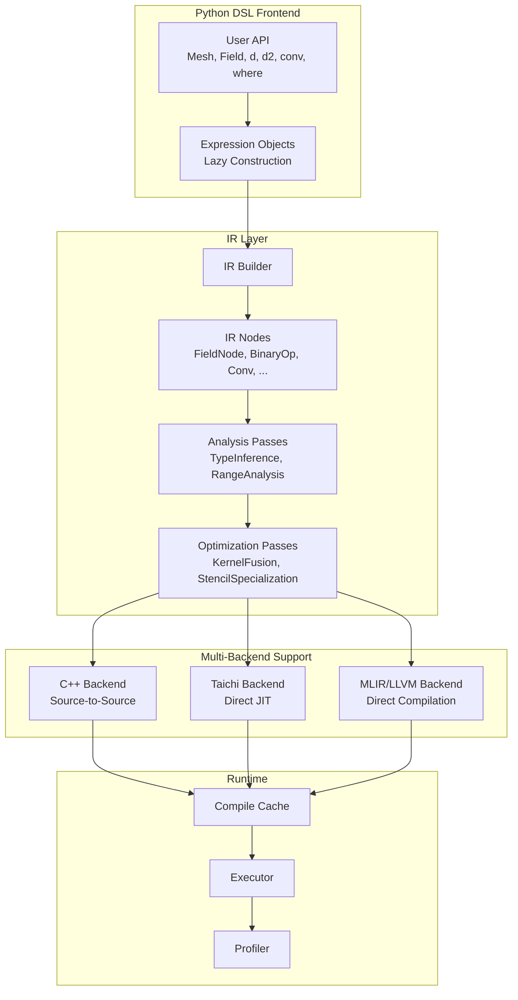
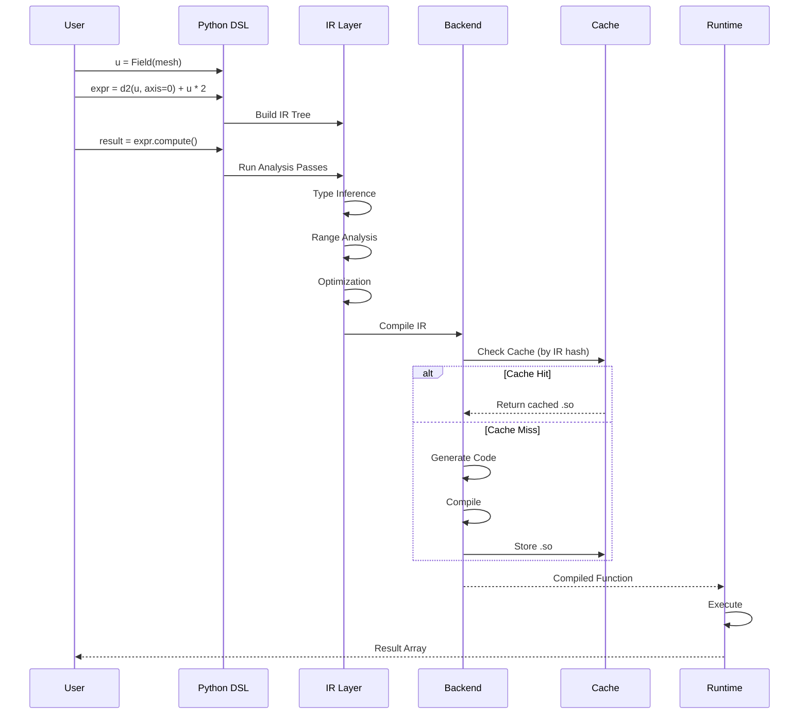

# OpFlow Python DSL JIT 迁移设计方案

## 1. 目标与范围

### 1.1 总体目标
将现有 C++ 模板元编程的 DSL 迁移到 Python，实现：
- **用户友好性提升**：Python 语法更简洁，无需处理模板复杂性
- **多后端兼容性**：支持 CPU、CUDA GPU、未来扩展其他后端
- **领域特征优化扩展性**：便于添加领域特定优化 Pass
- **渐进式迁移路径**：先源到源，后直接编译

### 1.2 迁移阶段

| 阶段 | 方案 | 输出 | 时间估计 |
|------|------|------|----------|
| Phase 1 | 源到源 JIT | C++ 代码 → 编译 → 动态加载 | 2-3 月 |
| Phase 2 | Taichi 后端 | Taichi JIT (CPU/GPU) | 1-2 月 |
| Phase 3 | MLIR/LLVM | 原生机器码 | 3-4 月 |

### 1.3 第一阶段范围

**支持特性**：
- 结构化网格 (Cartesian Mesh)
- 逐点算子 (Pointwise Operations)
- Stencil/卷积算子
- 归约操作 (Reduction)
- 基础边界条件

**非目标（Phase 1）**：
- AMR 网格
- 非结构网格
- 复杂求解器（留在 Phase 2+）

---

## 2. 现有 C++ DSL 分析

### 2.1 语法要素映射表

| C++ 语法 | Python DSL 语法 | 说明 |
|----------|-----------------|------|
| `CartesianMesh<Meta::int_<2>>` | `CartesianMesh(shape=(..., ...), extent=...)` | 网格类型实例化 |
| `CartesianField<Real, Mesh>` | `Field(mesh, dtype="float64")` | 类型参数简化 |
| `u + v` | `u + v` | 运算符重载（Python 原生支持） |
| `u * 2.0` | `u * 2.0` | 标量广播（Python 原生） |
| `struct D1FirstOrderCentered {...}` | `@op.operator def D1FirstOrderCentered(...)` | 单点计算格式定义 |
| `dx<D1FirstOrderCentered>(u)` | `d(u, axis=0, scheme=D1FirstOrderCentered)` | scheme 参数指定格式 |
| `conv(u, kernel)` | `conv(u, kernel)` | 直接映射 |
| `conditional(c, t, f)` | `t if c else f` | Python 三元运算符 |
| `rangeFor(range, func)` | `for i, j in mesh.interior_range():` | kernel 内显式循环 |
| `rangeReduce(range, +, func)` | `total += expr` (原子 `+=`) | 隐式规约 |
| **编译单元** | `@op.kernel` 装饰器 | 整个函数作为 JIT 单元 |
| **算子定义** | `@op.operator` 装饰器 | 单点计算格式 |

### 2.2 编译单元：从表达式到 Kernel 函数

**C++ 方式**：表达式模板 + 赋值触发计算
```cpp
// C++: 表达式模板延迟计算，赋值触发
auto expr = u + dt * (d2x<D2SecondOrderCentered>(u) + d2y<D2SecondOrderCentered>(u));
w = expr;  // 赋值触发计算
```

**Python 方式**：`@op.kernel` 装饰器标记整个函数为编译单元
```python
import opflow as op
from opflow.schemes import D2SecondOrderCentered

# Python: @op.kernel 标记整个函数为 JIT 编译单元
@op.kernel
def diffusion_step(u: Field, w: Field, dt: float):
    """时间推进 kernel - 使用算子而非手动展开"""
    lap = op.d2(u, axis=0, scheme=D2SecondOrderCentered) + \
          op.d2(u, axis=1, scheme=D2SecondOrderCentered)
    w.assign(u + dt * lap)

# 调用时触发 JIT（首次）或直接执行（后续）
diffusion_step(u, w, dt=0.001)
```

**关键差异**：

| 特性 | C++ 表达式模板 | Python `@op.kernel` |
|------|----------------|---------------------|
| 编译单元 | 单个赋值表达式 | 整个函数 |
| 触发时机 | 赋值操作 | 函数调用 |
| 控制流 | 受限（表达式内无循环） | 完整支持（kernel 内可有循环/分支） |
| 可读性 | 模板元编程复杂 | 原生 Python 语法 |
| 调试 | 困难（编译期错误难定位） | 编译期约束检查 + 清晰错误信息 |

### 2.3 算子定义：从模板结构体到 `@op.operator`

**C++ 方式**：模板结构体定义单点格式
```cpp
// C++: 算子模板结构体
struct D1FirstOrderCentered {
    static constexpr int width = 2;

    template <typename Field>
    static auto apply(const Field& f, int i, int j) {
        // dx 从 mesh 中获取
        return (f[i+1, j] - f[i-1, j]) / (2.0 * f.mesh().dx(0));
    }
};

// 使用
auto du = dx<D1FirstOrderCentered>(u);
```

**Python 方式**：`@op.operator` 装饰器定义单点格式
```python
import opflow as op
from opflow import d

# Python: @op.operator 定义单点计算格式
@op.operator
def D1FirstOrderCentered(f: FieldAccessor, i: int, j: int) -> float:
    """一阶中心差分: (f[i+1] - f[i-1]) / (2*dx)，dx 从 mesh 获取"""
    dx = f.mesh.dx[0]  # 从 mesh 获取网格间距
    return (f[i+1, j] - f[i-1, j]) / (2.0 * dx)

# 使用
du = d(u, axis=0, scheme=D1FirstOrderCentered)

# 或在 kernel 中通过 d() 调用
@op.kernel
def compute_gradient(u: Field, du: Field):
    """du = d(u)/dx"""
    du.assign(d(u, axis=0, scheme=D1FirstOrderCentered))
```

**Operator vs Kernel 职责分离**：

| 特性 | `@op.operator` | `@op.kernel` |
|------|----------------|--------------|
| 定义内容 | 单点计算格式 | 循环结构 + 并行策略 |
| 可复用性 | 高（可传给任意 `d()` 调用） | 低（特定场景） |
| 参数类型 | `FieldAccessor` (只读) | `Field` (读写) |
| 网格参数 | 从 `f.mesh` 获取 | 从 `Field.mesh` 获取 |
| 并行化 | 由调用方决定 | 自身包含并行循环 |
| 典型用途 | 微分格式、插值、滤波 | 求解器核心循环 |

### 2.4 语义要素

**Range 传播**：
- `accessibleRange`: 可安全访问的范围
- `localRange`: 本进程负责的范围
- `assignableRange`: 可写入的范围
- `logicalRange`: 逻辑全范围

**边界条件处理**：
- Dirichlet BC: `BCType::Dirc, value`
- Neumann BC: `BCType::Neum, value`
- 周期 BC: `BCType::Periodic`

**Kernel 函数约束**（Python DSL 新增）：
- 参数必须有类型标注
- Field 参数必须共享同一 mesh
- 循环范围必须是 `mesh.range()` 变体
- 索引表达式必须仿射
- 禁止动态 Python 构造（动态代码执行、import、class 等）

### 2.5 类型系统

```
Expr (基类)
├── FieldExpr
│   ├── elem_type: 元素类型 (float64, int32, ...)
│   ├── dim: 维度
│   ├── mesh_type: 网格类型
│   └── access_flag: 读写权限
├── ScalarExpr
│   └── value: 标量值
└── Expression<Op, Args...>
    ├── Op: 操作符类型
    └── Args: 参数类型列表
```

**Python DSL 扩展类型**：

```
KernelFunction
├── name: 函数名
├── params: List[Param]  # 带类型标注的参数
│   ├── name: 参数名
│   ├── type: Field | float | int
│   └── is_output: bool
├── body: List[Statement]  # 函数体 AST
├── loop_vars: Set[str]    # 循环变量
├── reduction_vars: Set[str]  # 归约变量
└── return_type: void | float | int
```

---

## 3. Python DSL 设计

### 3.1 Mesh 类型层次设计

现有 C++ 实现中有多种 Mesh 类型，之间存在共性与个性关系：

```
MeshBase (抽象基类)
├── StructuredMesh (结构化网格)
│   ├── CartesianMesh (笛卡尔网格) - 最常用
│   └── CurvilinearMesh (曲线网格)
├── SemiStructuredMesh (半结构化网格)
│   └── CartesianAMRMesh (AMR 自适应网格)
└── UnstructuredMesh (非结构化网格)
    ├── TriangleMesh (三角形网格)
    └── TetrahedronMesh (四面体网格)
```

**Python DSL Mesh 设计**：

```python
from abc import ABC, abstractmethod
from typing import Tuple, Optional
from enum import Enum, auto
import numpy as np

class MeshKind(Enum):
    """网格类型枚举"""
    CARTESIAN = auto()
    AMR = auto()
    CURVILINEAR = auto()
    UNSTRUCTURED = auto()

class MeshBase(ABC):
    """网格抽象基类 - 定义所有网格的共性接口"""

    @property
    @abstractmethod
    def dim(self) -> int:
        """网格维度"""
        pass

    @property
    @abstractmethod
    def kind(self) -> MeshKind:
        """网格类型"""
        pass

    @abstractmethod
    def cell_volume(self, *indices) -> float:
        """返回指定单元格的体积"""
        pass

    @abstractmethod
    def cell_center(self, *indices) -> Tuple[float, ...]:
        """返回指定单元格的中心坐标"""
        pass

    @abstractmethod
    def interior_range(self) -> "IndexRange":
        """返回内部索引范围（不含 halo）"""
        pass


class CartesianMesh(MeshBase):
    """笛卡尔网格 - 最常用的规则网格

    特性：
    - 支持均匀和非均匀间距
    - 正交坐标
    """

    def __init__(
        self,
        shape: Tuple[int, ...],
        *,
        extent: Optional[Tuple[float, ...]] = None,  # 均匀网格
        dx: Optional[Union[float, Tuple[float, ...], Tuple[np.ndarray, ...]]] = None,
    ):
        """
        创建笛卡尔网格

        均匀网格 - 方式 1：extent
            mesh = CartesianMesh(shape=(100, 100), extent=(0, 1, 0, 1))

        均匀网格 - 方式 2：dx 标量
            mesh = CartesianMesh(shape=(100, 100), dx=0.01)
            mesh = CartesianMesh(shape=(100, 100), dx=(0.01, 0.02))

        非均匀网格 - 方式 3：dx 数组
            mesh = CartesianMesh(shape=(100, 100), dx=(x_coords, y_coords))
        """
        self._shape = shape
        self._dim = len(shape)

        if extent is not None and dx is not None:
            raise ValueError("extent 和 dx 不能同时指定")

        if extent is not None:
            self._dx = tuple(
                (extent[2*i + 1] - extent[2*i]) / shape[i]
                for i in range(self._dim)
            )
        elif dx is not None:
            if isinstance(dx, (int, float)):
                self._dx = tuple(float(dx) for _ in range(self._dim))
            elif isinstance(dx, tuple):
                if len(dx) != self._dim:
                    raise ValueError(f"dx 长度必须等于维度数")
                self._dx = dx
            else:
                raise TypeError(f"dx 类型错误")
        else:
            raise ValueError("必须指定 extent 或 dx")

    @property
    def dim(self) -> int:
        return self._dim

    @property
    def kind(self) -> MeshKind:
        return MeshKind.CARTESIAN

    @property
    def is_uniform(self) -> bool:
        """是否为均匀网格"""
        return all(not isinstance(d, np.ndarray) for d in self._dx)

    @property
    def dx(self) -> Tuple[float, ...]:
        """网格间距（均匀网格返回常量，非均匀返回数组）"""
        return self._dx

    @property
    def shape(self) -> Tuple[int, ...]:
        return self._shape

    def __getitem__(self, key) -> Union[float, np.ndarray]:
        """支持 mesh.dx[0] 和 mesh.dx[0, i] 语法

        对应 C++:
        - mesh.dx(d)        → mesh.dx[d]
        - mesh.dx(d, i)     → mesh.dx[d, i]

        用法：
            dx = mesh.dx[0]        # 均匀网格，第 0 维间距
            dx = mesh.dx[0, i]      # 第 0 维，在 index i 位置的间距
            dx = mesh.dx[0, i]      # i 可以是完整的多维索引
        """
        if isinstance(key, int):
            val = self._dx[key]
            return float(val) if not isinstance(val, np.ndarray) else val
        elif isinstance(key, tuple):
            axis, index = key[0], key[1]
            val = self._dx[axis]
            if isinstance(val, np.ndarray):
                return float(val[index])
            else:
                return float(val)


class AMRMesh(MeshBase):
    """AMR 自适应网格 - 半结构化层次网格

    特性：
    - 多层级嵌套
    - 动态自适应
    - 各层级独立的 CartesianMesh
    """

    def __init__(
        self,
        base_shape: Tuple[int, ...],
        levels: int,
        refinement_ratio: int = 2
    ):
        self._base_shape = base_shape
        self._levels = levels
        self._refinement_ratio = refinement_ratio

    @property
    def kind(self) -> MeshKind:
        return MeshKind.AMR

    def level_mesh(self, level: int) -> CartesianMesh:
        """返回指定层级的网格"""
        ...


### 3.1.2 Field 类设计

```python
from typing import Optional, Union, Tuple, Dict
from enum import Enum, auto
from dataclasses import dataclass
import numpy as np

class LocOnMesh(Enum):
    """变量在网格上的位置（每维独立）

    对应 C++: LocOnMesh { Center, Corner }
    """
    CENTER = auto()  # 单元中心
    CORNER = auto()  # 网格角点


class DimPos(Enum):
    """边界位置

    对应 C++: DimPos { start, end }
    """
    START = auto()
    END = auto()


class BCType(Enum):
    """边界条件类型

    对应 C++: BCType { Dirc, Neum, Symm, Asym, Periodic, ... }
    """
    # 需要值的 BC
    DIRC = auto()      # Dirichlet: u = value
    NEUM = auto()      # Neumann: du/dn = value
    ROBIN = auto()     # Robin: a*u + b*du/dn = c

    # 逻辑 BC（不需要值）
    SYMM = auto()      # 对称
    ASYM = auto()      # 反对称
    PERIODIC = auto()  # 周期


@dataclass
class ConstBC:
    """常量边界条件"""
    bc_type: BCType
    value: Optional[float] = None
    # Robin BC 参数: a*u + b*du/dn = c
    robin_a: Optional[float] = None
    robin_b: Optional[float] = None
    robin_c: Optional[float] = None


@dataclass
class LogicalBC:
    """逻辑边界条件（对称、反对称、周期）"""
    bc_type: BCType


class Field:
    """字段类 - 定义在网格上的标量场

    特性：
    - halo 是 Field 的属性（不是 Mesh）
    - loc 是每维独立的（支持交错网格）
    - 支持边界条件设置
    - 支持 NumPy 互操作

    对应 C++: CartesianField<D, M, C>
    """

    def __init__(
        self,
        mesh: MeshBase,
        *,
        dtype: str = "float64",
        halo: int = 0,
        loc: Union[LocOnMesh, Tuple[LocOnMesh, ...]] = LocOnMesh.CENTER,
        name: Optional[str] = None,
    ):
        """
        创建字段

        对应 C++: ExprBuilder<Field>().setMesh(mesh).setExt(halo).setLoc(loc).build()

        参数：
            mesh: 网格对象
            dtype: 数据类型 ("float32" | "float64")
            halo: 边界扩展宽度（stencil 计算需要）
            loc: 变量位置（每维独立）
                - 单个值: 所有维度使用相同位置
                - 元组: 每维指定位置 (例如 2D: (CENTER, CENTER))
            name: 字段名称（调试用）

        示例：
            # 标准中心场
            p = Field(mesh, halo=1, loc=LocOnMesh.CENTER)

            # 交错网格：x-速度在角点，y-速度在中心
            u = Field(mesh, halo=1, loc=(LocOnMesh.CORNER, LocOnMesh.CENTER))
            v = Field(mesh, halo=1, loc=(LocOnMesh.CENTER, LocOnMesh.CORNER))
        """
        self._mesh = mesh
        self._dtype = dtype
        self._halo = halo
        self._name = name or f"field_{id(self)}"

        # 标准化 loc 为元组（每维一个）
        if isinstance(loc, LocOnMesh):
            self._loc = tuple(loc for _ in range(mesh.dim))
        else:
            if len(loc) != mesh.dim:
                raise ValueError(f"loc 长度 ({len(loc)}) 必须等于网格维度 ({mesh.dim})")
            self._loc = tuple(loc)

        # 边界条件字典: key = (axis, pos) where pos = DimPos.START | DimPos.END
        self._bc: Dict[Tuple[int, DimPos], Union[ConstBC, LogicalBC]] = {}

        # 计算含 halo 的总 shape
        total_shape = tuple(s + 2 * halo for s in mesh.shape)
        self._buffer = np.zeros(total_shape, dtype=dtype)
        # 内部视图（不含 halo）
        if halo > 0:
            slices = tuple(slice(halo, -halo) for _ in range(mesh.dim))
            self._array = self._buffer[slices]
        else:
            self._array = self._buffer

    @property
    def mesh(self) -> MeshBase:
        return self._mesh

    @property
    def dtype(self) -> str:
        return self._dtype

    @property
    def halo(self) -> int:
        return self._halo

    @property
    def loc(self) -> Tuple[LocOnMesh, ...]:
        """每维的位置元组（只读）"""
        return self._loc

    @property
    def name(self) -> str:
        return self._name

    @property
    def ndarray(self) -> np.ndarray:
        """返回 NumPy 数组视图（不含 halo）"""
        return self._array

    def set_bc(
        self,
        d: int,
        pos: DimPos,
        bc_type: BCType,
        value: Optional[float] = None,
        **kwargs
    ):
        """设置边界条件

        对应 C++: setBC(int d, DimPos pos, BCType type, T val)

        参数：
            d: 维度索引 (0, 1, 2, ...)
            pos: 边界位置 (DimPos.START | DimPos.END)
            bc_type: 边界条件类型
            value: 边界值（对 DIRC/NEUM/ROBIN 有效）
            **kwargs: Robin BC 参数 (robin_a, robin_b, robin_c)

        示例：
            # Dirichlet: u = 0
            u.set_bc(0, DimPos.START, BCType.DIRC, 0.0)

            # Neumann: du/dx = 0
            u.set_bc(0, DimPos.END, BCType.NEUM, 0.0)

            # 周期边界（两侧都要设置）
            u.set_bc(1, DimPos.START, BCType.PERIODIC)
            u.set_bc(1, DimPos.END, BCType.PERIODIC)

            # Robin: 2*u + 3*du/dn = 5
            u.set_bc(0, DimPos.START, BCType.ROBIN, robin_a=2.0, robin_b=3.0, robin_c=5.0)
        """
        if bc_type in (BCType.DIRC, BCType.NEUM, BCType.ROBIN):
            if value is None and bc_type != BCType.ROBIN:
                raise ValueError(f"{bc_type.name} BC requires a value")
            bc_node = ConstBC(bc_type, value, **kwargs)
        elif bc_type in (BCType.SYMM, BCType.ASYM, BCType.PERIODIC):
            bc_node = LogicalBC(bc_type)
        else:
            raise ValueError(f"Unsupported BC type: {bc_type}")

        self._bc[(d, pos)] = bc_node
        return self  # 支持链式调用

    def fill(self, value: float):
        """填充常量值"""
        self._array.fill(value)

    def assign(self, other: Union["Field", "ExprNode"]):
        """赋值操作 - 触发 JIT 编译"""
        # 在 kernel 中使用: du.assign(d(u, axis=0))
        # 这里会触发表达式求值和 JIT 编译
        ...

    # 运算符重载
    def __add__(self, other) -> "ExprNode":
        return BinaryOpNode(OpType.ADD, self, _wrap(other))

    def __sub__(self, other) -> "ExprNode":
        return BinaryOpNode(OpType.SUB, self, _wrap(other))

    def __mul__(self, other) -> "ExprNode":
        return BinaryOpNode(OpType.MUL, self, _wrap(other))

    def __truediv__(self, other) -> "ExprNode":
        return BinaryOpNode(OpType.DIV, self, _wrap(other))

    def __neg__(self) -> "ExprNode":
        return UnaryOpNode(OpType.NEG, self)

    # 索引操作（在 kernel 外使用）
    def __getitem__(self, key):
        """返回 NumPy 风格的切片"""
        return self._array[key]

    def __setitem__(self, key, value):
        """设置元素值（Host 代码）"""
        self._array[key] = value
```

#### 使用示例

```python
# === 网格创建（halo 不在 Mesh 上）===
mesh = CartesianMesh(shape=(100, 100), extent=(0, 1, 0, 1))

# === 标准场 ===
p = Field(mesh, halo=1, dtype="float64", name="p")  # 3点 stencil 需要 halo=1
p.set_bc(0, DimPos.START, BCType.DIRC, 0.0)
p.set_bc(0, DimPos.END, BCType.DIRC, 0.0)
p.set_bc(1, DimPos.START, BCType.PERIODIC)
p.set_bc(1, DimPos.END, BCType.PERIODIC)

# === 交错网格 ===
# 压强在中心
p = Field(mesh, halo=1, loc=LocOnMesh.CENTER)

# x-速度在 x 方向的角点，y 方向的中心
u = Field(mesh, halo=1, loc=(LocOnMesh.CORNER, LocOnMesh.CENTER), name="u")

# y-速度在 x 方向的中心，y 方向的角点
v = Field(mesh, halo=1, loc=(LocOnMesh.CENTER, LocOnMesh.CORNER), name="v")

# === 不同 Field 可以有不同的 halo ===
u = Field(mesh, halo=1)  # 3点 stencil
v = Field(mesh, halo=2)  # 5点 stencil (WENO)
```

### 3.1.3 MDIndex 多维索引类型

```python
from dataclasses import dataclass
from typing import Tuple

@dataclass(frozen=True)
class MDIndex:
    """多维索引 - 对应 C++ 的 MDIndex<d>

    C++ 定义：
    template <std::size_t d>
    struct MDIndex {
        std::array<int, d> idx;

        constexpr auto next(int steps = 1) const;  // 在 dim=0 上移动
        constexpr auto prev(int steps = 1) const;

        constexpr auto& operator[](int i);
        constexpr auto operator+(const MDIndex&) const;
        constexpr auto operator-(const MDIndex&) const;
    };

    特性：
    - 不可变（frozen=True）
    - 支持加减运算
    - 支持 next(dim)/prev(dim) 在特定维度移动
    - 维度由初始化时的索引数量决定
    """
    _indices: Tuple[int, ...]

    def __init__(self, *indices: int):
        object.__setattr__(self, '_indices', indices)

    @property
    def dim(self) -> int:
        """维度数"""
        return len(self._indices)

    def __getitem__(self, key: int) -> int:
        """访问特定维度的索引"""
        return self._indices[key]

    def __len__(self) -> int:
        return len(self._indices)

    def __iter__(self):
        return iter(self._indices)

    def __repr__(self) -> str:
        return f"MDIndex{self._indices}"

    def __eq__(self, other: "MDIndex") -> bool:
        if not isinstance(other, MDIndex):
            return False
        return self._indices == other._indices

    def __hash__(self) -> int:
        return hash(self._indices)

    # === 运算符 ===
    def __add__(self, other: "MDIndex") -> "MDIndex":
        """对应 C++: operator+"""
        if self.dim != other.dim:
            raise ValueError("Dimension mismatch")
        return MDIndex(*(a + b for a, b in zip(self._indices, other._indices)))

    def __sub__(self, other: "MDIndex") -> "MDIndex":
        """对应 C++: operator-"""
        if self.dim != other.dim:
            raise ValueError("Dimension mismatch")
        return MDIndex(*(a - b for a, b in zip(self._indices, other._indices)))

    # === 特定维度移动 ===
    def next(self, axis: int, steps: int = 1) -> "MDIndex":
        """在指定维度上向前移动

        对应 C++: i.template next<d>(steps)

        示例：
            i = MDIndex(5, 10)
            i.next(0)  # MDIndex(6, 10)  - x 方向 +1
            i.next(1)  # MDIndex(5, 11)  - y 方向 +1
            i.next(0, 2)  # MDIndex(7, 10)  - x 方向 +2
        """
        lst = list(self._indices)
        lst[axis] += steps
        return MDIndex(*lst)

    def prev(self, axis: int, steps: int = 1) -> "MDIndex":
        """在指定维度上向后移动

        对应 C++: i.template prev<d>(steps)

        示例：
            i = MDIndex(5, 10)
            i.prev(0)  # MDIndex(4, 10)  - x 方向 -1
            i.prev(1)  # MDIndex(5, 9)   - y 方向 -1
        """
        lst = list(self._indices)
        lst[axis] -= steps
        return MDIndex(*lst)

    # === 转换 ===
    def to_tuple(self) -> Tuple[int, ...]:
        """转换为普通元组"""
        return self._indices

    @classmethod
    def from_tuple(cls, indices: Tuple[int, ...]) -> "MDIndex":
        """从元组创建"""
        return cls(*indices)


# === 使用示例 ===
i = MDIndex(5, 10)       # 2D 索引 (5, 10)
i_next_x = i.next(0)     # MDIndex(6, 10)
i_prev_y = i.prev(1)     # MDIndex(5, 9)
i_plus = i + MDIndex(1, 2)  # MDIndex(6, 12)

j = MDIndex(3, 4, 5)     # 3D 索引
k = MDIndex(1, 1, 1)
l = j + k                # MDIndex(4, 5, 6)
```

#### mesh.dx 索引接口（支持 MDIndex）

```python
class CartesianMesh:
    def __getitem__(self, key) -> Union[float, np.ndarray]:
        """支持多种索引语法

        - mesh.dx[0] → 整个轴的间距（均匀是 float，非均匀是 np.ndarray）
        - mesh.dx[0, i] → 第 0 维在标量 i 处的间距
        - mesh.dx[0, MDIndex(...)] → 第 0 维在多维索引处（非均匀网格）

        对应 C++：
        - mesh.dx(d)           → mesh.dx[d]
        - mesh.dx(d, i)        → mesh.dx[d, i]
        """
        if isinstance(key, int):
            # mesh.dx[0]
            val = self._dx[key]
            return float(val) if not isinstance(val, np.ndarray) else val

        elif isinstance(key, tuple):
            axis, index = key[0], key[1]
            val = self._dx[axis]

            if isinstance(val, np.ndarray):
                # 非均匀网格
                if isinstance(index, MDIndex):
                    # mesh.dx[0, MDIndex(i, j)] → 提取第 0 维在 i 处的间距
                    return float(val[index[axis]])
                elif isinstance(index, tuple):
                    return float(val[index[axis]])
                else:
                    return float(val[index])
            else:
                # 均匀网格：返回常量
                return float(val)
```

### 3.2 `@op.operator` 算子定义

#### 3.2.1 C++ Operator 概念映射

C++ 中 Operator 是定义**单点计算格式**的模板类，描述如何在某一点上使用邻域值进行计算：

```cpp
// C++: 一阶中心差分算子（使用 MDIndex）
template <std::size_t d>
struct D1FirstOrderCentered {
    constexpr static auto bc_width = 1;

    template <CartesianFieldExprType E, typename I>
    OPFLOW_STRONG_INLINE static auto eval(const E& e, I i) {
        // i 是 MDIndex<d> 类型
        // i.template prev<d>() 在维度 d 上减 1
        // e.mesh.dx(d, i[d]) 获取非均匀网格在位置 i[d] 的间距
        return (e.evalAt(i) - e.evalAt(i.template prev<d>()))
               / (e.mesh.dx(d, i[d] - 1) + e.mesh.dx(d, i[d])) * 2;
    }
};

// 使用：dx 和 dy 是不同的模板实例化
auto du = dx<D1FirstOrderCentered>(u);  // d=0, 对 MDIndex<2>
auto dv = dy<D1FirstOrderCentered>(u);  // d=1, 对 MDIndex<2>
```

Python DSL 使用 `@op.operator` 装饰器定义等效的单点格式：

```python
import opflow as op

@op.operator
def D1FirstOrderCentered(f: FieldAccessor, axis: int, i: MDIndex) -> float:
    """一阶中心差分 - 维度无关，支持非均匀网格

    对应 C++: template <std::size_t d> struct D1FirstOrderCentered

    参数：
        f: 字段访问器
        axis: 求导方向（C++ 中是模板参数，Python 中作为参数传递）
        i: 多维索引

    使用：
        du = d(u, axis=0, scheme=D1FirstOrderCentered)  # x 方向
        dv = d(v, axis=1, scheme=D1FirstOrderCentered)  # y 方向
    """
    # 非均匀网格：获取 i 位置的 dx
    dx = f.mesh.dx[axis, i]

    # i.next(axis) 和 i.prev(axis) 对应 C++ 的 i.template next<d>() 和 i.template prev<d>()
    return (f[i.next(axis)] - f[i.prev(axis)]) / (2.0 * dx)


@op.operator
def D1SecondOrderCentered(f: FieldAccessor, axis: int, i: MDIndex) -> float:
    """二阶中心差分"""
    dx = f.mesh.dx[axis, i]
    return (-f[i.next(axis, 2)] + 8.0*f[i.next(axis)] -
            8.0*f[i.prev(axis)] + f[i.prev(axis, 2)]) / (12.0 * dx)


@op.operator
def D2SecondOrderCentered(f: FieldAccessor, axis: int, i: MDIndex) -> float:
    """二阶导数中心差分 - 支持非均匀网格"""
    # 非均匀网格二阶差分公式
    dx_plus = f.mesh.dx[axis, i.next(axis)]
    dx_minus = f.mesh.dx[axis, i.prev(axis)]

    u_right = f[i.next(axis)]
    u_center = f[i]
    u_left = f[i.prev(axis)]

    return 2.0 / (dx_plus + dx_minus) * (
        (u_right - u_center) / dx_plus - (u_center - u_left) / dx_minus
    )


@op.operator
def D1WENO53Upwind(f: FieldAccessor, axis: int, i: MDIndex) -> float:
    """WENO 5点 3阶迎风格式"""
    dx = f.mesh.dx[axis, i]

    # WENO 权重计算（在 axis 方向）
    f1 = f[i.prev(axis, 2)]
    f2 = f[i.prev(axis)]
    f3 = f[i]
    f4 = f[i.next(axis)]
    f5 = f[i.next(axis, 2)]

    # 三个子模板
    q1 = (2*f1 - 7*f2 + 11*f3) / 6.0
    q2 = (-f2 + 5*f3 + 2*f4) / 6.0
    q3 = (2*f3 + 5*f4 - f5) / 6.0

    # 光滑指示子
    s1 = (13/12.0)*(f1-2*f2+f3)**2 + 0.25*(f1-4*f2+3*f3)**2
    s2 = (13/12.0)*(f2-2*f3+f4)**2 + 0.25*(f2-f4)**2
    s3 = (13/12.0)*(f3-2*f4+f5)**2 + 0.25*(3*f3-4*f4+f5)**2

    eps = 1e-6
    a1 = 0.1 / (s1 + eps)**2
    a2 = 0.6 / (s2 + eps)**2
    a3 = 0.3 / (s3 + eps)**2

    w1, w2, w3 = a1/(a1+a2+a3), a2/(a1+a2+a3), a3/(a1+a2+a3)
    return w1*q1 + w2*q2 + w3*q3
```

#### 3.2.2 `@op.operator` 接口规范

**函数签名约束**：

```python
@op.operator
def MyOperator(
    f: FieldAccessor,  # 字段访问器（只读访问邻域，含 mesh 信息）
    axis: int,         # 操作轴（可选，单轴 operator 需要）
    i: MDIndex,        # 当前点多维索引
    **kwargs           # 可选额外参数
) -> float:            # 返回单点计算结果
    ...
```

**约束**：
1. 第一个参数必须是 `FieldAccessor`（只读字段访问，可访问 `f.mesh`）
2. 第二个参数（可选）是 `axis: int`，指定操作维度
3. 第三个参数必须是 `i: MDIndex`，多维索引类型
4. 返回类型必须是 `float`
5. 函数体内只能进行纯计算（无副作用）
6. 对 `f` 的访问必须通过 `i.next(axis)` / `i.prev(axis)` 或 `MDIndex` 运算
7. 网格参数通过 `f.mesh.dx[axis, i]` 获取（支持非均匀网格）

**FieldAccessor vs Field**：

```python
# FieldAccessor: 只读访问器，用于 operator 内部
@op.operator
def MyOp(f: FieldAccessor, i: int, j: int) -> float:
    return f[i] + f[i.next(0)]  # ✅ 只读访问，使用 MDIndex

@op.operator
def BadOp(f: Field, axis: int, i: MDIndex) -> float:  # ❌ 必须用 FieldAccessor
    f[i] = 0.0  # ❌ operator 内禁止写入
    return f[i]
```

#### 3.2.3 Operator 元数据

```python
@op.operator(
    name="d1_first_order_centered",  # 可选：显式命名
    order=1,                          # 精度阶数
    stencil_width=2,                  # stencil 宽度（单侧点数）
    category="d1"                     # 类别: d1, d2, conv, custom
)
def D1FirstOrderCentered(f: FieldAccessor, axis: int, i: MDIndex) -> float:
    dx = f.mesh.dx[axis, i]
    return (f[i.next(axis)] - f[i.prev(axis)]) / (2.0 * dx)


# 元数据访问
print(D1FirstOrderCentered.order)         # 1
print(D1FirstOrderCentered.stencil_width) # 2
print(D1FirstOrderCentered.category)      # "d1"
```

#### 3.2.4 使用 Operator

**在 `d()`, `d2()` 中使用**：

```python
from opflow import d, d2
from opflow.schemes import D1FirstOrderCentered, D2SecondOrderCentered
from opflow.operators import MyCustomOperator  # 自定义 operator

# 使用内置 operator（同一个 operator 用于不同轴）
du = d(u, axis=0, scheme=D1FirstOrderCentered)  # x 方向
dv = d(v, axis=1, scheme=D1FirstOrderCentered)  # y 方向

# 使用自定义 operator
du_custom = d(u, axis=0, scheme=MyCustomOperator)

# 二阶导数
d2u = d2(u, axis=0, scheme=D2SecondOrderCentered)

# 混合使用 - 同一个 operator 用于不同轴
laplacian = d2(u, axis=0, scheme=D2SecondOrderCentered) + \
            d2(u, axis=1, scheme=D2SecondOrderCentered)
```

**在 `@op.kernel` 中通过 `d()` 使用**：

```python
@op.kernel
def custom_diffusion(u: Field, du: Field):
    """使用自定义 operator 的 kernel"""
    du.assign(d(u, axis=0, scheme=D1FirstOrderCentered))
```

#### 3.2.5 Operator 与 `@op.kernel` 的关系

```
┌─────────────────────────────────────────────────────────────────┐
│                    @op.kernel                                   │
│  ┌───────────────────────────────────────────────────────────┐  │
│  │  du.assign(d(u, axis=0, scheme=D1FirstOrderCentered))     │  │
│  │                   │                                       │  │
│  │                   ▼  内部展开为逐点调用                     │  │
│  │  ┌─────────────────────────────────────────────────────┐  │  │
│  │  │  @op.operator                                       │  │  │
│  │  │  def D1FirstOrderCentered(f, axis, i):             │  │  │
│  │  │      dx = f.mesh.dx[axis, i]                        │  │  │
│  │  │      return (f[i.next(axis)] - f[i.prev(axis)])... │  │  │
│  │  └─────────────────────────────────────────────────────┘  │  │
│  └───────────────────────────────────────────────────────────┘  │
└─────────────────────────────────────────────────────────────────┘

Kernel: 定义整个循环结构和并行策略
Operator: 定义单点上的计算格式（可复用），从 f.mesh 获取网格参数
i 是 MDIndex 类型，通过 i.next(axis)/i.prev(axis) 访问邻域
```

#### 3.2.6 内置 Operator 库

```python
# opflow.schemes - 内置微分格式

# 一阶导数（维度无关）
D1FirstOrderForward    # 前向差分
D1FirstOrderBackward   # 后向差分
D1FirstOrderCentered   # 中心差分
D1SecondOrderCentered  # 二阶中心
D1WENO53Upwind         # WENO-5 迎风
D1WENO53Downwind       # WENO-5 顺风
D1Quick                # QUICK 格式

# 二阶导数（维度无关）

# 混合导数（不需要 axis 参数）
D2MixedOrderCentered   # 混合导数 ∂²f/∂x∂y
```

#### 3.2.7 LocOnMesh 处理

**设计决策**：`loc` 是 Field 的属性，Operator 通过 `f.loc[axis]` 获取

```python
class FieldAccessor:
    """字段访问器 - Operator 内部使用"""

    @property
    def loc(self) -> Tuple[LocOnMesh, ...]:
        """返回当前字段在各维度的位置类型

        对应 C++: f.loc[d]
        """
        return self._field.loc


# === Operator 根据 loc 选择正确的计算方式 ===

@op.operator
def D1FirstOrderCentered(f: FieldAccessor, axis: int, i: MDIndex) -> float:
    """一阶中心差分 - 自动适应 LocOnMesh

    根据 f.loc[axis] 选择正确的差分公式：
    - Center: 使用中心差分 (f[i+1] - f[i-1]) / 2dx
    - Corner: 使用单侧差分 (f[i+1] - f[i]) / dx
    """
    dx = f.mesh.dx[axis, i]

    if f.loc[axis] == LocOnMesh.CENTER:
        # Center 位置：标准中心差分
        return (f[i.next(axis)] - f[i.prev(axis)]) / (2.0 * dx)
    else:
        # Corner 位置：单侧差分
        return (f[i.next(axis)] - f[i]) / dx


@op.operator
def D2SecondOrderCentered(f: FieldAccessor, axis: int, i: MDIndex) -> float:
    """二阶中心差分 - 自动适应 LocOnMesh"""
    dx = f.mesh.dx[axis, i]

    if f.loc[axis] == LocOnMesh.CENTER:
        u_right = f[i.next(axis)]
        u_center = f[i]
        u_left = f[i.prev(axis)]
        return (u_right - 2.0 * u_center + u_left) / (dx * dx)
    else:
        # Corner 位置：可能需要不同的格式
        u_right = f[i.next(axis)]
        u_center = f[i]
        u_left = f[i.prev(axis)]
        return (u_right - 2.0 * u_center + u_left) / (dx * dx)


# === 使用示例 ===

# Center 位置的场
p = Field(mesh, halo=1, loc=LocOnMesh.CENTER)
dp = d(p, axis=0, scheme=D1FirstOrderCentered)  # 使用中心差分

# Corner 位置的场（交错网格）
u = Field(mesh, halo=1, loc=(LocOnMesh.CORNER, LocOnMesh.CENTER))
du = d(u, axis=0, scheme=D1FirstOrderCentered)  # 自动使用单侧差分
```

**C++ 对应代码**：

```cpp
// C++ 中 D1FirstOrderCentered 的 loc 处理
template <std::size_t d>
struct D1FirstOrderCentered {
    template <CartesianFieldExprType E, typename I>
    static auto eval(const E& e, I i) {
        return e.loc[d] == LocOnMesh::Center
               ? (e.evalAt(i) - e.evalAt(i.template prev<d>()))
                 / (e.mesh.dx(d, i[d] - 1) + e.mesh.dx(d, i[d])) * 2
               : (e.evalAt(i.template next<d>()) - e.evalAt(i)) / (e.mesh.dx(d, i[d]));
    }
};
```

#### 3.2.8 多轴 Operator

```python
@op.operator
def D2MixedCentered(f: FieldAccessor, i: MDIndex) -> float:
    """混合二阶导数 ∂²f/∂x∂y - 不需要 axis 参数

    混合导数访问多个轴，不使用 axis 参数
    """
    dx, dy = f.mesh.dx[0, i], f.mesh.dx[1, i]

    # f[i+1, j+1] - f[i+1, j-1] - f[i-1, j+1] + f[i-1, j-1]
    return (f[i.next(0).next(1)] - f[i.next(0).prev(1)] -
            f[i.prev(0).next(1)] + f[i.prev(0).prev(1)]) / (4.0 * dx * dy)


@op.kernel
def compute_hessian(u: Field, hxx: Field, hyy: Field, hxy: Field):
    hxx.assign(d2(u, axis=0, scheme=D2SecondOrderCentered))
    hyy.assign(d2(u, axis=1, scheme=D2SecondOrderCentered))
    hxy.assign(d2(u, scheme=D2MixedCentered))  # 混合导数（不需要 axis）
```

#### 3.2.8 Operator 编译与 IR 表示

```python
@dataclass
class OperatorIR:
    """Operator IR 表示"""
    name: str
    func: callable              # 原始 Python 函数
    signature: inspect.Signature
    stencil: List[MDIndex]      # 邻域偏移列表 [MDIndex(0,0), MDIndex(1,0), ...]
    order: int                  # 精度阶数
    category: str               # d1, d2, conv, custom
    has_axis: bool              # 是否接受 axis 参数

    def get_stencil_coefficients(self) -> Dict[MDIndex, float]:
        """提取 stencil 系数"""
        # 通过符号执行或 AST 分析提取
        ...


# 编译时 IR 提取
def compile_operator(op_func: callable) -> OperatorIR:
    source = inspect.getsource(op_func)
    tree = ast.parse(source)

    # 1. 分析 stencil 访问模式
    stencil_analyzer = StencilAnalyzer()
    stencil_analyzer.visit(tree)
    stencil = stencil_analyzer.get_stencil_offsets()

    # 2. 提取元数据
    metadata = getattr(op_func, '_op_metadata', {})

    # 3. 检查是否有 axis 参数
    sig = inspect.signature(op_func)
    params = list(sig.parameters.values())
    has_axis = len(params) >= 2 and params[1].name == "axis"

    return OperatorIR(
        name=op_func.__name__,
        func=op_func,
        signature=sig,
        stencil=stencil,
        order=metadata.get('order', 1),
        category=metadata.get('category', 'custom'),
        has_axis=has_axis
    )
```

#### 3.2.9 Operator 约束检查

```python
class OperatorChecker(ast.NodeVisitor):
    """Operator 约束检查器"""

    def check(self, func: callable) -> List[ConstraintError]:
        errors = []

        # 1. 检查签名
        sig = inspect.signature(func)
        params = list(sig.parameters.values())

        if len(params) < 2:
            errors.append("Operator must have at least 2 params: (f, i) or (f, axis, i)")

        # 第一个参数类型
        first_param = params[0]
        if not self._is_field_accessor(first_param):
            errors.append(f"First param must be FieldAccessor, got {first_param.annotation}")

        # 第二个参数：axis (可选) 或 i (MDIndex)
        if len(params) >= 3:
            # 有 axis 参数的情况: (f, axis, i)
            if params[1].name != "axis":
                errors.append(f"Second param must be 'axis', got {params[1].name}")
            if not self._is_mdindex(params[2]):
                errors.append(f"Third param must be MDIndex, got {params[2].annotation}")
        elif len(params) == 2:
            # 没有 axis 参数的情况: (f, i)
            if not self._is_mdindex(params[1]):
                errors.append(f"Second param must be MDIndex, got {params[1].annotation}")

        # 2. 检查返回类型
        if sig.return_annotation != float:
            errors.append(f"Return type must be float, got {sig.return_annotation}")

        # 3. 检查函数体（只读访问、无副作用）
        tree = ast.parse(inspect.getsource(func))
        for node in ast.walk(tree):
            # 禁止写入操作
            if isinstance(node, ast.Assign):
                if isinstance(node.targets[0], ast.Subscript):
                    errors.append("Operator cannot write to field (read-only)")

            # 禁止外部函数调用
            if isinstance(node, ast.Call):
                if isinstance(node.func, ast.Name):
                    if node.func.id not in ALLOWED_BUILTINS:
                        errors.append(f"Cannot call external function '{node.func.id}'")

        # 4. 检查索引仿射性（通过 MDIndex.next/prev）
        self._check_affine_indices(tree, errors)

        return errors
```

### 3.3 条件表达式 - Python 三元运算符

**设计决策**：使用 Python 原生三元运算符语法

```python
# Python 原生三元运算符（推荐）
flux = u * v if u > 0 else 0.0

# 多条件嵌套
result = (
    u + v if u > 0 and v > 0 else
    u - v if u > 0 else
    0.0
)

# 内部实现：AST 转换为 TernaryOpNode
# Python `a if cond else b` → IR TernaryOpNode(cond, a, b)
```

### 3.4 归约操作 - 原子 `+=` 重载

**设计决策**：通过重载 `+=` 等运算符实现隐式原子规约

```python
# 方式 1: for-range + 原子 +=（隐式规约）
total = 0.0
for i, j in mesh.interior_range():
    total += u[i, j] * mesh.cell_volume(i, j)

# 编译器识别 `total +=` 为规约操作，生成原子代码

# 方式 2: 内置规约方法
sum_val = u.sum()
max_val = u.max()
min_val = u.min()
norm_l2 = (u ** 2).sum() ** 0.5

# 方式 3: 多进程并行归约
integral = u.sum(parallel=True)  # 启用 OpenMP/MPI 归约
```

**实现原理**：

```python
class ReductionVar:
    """规约变量 - 原子操作代理"""

    def __init__(self, initial: float):
        self._value = initial

    def __iadd__(self, other) -> "ReductionVar":
        """原子 += 操作

        JIT 编译器识别此模式，生成：
        - OpenMP: `#pragma omp atomic`
        - CUDA: `atomicAdd()`
        - MPI: `MPI_Allreduce()`
        """
        # 运行时实现（调试用）
        self._value += other
        return self

    @property
    def value(self) -> float:
        return self._value
```

### 3.5 Kernel 函数设计

#### 3.5.1 `@op.kernel` 装饰器接口

JIT 编译的基本单元是**整个 kernel 函数**，而非单个表达式。使用 `@op.kernel` 装饰器标记需要 JIT 编译的函数：

```python
import opflow as op
from opflow import CartesianMesh, Field
from opflow.schemes import D2SecondOrderCentered

# === Kernel 函数定义 ===
@op.kernel
def laplacian_kernel(u: Field, du: Field, dx: float):
    """5点 Laplacian stencil 计算

    约束：
    - u, du 必须在同一 mesh 上
    - 循环范围由 mesh.interior_range() 决定
    - 索引访问必须在 halo 范围内
    """
    for i, j in u.mesh.interior_range():
        du[i, j] = (u[i-1, j] + u[i+1, j] +
                    u[i, j-1] + u[i, j+1] - 4.0 * u[i, j]) / (dx * dx)


@op.kernel
def time_step(u: Field, u_new: Field, dt: float, dx: float):
    """显式时间推进"""
    for i, j in u.mesh.interior_range():
        lap = (u[i-1, j] + u[i+1, j] +
               u[i, j-1] + u[i, j+1] - 4.0 * u[i, j]) / (dx * dx)
        u_new[i, j] = u[i, j] + dt * lap


@op.kernel
def compute_residual(u: Field, rhs: Field, res: Field, dx: float):
    """计算残差 = Laplacian(u) - rhs"""
    for i, j in u.mesh.interior_range():
        lap = (u[i-1, j] + u[i+1, j] +
               u[i, j-1] + u[i, j+1] - 4.0 * u[i, j]) / (dx * dx)
        res[i, j] = lap - rhs[i, j]


@op.kernel
def compute_l2_norm(u: Field) -> float:
    """归约：计算 L2 范数"""
    total = 0.0  # ReductionVar - 原子累加
    for i, j in u.mesh.interior_range():
        total += u[i, j] * u[i, j]
    return op.sqrt(total)


@op.kernel
def jacobi_sweep(u: Field, u_new: Field, rhs: Field, dx: float):
    """Jacobi 迭代"""
    for i, j in u.mesh.interior_range():
        u_new[i, j] = 0.25 * (u[i-1, j] + u[i+1, j] +
                              u[i, j-1] + u[i, j+1] -
                              dx * dx * rhs[i, j])


# === 使用示例 ===
mesh = CartesianMesh(shape=(100, 100), extent=(0, 1, 0, 1))
u = Field(mesh, halo=1, dtype="float64", name="u")
u_new = Field(mesh, halo=1, dtype="float64", name="u_new")

# 调用 kernel（首次触发 JIT 编译）
laplacian_kernel(u, u_new, dx=0.01)

# 时间步进循环
for step in range(1000):
    time_step(u, u_new, dt=0.0001, dx=0.01)
    u, u_new = u_new, u  # 交换缓冲区

    if step % 100 == 0:
        norm = compute_l2_norm(u)
        print(f"Step {step}: L2 norm = {norm}")
```

#### 3.5.2 Kernel 函数 vs 普通 Python 函数

| 特性 | 普通 Python 函数 | `@op.kernel` 函数 |
|------|------------------|-------------------|
| **执行方式** | Python 解释器 | JIT 编译为原生代码 |
| **控制流** | 动态，可任意 | 静态可分析，有限制 |
| **数据类型** | 动态类型 | 静态类型推断 |
| **循环** | 任意 Python 循环 | 仅限 `for ... in mesh.range()` |
| **函数调用** | 任意 Python 函数 | 仅限 `@op.kernel` 或内联函数 |
| **异常** | Python 异常 | 编译期错误，运行时无异常 |
| **副作用** | 任意 | 仅限 Field 写入/归约 |
| **闭包** | 支持 | 禁止捕获可变状态 |
| **返回值** | 任意类型 | 仅限标量或 void |

#### 3.5.3 Kernel 函数约束

**约束类别**：

```python
# ============================================
# 约束 1: 参数类型必须标注
# ============================================
@op.kernel
def good_kernel(u: Field, v: Field, alpha: float):  # ✅ 类型标注完整
    ...

@op.kernel
def bad_kernel(u, v, alpha):  # ❌ 缺少类型标注 → 编译错误
    ...


# ============================================
# 约束 2: Field 参数必须在同一 mesh 上
# ============================================
@op.kernel
def good_kernel(u: Field, v: Field):
    for i, j in u.mesh.interior_range():
        v[i, j] = u[i, j] + 1.0  # ✅ 同 mesh

@op.kernel
def bad_kernel(u: Field, v: Field):
    # 编译器检查: u.mesh 和 v.mesh 是否兼容
    # 运行时: 若 mesh 不匹配，抛出 MeshMismatchError
    ...


# ============================================
# 约束 3: 循环范围必须是 mesh.range() 变体
# ============================================
@op.kernel
def good_kernel(u: Field):
    for i, j in u.mesh.interior_range():  # ✅ mesh 提供的 range
        ...

    for i, j in u.mesh.local_range():  # ✅ 不同的 range
        ...

@op.kernel
def bad_kernel(u: Field):
    for i in range(100):  # ❌ 魔数循环 → 编译警告
        ...

    for i in some_list:  # ❌ 动态迭代器 → 编译错误
        ...


# ============================================
# 约束 4: 索引表达式必须是仿射的
# ============================================
@op.kernel
def good_kernel(u: Field):
    for i, j in u.mesh.interior_range():
        a = u[i, j]       # ✅ 直接索引
        b = u[i-1, j]     # ✅ 常量偏移
        c = u[i+1, j+2]   # ✅ 常量偏移
        offset = 1
        d = u[i+offset, j]  # ✅ 编译期常量

@op.kernel
def bad_kernel(u: Field, offsets: list):
    for i, j in u.mesh.interior_range():
        a = u[i*2, j]     # ❌ 非仿射（乘法）→ 编译错误
        b = u[i+offsets[0], j]  # ❌ 运行时值作为索引 → 编译错误


# ============================================
# 约束 5: 禁止的 Python 构造
# ============================================
@op.kernel
def bad_kernel(u: Field):
    # 以下构造在 kernel 中禁止:
    # - eval() / exec() 动态代码执行
    # - import 语句
    # - 文件 I/O 操作
    # - class 类定义
    # - lambda 表达式
    # - try-except 块
    # - 修改全局变量
    # - print() 调用（调试模式可豁免）
    ...


# ============================================
# 约束 6: 归约变量必须显式初始化
# ============================================
@op.kernel
def good_kernel(u: Field) -> float:
    total = 0.0  # ✅ 归约变量初始化
    for i, j in u.mesh.interior_range():
        total += u[i, j]
    return total

@op.kernel
def bad_kernel(u: Field) -> float:
    # ❌ total 未初始化 → 编译错误
    for i, j in u.mesh.interior_range():
        total += u[i, j]
    return total


# ============================================
# 约束 7: 条件分支必须可静态分析
# ============================================
@op.kernel
def good_kernel(u: Field, threshold: float):
    for i, j in u.mesh.interior_range():
        # ✅ 编译期可分析的三元表达式
        u[i, j] = u[i, j] if u[i, j] > threshold else 0.0

        # ✅ if-elif-else 结构
        if u[i, j] > 1.0:
            u[i, j] = 1.0
        elif u[i, j] < 0.0:
            u[i, j] = 0.0

@op.kernel
def bad_kernel(u: Field):
    for i, j in u.mesh.interior_range():
        if some_external_function():  # ❌ 外部函数调用 → 编译错误
            ...
```

#### 3.5.4 编译期约束检查机制

```python
from dataclasses import dataclass
from typing import List, Optional, Set
from enum import Enum, auto
import ast

class ConstraintError(Exception):
    """约束违反错误"""
    def __init__(self, message: str, lineno: int, col_offset: int):
        self.message = message
        self.lineno = lineno
        self.col_offset = col_offset
        super().__init__(f"Line {lineno}:{col_offset} - {message}")


class ConstraintChecker(ast.NodeVisitor):
    """Kernel 函数 AST 约束检查器"""

    FORBIDDEN_NODES = {
        ast.Import: "import statements are forbidden in kernels",
        ast.ImportFrom: "import statements are forbidden in kernels",
        ast.Global: "global statements are forbidden in kernels",
        ast.Nonlocal: "nonlocal statements are forbidden in kernels",
        ast.ClassDef: "class definitions are forbidden in kernels",
        ast.Lambda: "lambda expressions are forbidden in kernels",
        ast.Yield: "yield expressions are forbidden in kernels",
        ast.AsyncDef: "async functions are forbidden in kernels",
        ast.With: "with statements are forbidden in kernels",
    }

    FORBIDDEN_BUILTINS = {
        'eval', 'exec', 'compile', 'open', 'input', 'print',
        '__import__', 'globals', 'locals', 'vars',
        'getattr', 'setattr', 'delattr', 'hasattr',
    }

    def __init__(self, kernel_func: callable):
        self.kernel_func = kernel_func
        self.source = inspect.getsource(kernel_func)
        self.tree = ast.parse(self.source)
        self.errors: List[ConstraintError] = []
        self.warnings: List[str] = []

        # 类型环境
        self.var_types: dict[str, str] = {}
        self.loop_vars: Set[str] = set()
        self.reduction_vars: Set[str] = set()
        self.field_params: List[str] = []

    def check(self) -> bool:
        """执行所有约束检查"""
        self._check_type_annotations()
        self._check_ast_nodes()
        self._check_control_flow()
        self._check_index_expressions()
        self._check_reduction_vars()

        if self.errors:
            raise ConstraintErrorGroup(self.errors)
        return True

    def _check_type_annotations(self):
        """检查参数类型标注"""
        sig = inspect.signature(self.kernel_func)
        for param_name, param in sig.parameters.items():
            if param.annotation == inspect.Parameter.empty:
                self.errors.append(ConstraintError(
                    f"Parameter '{param_name}' lacks type annotation",
                    self.tree.body[0].lineno, 0
                ))
            elif self._is_field_type(param.annotation):
                self.field_params.append(param_name)

    def _check_ast_nodes(self):
        """检查禁止的 AST 节点"""
        for node in ast.walk(self.tree):
            node_type = type(node)
            if node_type in self.FORBIDDEN_NODES:
                self.errors.append(ConstraintError(
                    self.FORBIDDEN_NODES[node_type],
                    getattr(node, 'lineno', 0),
                    getattr(node, 'col_offset', 0)
                ))

            # 检查禁止的内置函数调用
            if isinstance(node, ast.Call):
                if isinstance(node.func, ast.Name):
                    if node.func.id in self.FORBIDDEN_BUILTINS:
                        self.errors.append(ConstraintError(
                            f"Built-in function '{node.func.id}' is forbidden",
                            node.lineno, node.col_offset
                        ))

    def _check_control_flow(self):
        """检查控制流约束"""
        for node in ast.walk(self.tree):
            if isinstance(node, ast.For):
                self._check_for_loop(node)
            if isinstance(node, ast.Try):
                self.errors.append(ConstraintError(
                    "try-except blocks are forbidden in kernels",
                    node.lineno, node.col_offset
                ))

    def _check_for_loop(self, node: ast.For):
        """检查 for 循环是否使用合法的 range"""
        if isinstance(node.iter, ast.Call):
            if isinstance(node.iter.func, ast.Attribute):
                method_name = node.iter.func.attr
                valid_methods = {'interior_range', 'local_range',
                                 'assignable_range', 'logical_range'}
                if method_name not in valid_methods:
                    self.warnings.append(
                        f"Line {node.lineno}: Loop uses non-standard range"
                    )
            else:
                if isinstance(node.iter.func, ast.Name) and node.iter.func.id == 'range':
                    self._check_range_literal(node)
                else:
                    self.errors.append(ConstraintError(
                        "Loop iterator must be mesh.range() or range()",
                        node.lineno, node.col_offset
                    ))

    def _check_index_expressions(self):
        """检查索引表达式是否为仿射"""
        for node in ast.walk(self.tree):
            if isinstance(node, ast.Subscript):
                self._check_subscript_affine(node)

    def _check_subscript_affine(self, node: ast.Subscript):
        """检查下标是否为仿射表达式 (i + c 或 i - c)"""
        index = node.slice
        if isinstance(index, ast.Tuple):
            for idx in index.elts:
                if not self._is_affine_index(idx):
                    self.errors.append(ConstraintError(
                        "Index must be affine (loop_var ± constant)",
                        node.lineno, node.col_offset
                    ))

    def _is_affine_index(self, node) -> bool:
        """判断索引是否为仿射表达式"""
        if isinstance(node, ast.Name):
            return node.id in self.loop_vars
        if isinstance(node, ast.Constant):
            return True
        if isinstance(node, ast.BinOp):
            if isinstance(node.op, (ast.Add, ast.Sub)):
                left_ok = (isinstance(node.left, ast.Name) and
                          node.left.id in self.loop_vars)
                right_ok = isinstance(node.right, ast.Constant)
                return left_ok and right_ok
        return False

    def _check_reduction_vars(self):
        """检查归约变量"""
        for node in ast.walk(self.tree):
            if isinstance(node, ast.AugAssign):
                if isinstance(node.op, ast.Add):
                    if isinstance(node.target, ast.Name):
                        self.reduction_vars.add(node.target.id)


@dataclass
class ConstraintErrorGroup(Exception):
    """约束错误组"""
    errors: List[ConstraintError]

    def __str__(self):
        lines = ["Kernel constraint check failed:"]
        for err in self.errors:
            lines.append(f"  {err}")
        return "\n".join(lines)
```

#### 3.5.5 Kernel 编译流程

```
┌─────────────────────────────────────────────────────────────────┐
│                    @op.kernel 装饰器                            │
└─────────────────────────────────────────────────────────────────┘
                              │
                              ▼
┌─────────────────────────────────────────────────────────────────┐
│  1. 获取函数源码和 AST                                          │
│     source = inspect.getsource(func)                           │
│     tree = ast.parse(source)                                   │
└─────────────────────────────────────────────────────────────────┘
                              │
                              ▼
┌─────────────────────────────────────────────────────────────────┐
│  2. 约束检查 (ConstraintChecker)                                │
│     - 参数类型标注检查                                          │
│     - 禁止构造检查 (动态代码执行, import, class, ...)          │
│     - 循环范围检查 (mesh.range())                               │
│     - 索引仿射性检查                                            │
│     - 归约变量检查                                              │
└─────────────────────────────────────────────────────────────────┘
                              │
                   ┌──────────┴──────────┐
                   │  约束检查通过？      │
                   └──────────┬──────────┘
                      Yes │         │ No
                          ▼         ▼
              ┌───────────────┐  ┌────────────────┐
              │  继续编译      │  │ 抛出约束错误    │
              └───────────────┘  │ ConstraintError │
                      │          └────────────────┘
                      ▼
┌─────────────────────────────────────────────────────────────────┐
│  3. AST → Kernel IR 转换                                        │
│     - 识别循环结构 → LoopNode                                   │
│     - 识别数组访问 → FieldAccessNode                           │
│     - 识别归约操作 → ReductionNode                             │
│     - 构建完整的 KernelIR                                       │
└─────────────────────────────────────────────────────────────────┘
                              │
                              ▼
┌─────────────────────────────────────────────────────────────────┐
│  4. 类型推导与 Range 分析                                       │
│     - 推导所有中间变量类型                                      │
│     - 计算 accessible/local/assignable range                   │
│     - 检测 range 兼容性                                         │
└─────────────────────────────────────────────────────────────────┘
                              │
                              ▼
┌─────────────────────────────────────────────────────────────────┐
│  5. 后端代码生成                                                │
│     Phase 1: 生成 C++ 代码                                      │
│     Phase 2: 生成 Taichi 代码                                   │
│     Phase 3: 生成 MLIR/LLVM IR                                 │
└─────────────────────────────────────────────────────────────────┘
                              │
                              ▼
┌─────────────────────────────────────────────────────────────────┐
│  6. 编译与加载                                                  │
│     - 调用编译器 (gcc/clang/msvc)                              │
│     - 动态加载共享库 (ctypes/pybind11)                         │
│     - 缓存编译结果                                              │
└─────────────────────────────────────────────────────────────────┘
                              │
                              ▼
┌─────────────────────────────────────────────────────────────────┐
│  7. 返回包装函数                                                │
│     wrapper(*args, **kwargs) → compiled_kernel(...)            │
└─────────────────────────────────────────────────────────────────┘
```

#### 3.5.6 Kernel 函数与普通函数互操作

```python
# === 内联函数：可在 kernel 中调用的纯计算函数 ===
@op.inline
def squared(x: float) -> float:
    """纯计算函数，会被内联到 kernel 中"""
    return x * x

@op.inline
def flux_limiter(r: float) -> float:
    """通量限制器"""
    return (r + abs(r)) / (1.0 + abs(r)) if r > 0 else 0.0

@op.kernel
def advect_with_limiter(u: Field, flux: Field, v: float):
    for i, j in u.mesh.interior_range():
        r = (u[i, j] - u[i-1, j]) / (u[i+1, j] - u[i, j] + 1e-10)
        limited = flux_limiter(r)  # ✅ 调用内联函数
        flux[i, j] = v * u[i, j] * limited


# === Host 函数：在 Python 端调用，不可在 kernel 中调用 ===
def initialize_field(mesh: CartesianMesh) -> Field:
    """普通 Python 函数，用于准备数据"""
    u = Field(mesh, dtype="float64", name="u")
    u.fill(0.0)
    u.ndarray[:] = np.random.rand(*mesh.shape)
    return u


# === Kernel 组合 ===
@op.kernel
def step1(u: Field, tmp: Field):
    """第一步：计算中间值"""
    for i, j in u.mesh.interior_range():
        tmp[i, j] = u[i, j] + 0.5 * u[i-1, j]

@op.kernel
def step2(tmp: Field, out: Field):
    """第二步：计算最终值"""
    for i, j in tmp.mesh.interior_range():
        out[i, j] = tmp[i, j] * 2.0

def composed_solve(u: Field, out: Field):
    """组合多个 kernel 的 host 函数"""
    tmp = Field(u.mesh, dtype="float64", name="tmp")
    step1(u, tmp)   # 调用 kernel
    step2(tmp, out) # 调用 kernel
```

### 3.6 核心 API 示例（整合版）

```python
import opflow as op
from opflow import CartesianMesh, Field
from opflow.schemes import D2SecondOrderCentered
import numpy as np

# === 网格与字段定义 ===
mesh = CartesianMesh(shape=(100, 100), extent=(0, 1, 0, 1))
u = Field(mesh, halo=1, name="u", dtype="float64")
u_new = Field(mesh, halo=1, name="u_new", dtype="float64")

# === 边界条件设置 ===
u.set_bc(0, DimPos.START, BCType.DIRC, 0.0)
u.set_bc(0, DimPos.END, BCType.NEUM, 0.0)
u.set_bc(1, DimPos.START, BCType.PERIODIC)
u.set_bc(1, DimPos.END, BCType.PERIODIC)

# === 定义 Kernel 函数 ===
@op.kernel
def diffusion_step(u: Field, u_new: Field, dt: float, dx: float):
    """显式扩散时间步"""
    for i, j in u.mesh.interior_range():
        lap = (u[i-1, j] + u[i+1, j] +
               u[i, j-1] + u[i, j+1] - 4.0 * u[i, j]) / (dx * dx)
        u_new[i, j] = u[i, j] + dt * lap

@op.kernel
def compute_error(u: Field, exact: Field) -> float:
    """计算 L2 误差"""
    err_sq = 0.0
    for i, j in u.mesh.interior_range():
        err_sq += (u[i, j] - exact[i, j]) ** 2
    return op.sqrt(err_sq)

# === 主循环（Host 代码）===
dx = 0.01
dt = 0.00001
for step in range(10000):
    diffusion_step(u, u_new, dt, dx)
    u, u_new = u_new, u  # 交换缓冲区

    if step % 1000 == 0:
        error = compute_error(u, exact_solution)
        print(f"Step {step}: Error = {error}")
```

### 3.7 IR 设计

```python
from dataclasses import dataclass, field
from typing import List, Optional, Union, Literal
from enum import Enum, auto

class OpType(Enum):
    # 逐点操作
    ADD = auto()
    SUB = auto()
    MUL = auto()
    DIV = auto()
    NEG = auto()

    # 数学函数
    SIN = auto()
    COS = auto()
    SQRT = auto()
    ABS = auto()
    EXP = auto()
    LOG = auto()

    # 微分算子
    D1 = auto()  # 一阶导
    D2 = auto()  # 二阶导

    # 卷积/Stencil
    CONV = auto()

    # 条件表达式
    WHERE = auto()

    # 归约
    SUM = auto()
    MAX = auto()
    MIN = auto()
    REDUCE = auto()

    # 字段访问
    FIELD_REF = auto()

    # 标量常量
    SCALAR = auto()

@dataclass
class Range:
    """多维范围表示"""
    start: List[int]
    end: List[int]
    stride: List[int] = field(default_factory=lambda: [1])

    def intersection(self, other: "Range") -> "Range":
        ...

    def union(self, other: "Range") -> "Range":
        ...

@dataclass
class IRNode:
    """IR 节点基类"""
    op: OpType
    dtype: str  # "float64", "float32", "int32", etc.
    shape: List[int]
    accessible_range: Range
    local_range: Range
    children: List["IRNode"] = field(default_factory=list)

    # 优化提示
    flags: dict = field(default_factory=dict)

    def hash(self) -> str:
        """计算 IR 树的结构化哈希（用于缓存键）

        哈希包含：
        - 节点类型
        - 关键属性（不包括 flags）
        - 子节点哈希

        排除：
        - flags（不影响语义）
        - accessible_range（运行时确定）
        """
        import hashlib
        import json

        def _serialize(node) -> dict:
            result = {"type": type(node).__name__}

            # 收集所有 dataclass 字段
            for f in dataclasses.fields(node):
                if f.name in ("flags", "accessible_range", "local_range", "children"):
                    continue

                val = getattr(node, f.name)
                if isinstance(val, IRNode):
                    result[f.name] = _serialize(val)
                elif isinstance(val, (list, tuple)):
                    result[f.name] = [
                        _serialize(v) if isinstance(v, IRNode) else v
                        for v in val
                    ]
                elif isinstance(val, dict):
                    result[f.name] = {
                        k: _serialize(v) if isinstance(v, IRNode) else v
                        for k, v in val.items()
                    }
                elif isinstance(val, Range):
                    result[f.name] = {
                        "start": val.start,
                        "end": val.end,
                        "stride": val.stride
                    }
                else:
                    result[f.name] = val

            # 按顺序添加子节点哈希
            if node.children:
                result["children"] = [c.hash()[:8] for c in node.children]

            return result

        serialized = json.dumps(_serialize(self), sort_keys=True)
        return hashlib.sha256(serialized.encode()).hexdigest()

@dataclass
class FieldNode(IRNode):
    """字段引用节点"""
    name: str
    mesh_id: int
    halo: int
    loc: List[str]  # ["Center", "Center"] for cell-centered

    # === 扩展属性（基于 C++ DSL 分析）===
    bc_width: int = 0           # 边界宽度，用于 Range 传播
    is_concrete: bool = True    # 是否为具体字段（vs 临时表达式）
    mesh_type: str = "structured"  # 预留：structured | amr | unstructured

    # 边界条件（每轴每侧）
    # key: (axis, side) where side = "start" | "end"
    bc: Dict[Tuple[int, str], "BCNode"] = field(default_factory=dict)

@dataclass
class BCNode(IRNode):
    """边界条件节点

    支持类型:
    - Dirichlet: u = value
    - Neumann: du/dn = value (一阶外推实现)
    - Periodic: u(start) = u(end)
    - Robin: a*u + b*du/dn = c
    - Outflow: 零梯度外推 (同 Neumann value=0)
    """
    bc_type: str  # "dirichlet" | "neumann" | "periodic" | "robin" | "outflow"
    axis: int
    side: str     # "start" | "end"
    value: Optional[IRNode] = None  # BC 值（常量或表达式）

    # Robin BC 参数: a*u + b*du/dn = c
    robin_a: Optional[float] = None
    robin_b: Optional[float] = None
    robin_c: Optional[float] = None

@dataclass
class ShiftNode(IRNode):
    """偏移访问节点 - 用于 Jacobi 迭代等场景

    示例: u.shift(0, -1) 在 dim=0 方向偏移 -1

    **设计决策**:
    - ShiftNode **不处理边界条件**
    - 如果 shift 操作导致越界访问，视为**未定义行为（UB）**
    - Range 分析阶段会确保 shift 在 accessible_range 内有效
    - 越界访问在 debug 模式下触发断言
    """
    input: IRNode
    offsets: Tuple[int, ...]  # 每维的偏移量

    # 不需要 boundary_mode 或 fill_value
    # 越界 = UB，由 Range 分析保证正确性

@dataclass
class ScalarNode(IRNode):
    """标量常量节点"""
    value: float

@dataclass
class UnaryOpNode(IRNode):
    """一元操作节点"""
    child: IRNode
    # 对于微分算子
    axis: Optional[int] = None
    kernel: Optional[str] = None  # "centered", "upwind", "weno5", etc.

    # === 安全模式（对齐 C++ eval/eval_safe）===
    safety_mode: str = "fast"  # "fast" (eval) | "safe" (eval_safe)

    # === 边界宽度传播 ===
    bc_width: int = 0  # 该算子需要的额外边界单元数

@dataclass
class BinaryOpNode(IRNode):
    """二元操作节点"""
    left: IRNode
    right: IRNode

@dataclass
class TernaryOpNode(IRNode):
    """三元操作节点 (where)"""
    cond: IRNode
    true_val: IRNode
    false_val: IRNode

@dataclass
class ConvNode(IRNode):
    """卷积/Stencil 节点"""
    input: IRNode
    kernel: List[List[float]]  # 2D kernel
    kernel_shape: List[int]

@dataclass
class ReduceNode(IRNode):
    """归约节点"""
    input: IRNode
    op: str  # "sum", "max", "min", "custom"
    axes: Optional[List[int]] = None  # None = all axes
```

### 3.8 AST → IR 构建流程

```python
class IRBuilder:
    """从 Python AST 构建 OpFlow IR"""

    def build(self, expr: "Expr") -> IRNode:
        """构建 IR 树"""
        return self._visit(expr)

    def _visit(self, node) -> IRNode:
        if isinstance(node, Field):
            return self._visit_field(node)
        elif isinstance(node, ScalarExpr):
            return self._visit_scalar(node)
        elif isinstance(node, BinaryExpr):
            return self._visit_binary(node)
        elif isinstance(node, UnaryExpr):
            return self._visit_unary(node)
        # ...
```

### 3.9 类型推导

```python
class TypeInferencer:
    """类型推导 Pass"""

    def infer(self, ir: IRNode) -> str:
        """推导 IR 节点的输出类型"""
        if isinstance(ir, FieldNode):
            return ir.dtype
        elif isinstance(ir, ScalarNode):
            return type(ir.value).__name__
        elif isinstance(ir, BinaryOpNode):
            left_type = self.infer(ir.left)
            right_type = self.infer(ir.right)
            return self._promote_types(left_type, right_type)
        # ...

    def _promote_types(self, t1: str, t2: str) -> str:
        """类型提升规则"""
        type_order = ["int32", "float32", "float64"]
        i1, i2 = type_order.index(t1), type_order.index(t2)
        return type_order[max(i1, i2)]
```

### 3.10 Range 分析

```python
class RangeAnalyzer:
    """Range 传播分析 Pass"""

    def analyze(self, ir: IRNode) -> IRNode:
        """分析并填充 Range 信息"""
        self._propagate_range(ir)
        return ir

    def _propagate_range(self, ir: IRNode):
        if isinstance(ir, FieldNode):
            # 字段的 Range 由网格定义
            pass
        elif isinstance(ir, BinaryOpNode):
            self._propagate_range(ir.left)
            self._propagate_range(ir.right)
            # 二元操作：取交集
            ir.accessible_range = ir.left.accessible_range.intersection(
                ir.right.accessible_range
            )
            ir.local_range = ir.left.local_range.intersection(
                ir.right.local_range
            )
        elif isinstance(ir, UnaryOpNode):
            self._propagate_range(ir.child)
            ir.accessible_range = ir.child.accessible_range.copy()
            ir.local_range = ir.child.local_range.copy()

            # bc_width 传播：缩小有效范围
            if ir.bc_width > 0:
                ir.accessible_range = self._shrink_range(
                    ir.accessible_range, [ir.bc_width] * ir.accessible_range.dim
                )
        elif isinstance(ir, ShiftNode):
            self._propagate_range(ir.input)
            # shift 不改变 range（假设 halo 足够）
            ir.accessible_range = ir.input.accessible_range.copy()
            ir.local_range = ir.input.local_range.copy()
        elif isinstance(ir, ConvNode):
            self._propagate_range(ir.input)
            # 卷积会缩小有效范围
            padding = [s // 2 for s in ir.kernel_shape]
            ir.accessible_range = self._shrink_range(
                ir.input.accessible_range, padding
            )
            ir.local_range = self._shrink_range(
                ir.input.local_range, padding
            )
```

### 3.11 eval vs eval_safe 双路径设计

现有 C++ 实现中每个算子都有两条求值路径：

```cpp
// C++: 双路径求值
OPFLOW_STRONG_INLINE static auto eval(const T1& t1, auto&&... i) {
    return t1.evalAt(OP_PERFECT_FOWD(i)...);  // 快速路径
}
OPFLOW_STRONG_INLINE static auto eval_safe(const T1& t1, auto&&... i) {
    return t1.evalSafeAt(OP_PERFECT_FOWD(i)...);  // 安全路径（边界检查）
}
```

**Python DSL IR 中的表示**：

```python
@dataclass
class UnaryOpNode(IRNode):
    child: IRNode
    safety_mode: str = "fast"  # "fast" | "safe"
```

**代码生成策略**：

1. **Fast 模式**：直接生成索引访问，假设索引有效
2. **Safe 模式**：生成边界检查 + BC 应用逻辑

```python
def _gen_kernel_safe(self, ir: IRNode) -> str:
    """生成带边界检查的 kernel"""
    if isinstance(ir, BinaryOpNode):
        return f'''
        if (in_range(i, {ir.accessible_range})) {{
            {self._gen_kernel(ir)}
        }} else {{
            // 应用边界条件
            {self._gen_bc_fallback(ir)}
        }}
        '''
```

### 3.12 边界条件 IR 表示

```python
@dataclass
class BCNode(IRNode):
    """边界条件节点"""
    bc_type: str      # "dirichlet", "neumann", "periodic", "symmetric"
    axis: int
    side: str         # "start" | "end"
    value: Optional[IRNode] = None  # BC 值（可以是常量或表达式）

    def to_cpp(self) -> str:
        """生成 C++ 边界条件代码"""
        if self.bc_type == "dirichlet":
            return f"return {self.value};"
        elif self.bc_type == "neumann":
            # 使用 ghost cell 外推
            return f"return inner_value + dx * {self.value};"
        elif self.bc_type == "periodic":
            return "return opposite_side_value;"
        ...
```

**在 FieldNode 中的关联**：

```python
@dataclass
class FieldNode(IRNode):
    name: str
    mesh_id: int
    halo: int
    loc: List[str]

    # 边界条件字典: key = (axis, side)
    bc: Dict[Tuple[int, str], BCNode] = field(default_factory=dict)

    def set_bc(self, axis: int, side: str, bc_type: str, value=None):
        """设置边界条件"""
        bc_node = BCNode(
            op=OpType.BC,
            dtype=self.dtype,
            bc_type=bc_type,
            axis=axis,
            side=side,
            value=ScalarNode(value) if value is not None else None
        )
        self.bc[(axis, side)] = bc_node
```

---

## 4. JIT 编译架构

### 4.1 Phase 1: C++ 源到源编译

#### 4.1.1 代码生成器框架

```python
class CppCodeGen:
    """C++ 代码生成器"""

    def __init__(self):
        self.indent = "    "

    def generate(self, ir: IRNode, func_name: str) -> str:
        """生成完整的 C++ 源文件"""
        includes = self._gen_includes()
        field_decls = self._gen_field_declarations(ir)
        kernel = self._gen_kernel(ir, func_name)
        launcher = self._gen_launcher(ir, func_name)

        return f'''// Auto-generated by OpFlow Python DSL JIT
// DO NOT EDIT - Generated from IR hash: {ir.hash()}

{includes}

extern "C" {{

{field_decls}

{kernel}

{launcher}

}}  // extern "C"
'''

    def _gen_kernel(self, ir: IRNode, func_name: str) -> str:
        """生成核心 kernel 函数"""

        # 收集所有字段引用
        fields = self._collect_fields(ir)
        params = ", ".join([f"const double* __restrict__ {f.name}" for f in fields])

        # 生成循环嵌套
        loops = self._gen_nested_loops(ir)

        # 生成边界条件处理
        bc_handling = self._gen_bc_handling(ir)

        return f'''
OPFLOW_STRONG_INLINE void {func_name}_kernel(
    double* __restrict__ output,
    {params},
    int i_start, int i_end, int j_start, int j_end
) {{
    {bc_handling}

    #pragma omp parallel for collapse(2) schedule(static)
    for (int i = i_start; i < i_end; ++i) {{
        for (int j = j_start; j < j_end; ++j) {{
            output[i * stride + j] = {self._gen_expr(ir, "i", "j")};
        }}
    }}
}}
'''
```

#### 4.1.2 边界条件代码生成

```python
def _gen_bc_handling(self, ir: IRNode) -> str:
    """生成边界条件处理代码"""

    fields = self._collect_fields(ir)
    bc_codes = []

    for field in fields:
        for (axis, side), bc in field.bc.items():
            if bc.bc_type == "dirichlet":
                bc_codes.append(self._gen_dirichlet_bc(field, bc))
            elif bc.bc_type == "neumann":
                bc_codes.append(self._gen_neumann_bc(field, bc))
            elif bc.bc_type == "periodic":
                bc_codes.append(self._gen_periodic_bc(field, bc))
            elif bc.bc_type == "outflow":
                bc_codes.append(self._gen_outflow_bc(field, bc))

    return "\n".join(bc_codes) if bc_codes else "// No special BC handling"

def _gen_dirichlet_bc(self, field: FieldNode, bc: BCNode) -> str:
    """生成 Dirichlet 边界条件"""
    idx = "i" if bc.axis == 0 else "j"
    bound = "0" if bc.side == "start" else f"n{bc.axis}"

    return f'''
    // Dirichlet BC on {field.name}: axis={bc.axis}, side={bc.side}
    if ({idx} == {bound}) {{
        output[{idx} * stride] = {bc.value};
        continue;
    }}
    '''

def _gen_neumann_bc(self, field: FieldNode, bc: BCNode) -> str:
    """生成 Neumann 边界条件（一阶外推）"""
    idx = "i" if bc.axis == 0 else "j"
    bound = "0" if bc.side == "start" else f"n{bc.axis} - 1"
    inner_idx = "1" if bc.side == "start" else f"n{bc.axis} - 2"

    return f'''
    // Neumann BC on {field.name}: axis={bc.axis}, side={bc.side}
    if ({idx} == {bound}) {{
        // du/dn = {bc.value} => u_ghost = u_inner + dx * {bc.value}
        output[{idx} * stride] = {field.name}[{inner_idx} * stride] + dx * {bc.value};
        continue;
    }}
    '''

def _gen_periodic_bc(self, field: FieldNode, bc: BCNode) -> str:
    """生成周期边界条件（需要在 launcher 中处理）"""
    # 周期边界通常通过 halo exchange 处理，此处只是标记
    return f"// Periodic BC on {field.name}: axis={bc.axis}, handled by halo exchange"
```

#### 4.1.3 eval/eval_safe 双路径生成

```python
def _gen_expr(self, ir: IRNode, *indices) -> str:
    """生成表达式代码，自动处理 eval/eval_safe"""

    # 检查是否需要安全模式
    if self._requires_safe_mode(ir):
        return self._gen_expr_safe(ir, *indices)
    else:
        return self._gen_expr_fast(ir, *indices)

def _requires_safe_mode(self, ir: IRNode) -> bool:
    """检查是否需要安全模式（边界检查）"""
    if isinstance(ir, UnaryOpNode):
        return ir.safety_mode == "safe" or self._requires_safe_mode(ir.child)
    elif isinstance(ir, BinaryOpNode):
        return self._requires_safe_mode(ir.left) or self._requires_safe_mode(ir.right)
    return False

def _gen_expr_safe(self, ir: IRNode, *indices) -> str:
    """生成带边界检查的表达式"""
    if isinstance(ir, ShiftNode):
        # 生成带边界检查的偏移访问
        base_idx = self._gen_expr_safe(ir.input, *indices)
        offset_idx = self._apply_shift(indices, ir.offsets)

        # 检查是否越界，越界时应用 BC
        return f'''[](){{
            auto idx = {offset_idx};
            if (in_range(idx)) {{
                return {base_idx};
            }} else {{
                return {self._gen_bc_fallback(ir.input, "idx")};
            }}
        }}()'''

    return self._gen_expr_fast(ir, *indices)

def _gen_bc_fallback(self, field: FieldNode, idx_var: str) -> str:
    """生成边界条件回退代码

    **注意**: 此函数用于 eval_safe 模式，处理可能的边界访问。
    ShiftNode 不使用此函数（ShiftNode 越界 = UB）。

    **修复**: 正确处理三元链语法
    """
    # 收集所有边界条件分支
    bc_branches = []

    for (axis, side), bc in field.bc.items():
        condition = self._gen_bc_condition(idx_var, axis, side, field.shape)
        value = self._gen_bc_value(bc, field)
        bc_branches.append((condition, value))

    if not bc_branches:
        # 无边界条件定义，返回零
        return "0.0"

    # 生成嵌套三元表达式
    # (cond1) ? val1 : ((cond2) ? val2 : default)
    result = "0.0"  # 默认值
    for condition, value in reversed(bc_branches):
        result = f"({condition}) ? ({value}) : ({result})"

    return result

def _gen_bc_condition(self, idx_var: str, axis: int, side: str, shape: List[int]) -> str:
    """生成边界条件判断条件

    **修复**: 正确处理多维索引
    """
    dim = len(shape)

    if dim == 1:
        idx_expr = idx_var
    else:
        # 假设 idx_var 是线性索引，需要转换为多维
        # 或者 idx_var 已经是 NDIndex 类型
        idx_expr = f"{idx_var}[{axis}]"

    if side == "start":
        return f"{idx_expr} < 0"
    else:  # side == "end"
        return f"{idx_expr} >= {shape[axis]}"

def _gen_bc_value(self, bc: BCNode, field: FieldNode) -> str:
    """生成边界条件值

    支持 Dirichlet, Neumann, Periodic, Robin, Outflow
    """
    if bc.bc_type == "dirichlet":
        if isinstance(bc.value, ScalarNode):
            return str(bc.value.value)
        else:
            return self._gen_expr(bc.value)

    elif bc.bc_type == "neumann":
        # Neumann: du/dn = value
        # ghost_value = inner_value + dx * value
        inner_idx = self._get_inner_idx_expr(field, bc.axis, bc.side)
        dx_val = self._gen_expr(bc.value) if bc.value else "0.0"
        return f"{field.name}[{inner_idx}] + dx[{bc.axis}] * {dx_val}"

    elif bc.bc_type == "periodic":
        # Periodic: wrap around
        opposite_idx = self._get_opposite_idx_expr(field, bc.axis, bc.side)
        return f"{field.name}[{opposite_idx}]"

    elif bc.bc_type == "robin":
        # Robin: a*u + b*du/dn = c
        # u_bc = (c - b * du_inner / dx) / a
        inner_idx = self._get_inner_idx_expr(field, bc.axis, bc.side)
        return f"({bc.robin_c} - {bc.robin_b} * ({field.name}[idx] - {field.name}[{inner_idx}]) / dx[{bc.axis}]) / {bc.robin_a}"

    elif bc.bc_type == "outflow":
        # Outflow: zero gradient
        inner_idx = self._get_inner_idx_expr(field, bc.axis, bc.side)
        return f"{field.name}[{inner_idx}]"

    else:
        raise NotImplementedError(f"BC type '{bc.bc_type}' not implemented")
```

**编译流程**：

```python
class CppJITCompiler:
    """C++ JIT 编译器"""

    def __init__(self,
                 compiler: str = "g++",
                 flags: List[str] = None,
                 cache_dir: str = "~/.opflow/cache"):
        self.compiler = compiler
        self.flags = flags or ["-O3", "-fPIC", "-march=native"]
        self.cache_dir = Path(cache_dir).expanduser()
        self.cache_dir.mkdir(parents=True, exist_ok=True)

    def compile(self, cpp_code: str, func_name: str) -> Callable:
        """编译 C++ 代码并返回 Python 可调用函数"""

        # 1. 计算代码哈希作为缓存键
        code_hash = hashlib.sha256(cpp_code.encode()).hexdigest()[:16]

        # 2. 检查缓存
        so_path = self.cache_dir / f"{func_name}_{code_hash}.so"
        if not so_path.exists():
            # 3. 写入源文件
            src_path = self.cache_dir / f"{func_name}_{code_hash}.cpp"
            src_path.write_text(cpp_code)

            # 4. 编译
            cmd = [
                self.compiler,
                *self.flags,
                "-shared",
                str(src_path),
                "-o", str(so_path)
            ]
            subprocess.run(cmd, check=True)

        # 5. 加载共享库
        lib = ctypes.CDLL(str(so_path))

        # 6. 设置函数签名
        func = getattr(lib, func_name)
        func.argtypes = [...]  # 根据 IR 设置
        func.restype = None

        return func
```

### 4.2 Phase 2: Taichi 后端

```python
import taichi as ti

class TaichiBackend:
    """Taichi JIT 后端"""

    def __init__(self, arch: str = "cpu"):
        ti.init(arch=getattr(ti, arch))

    def compile(self, ir: IRNode) -> Callable:
        """将 IR 编译为 Taichi kernel"""

        @ti.kernel
        def kernel(output: ti.types.ndarray(),
                   inputs: ti.types.ndarray()):
            for i, j in ti.ndrange(output.shape[0], output.shape[1]):
                output[i, j] = self._compute_expr(ir, i, j, inputs)

        return kernel

    def _compute_expr(self, ir: IRNode, i: int, j: int, inputs):
        """生成 Taichi 表达式"""
        # Taichi 会自动 JIT 编译这个 kernel
        ...
```

### 4.3 Phase 3: MLIR/LLVM 后端

```python
class MLIRBackend:
    """MLIR/LLVM 直接编译后端"""

    def __init__(self):
        # 使用 mlir-python-bindings 或类似工具
        self.context = mlir.Context()
        self.builder = mlir.Builder()

    def compile(self, ir: IRNode) -> Callable:
        """将 IR 编译为 MLIR，再 lowering 到 LLVM IR"""
        mlir_module = self._ir_to_mlir(ir)
        llvm_ir = self._lower_to_llvm(mlir_module)
        return self._jit_compile(llvm_ir)
```

---

## 5. 表达式示例对比

### 5.1 Poisson 方程求解

**C++ 原版**：
```cpp
auto mesh = MeshBuilder<CartesianMesh<Meta::int_<2>>>()
    .newMesh(100, 100)
    .setMeshOfDim(0, 0., 1.)
    .setMeshOfDim(1, 0., 1.)
    .build();

auto u = ExprBuilder<CartesianField<Real, decltype(mesh)>>()
    .setMesh(mesh)
    .setBC(0, DimPos::start, BCType::Dirc, 0.)
    .setBC(0, DimPos::end, BCType::Dirc, 0.)
    .setBC(1, DimPos::start, BCType::Dirc, 0.)
    .setBC(1, DimPos::end, BCType::Dirc, 0.)
    .build();

auto rhs = ExprBuilder<CartesianField<Real, decltype(mesh)>>()
    .setMesh(mesh)
    .setBC(0, DimPos::start, BCType::Dirc, 0.)
    .setBC(0, DimPos::end, BCType::Dirc, 0.)
    .setBC(1, DimPos::start, BCType::Dirc, 0.)
    .setBC(1, DimPos::end, BCType::Dirc, 0.)
    .build();

// 初始化右端项
rangeFor(rhs.assignableRange, [&](auto&& i) {
    rhs[i] = -2.0 * std::sin(M_PI * mesh.x(i[0])) * std::sin(M_PI * mesh.y(i[1]));
});

// Jacobi 迭代
for (int iter = 0; iter < 1000; ++iter) {
    u = (u.shift<0, -1>() + u.shift<0, 1>() + u.shift<1, -1>() + u.shift<1, 1>()
         - rhs * mesh.dx() * mesh.dx()) / 4.0;
}
```

**Python DSL 版**：
```python
from opflow import Mesh, Field, d2
import numpy as np

# 网格定义
mesh = CartesianMesh(shape=(100, 100), extent=(0, 1, 0, 1))

# 字段定义
u = Field(mesh, halo=1, name="u", dtype="float64")
for d in range(mesh.dim):
    u.set_bc(d, DimPos.START, BCType.DIRC, 0.0)
    u.set_bc(d, DimPos.END, BCType.DIRC, 0.0)

rhs = Field(mesh, halo=1, name="rhs", dtype="float64")
for d in range(mesh.dim):
    rhs.set_bc(d, DimPos.START, BCType.DIRC, 0.0)
    rhs.set_bc(d, DimPos.END, BCType.DIRC, 0.0)

# 初始化右端项（支持 NumPy 风格）
x, y = mesh.coords()
rhs[:] = -2.0 * np.sin(np.pi * x) * np.sin(np.pi * y)

# Jacobi 迭代
for iter in range(1000):
    # 方式1: 显式 stencil
    u.assign((u.shift(0, -1) + u.shift(0, 1) + u.shift(1, -1) + u.shift(1, 1)
              - rhs * mesh.dx**2) / 4.0)

    # 方式2: 使用微分算子（更语义化）
    # u_new = solve_jacobi(d2(u, axis=0) + d2(u, axis=1) == rhs)
```

### 5.2 对流扩散方程

**Python DSL**：
```python
from opflow import CartesianMesh, Field, d, d2, conv, where

mesh = CartesianMesh(shape=(200, 200), extent=(0, 1, 0, 1))

u = Field(mesh, halo=2, name="u", dtype="float64")
u.set_bc(0, DimPos.START, BCType.DIRC, 1.0)    # x=0 (left): Dirichlet
u.set_bc(0, DimPos.END, BCType.NEUM, 0.0)      # x=L (right): Outflow (Neumann 0)
u.set_bc(1, DimPos.START, BCType.PERIODIC)     # y=0: 周期
u.set_bc(1, DimPos.END, BCType.PERIODIC)       # y=L: 周期

# 速度场
vx = Field(mesh, halo=2, name="vx")
vx.fill(1.0)
vy = Field(mesh, halo=2, name="vy")
vy.fill(0.0)

# 扩散系数
nu = 0.001

# 对流项（WENO 格式）
conv_x = d(u, axis=0, scheme="weno5", upwind=vx)
conv_y = d(u, axis=1, scheme="weno5", upwind=vy)

# 扩散项（中心差分）
diff_x = d2(u, axis=0, scheme="centered")
diff_y = d2(u, axis=1, scheme="centered")

# 时间推进
dt = 0.001
for t in np.arange(0, 1, dt):
    rhs = -(vx * conv_x + vy * conv_y) + nu * (diff_x + diff_y)
    u.assign(u + dt * rhs)
```

---

## 6. 优化 Pass 设计

### 6.1 Kernel 融合

```python
class KernelFusionPass:
    """Kernel 融合优化 Pass"""

    def optimize(self, ir: IRNode) -> IRNode:
        """融合连续的逐点操作"""
        return self._fuse_pointwise(ir)

    def _fuse_pointwise(self, ir: IRNode) -> IRNode:
        if isinstance(ir, BinaryOpNode):
            # 检查是否可以融合
            if self._is_pointwise(ir.op):
                left = self._fuse_pointwise(ir.left)
                right = self._fuse_pointwise(ir.right)
                # 合并为单个融合 kernel
                return FusedNode(op=ir.op, children=[left, right])
        return ir
```

### 6.2 Stencil 特化

```python
class StencilSpecializationPass:
    """Stencil 特化优化 Pass"""

    # 常用 stencil 的预定义实现
    STENCIL_TEMPLATES = {
        (3, 3): "stencil_3x3",
        (5, 5): "stencil_5x5",
        (7, 7): "stencil_7x7",
    }

    def optimize(self, ir: IRNode) -> IRNode:
        if isinstance(ir, ConvNode):
            key = tuple(ir.kernel_shape)
            if key in self.STENCIL_TEMPLATES:
                ir.flags["use_template"] = self.STENCIL_TEMPLATES[key]
        return ir
```

### 6.3 内存访问优化

```python
class MemoryAccessPass:
    """内存访问优化 Pass"""

    def optimize(self, ir: IRNode) -> IRNode:
        # 分析内存访问模式
        access_pattern = self._analyze_access(ir)

        # 选择最优内存布局
        if access_pattern.is_sequential:
            ir.flags["layout"] = "contiguous"
        elif access_pattern.is_stencil:
            ir.flags["layout"] = "blocked"  # 分块以提高缓存命中率

        return ir
```

---

## 7. 多后端支持

### 7.1 后端抽象接口

```python
from abc import ABC, abstractmethod
from typing import Callable

class Backend(ABC):
    """后端抽象基类"""

    @abstractmethod
    def compile(self, ir: IRNode, func_name: str) -> Callable:
        """编译 IR 到可执行函数"""
        pass

    @abstractmethod
    def get_capabilities(self) -> dict:
        """返回后端能力描述"""
        pass

class BackendManager:
    """后端管理器"""

    def __init__(self):
        self.backends: dict[str, Backend] = {}
        self.default_backend: str = "cpp"

    def register(self, name: str, backend: Backend):
        self.backends[name] = backend

    def get(self, name: str = None) -> Backend:
        name = name or self.default_backend
        return self.backends[name]

    def auto_select(self, ir: IRNode) -> str:
        """根据 IR 特性自动选择最优后端"""
        if ir.flags.get("requires_gpu"):
            return "taichi_cuda" if "taichi_cuda" in self.backends else "cpp"
        return "cpp"
```

### 7.2 后端能力矩阵

| 后端 | CPU | CUDA GPU | 融合优化 | Stencil 优化 | MPI |
|------|-----|----------|----------|--------------|-----|
| C++ (Phase 1) | ✅ | ❌ | 基础 | ✅ | ✅ |
| Taichi (Phase 2) | ✅ | ✅ | ✅ | ✅ | ❌ |
| MLIR/LLVM (Phase 3) | ✅ | ✅ | 高级 | 高级 | 计划中 |

> **GPU 支持说明**: Phase 1 不直接支持 GPU，需要 GPU 时请使用 Phase 2 的 Taichi 后端。

---

## 8. 缓存与热加载

### 8.1 编译缓存

```python
class CompileCache:
    """编译结果缓存"""

    def __init__(self, cache_dir: str = "~/.opflow/cache"):
        self.cache_dir = Path(cache_dir).expanduser()
        self.index_file = self.cache_dir / "index.json"
        self.index = self._load_index()

    def get(self, ir_hash: str) -> Optional[Callable]:
        """从缓存获取编译结果"""
        if ir_hash in self.index:
            so_path = self.cache_dir / self.index[ir_hash]["so_file"]
            if so_path.exists():
                return self._load_function(so_path, ir_hash)
        return None

    def put(self, ir_hash: str, so_path: Path, metadata: dict):
        """存储编译结果到缓存"""
        self.index[ir_hash] = {
            "so_file": str(so_path.relative_to(self.cache_dir)),
            **metadata
        }
        self._save_index()
```

### 8.2 热重载

```python
class HotReloader:
    """开发模式热重载"""

    def __init__(self, watch_dir: str):
        self.watch_dir = Path(watch_dir)
        self.file_watcher = FileWatcher(self.watch_dir, self._on_change)
        self.compiled_funcs: dict[str, Callable] = {}

    def _on_change(self, changed_file: Path):
        """文件变化时重新编译"""
        func_name = self._extract_func_name(changed_file)
        ir = self._parse_file(changed_file)
        self.compiled_funcs[func_name] = backend.compile(ir, func_name)

    def get_func(self, name: str) -> Callable:
        return self.compiled_funcs[name]
```

---

## 9. 测试策略

### 9.1 单元测试

```python
def test_binary_ops():
    mesh = CartesianMesh(shape=(10, 10), dx=1.0)
    u = Field(mesh, name="u")
    u.fill(1.0)
    v = Field(mesh, name="v")
    v.fill(2.0)

    result = u + v
    expected = np.full((10, 10), 3.0)

    np.testing.assert_allclose(result.compute(), expected)

def test_stencil():
    mesh = CartesianMesh(shape=(10, 10), dx=1.0)
    u = Field(mesh, halo=1, name="u")
    u[5, 5] = 1.0

    # 5-point Laplacian
    kernel = [[0, 1, 0],
              [1, -4, 1],
              [0, 1, 0]]
    lap = conv(u, kernel)

    assert lap[5, 5] == -4.0
```

### 9.1.3 eval_safe 模式测试

```python
def test_eval_safe_boundary():
    """测试 eval_safe 模式下的边界处理"""
    mesh = CartesianMesh(shape=(10, 10), extent=(0, 1, 0, 1))
    u = Field(mesh, halo=1, name="u")
    u.fill(1.0)

    # 设置 Dirichlet BC
    u.set_bc(0, DimPos.START, BCType.DIRC, 0.0)
    u.set_bc(0, DimPos.END, BCType.DIRC, 0.0)

    # fast 模式：不检查边界，假设索引有效
    d2_fast = d2(u, axis=0, mode="fast")

    # safe 模式：在边界处应用 BC
    d2_safe = d2(u, axis=0, mode="safe")

    # 在内部点两者应相同
    np.testing.assert_allclose(
        d2_fast[1:-1, :].compute(),
        d2_safe[1:-1, :].compute()
    )

    # 在边界处 safe 模式应返回 BC 值
    assert d2_safe[0, 5] == 0.0  # Dirichlet BC
    assert d2_safe[-1, 5] == 0.0

def test_neumann_bc():
    """测试 Neumann 边界条件（零梯度）"""
    mesh = CartesianMesh(shape=(10, 10), dx=1.0)
    u = Field(mesh, halo=1, name="u")

    # 初始化线性分布
    for i in range(10):
        u[i, :] = float(i)

    # Neumann BC: du/dx = 0
    u.set_bc(0, DimPos.START, BCType.NEUM, 0.0)
    u.set_bc(0, DimPos.END, BCType.NEUM, 0.0)

    # 使用 safe 模式计算
    d2_safe = d2(u, axis=0, mode="safe")

    # Neumann BC 应保持线性分布的 d2 = 0
    np.testing.assert_allclose(d2_safe.compute(), 0.0, atol=1e-10)

def test_periodic_bc():
    """测试周期边界条件"""
    mesh = CartesianMesh(shape=(10, 10), dx=1.0)
    u = Field(mesh, halo=1, name="u")

    # 初始化正弦波
    x = np.linspace(0, 2*np.pi, 10, endpoint=False)
    u[:, 0] = np.sin(x)

    # Periodic BC
    u.set_bc(0, DimPos.START, BCType.PERIODIC)
    u.set_bc(0, DimPos.END, BCType.PERIODIC)

    # shift 操作 + safe 模式
    u_shift = u.shift(0, 1)  # 在周期边界下有效

    # 验证周期性
    np.testing.assert_allclose(
        u_shift[0, 0].compute(mode="safe"),
        u[1, 0].compute()
    )

def test_robin_bc():
    """测试 Robin 边界条件"""
    mesh = CartesianMesh(shape=(10, 10), dx=1.0)
    u = Field(mesh, halo=1, name="u")
    u.fill(1.0)

    # Robin BC: 2*u + 3*du/dn = 5
    u.set_bc(0, DimPos.START, BCType.ROBIN, robin_a=2.0, robin_b=3.0, robin_c=5.0)

    d2_safe = d2(u, axis=0, mode="safe")

    # 验证 Robin BC 在边界处的值
    # u_bc = (c - b * du_inner / dx) / a
    # du_inner = 0 (因为 u 均匀)
    # u_bc = 5.0 / 2.0 = 2.5
    assert abs(d2_safe[0, 5].compute() - 2.5) < 1e-10
```

### 9.1.4 ShiftNode UB 测试

```python
import pytest

def test_shift_out_of_bounds_ub():
    """验证 ShiftNode 越界为 UB（debug 模式断言）"""
    mesh = CartesianMesh(shape=(10, 10), dx=1.0)
    u = Field(mesh, halo=0, name="u")  # 无 halo
    u.fill(1.0)

    # shift 越界（无 halo 时访问 i=-1）
    u_shift = u.shift(0, -1)

    # **预期**: Range 分析应报错或缩小有效范围
    # 在 debug 模式下，越界访问应触发断言
    with pytest.raises(AssertionError, match="out of bounds"):
        u_shift[0, 5].compute(debug=True)

def test_shift_with_sufficient_halo():
    """验证足够 halo 时 shift 有效"""
    mesh = CartesianMesh(shape=(10, 10), dx=1.0)
    u = Field(mesh, halo=1, name="u")  # 有 halo
    u.fill(1.0)

    # 在 halo 范围内 shift
    u_shift = u.shift(0, -1)

    # 有效范围自动缩小，但内部访问正常
    result = u_shift[1:9, :].compute()  # 不访问边界
    np.testing.assert_allclose(result, 1.0)
```

### 9.2 与 C++ 结果对比测试

```python
def test_poisson_vs_cpp():
    """与 C++ 参考实现对比"""
    # Python DSL 实现
    py_result = solve_poisson_python_dsl(...)

    # C++ 参考结果（从文件加载或通过绑定调用）
    cpp_result = load_cpp_reference("poisson_ref.bin")

    np.testing.assert_allclose(py_result, cpp_result, rtol=1e-10)
```

### 9.3 性能基准测试

```python
def benchmark_stencil():
    mesh = Mesh(shape=(1000, 1000))
    u = Field(mesh, "u").random_init()

    # Python DSL
    t0 = time.time()
    for _ in range(100):
        result = conv(u, laplacian_kernel)
        result.compute()  # 触发 JIT
    py_time = time.time() - t0

    # C++ 参考
    cpp_time = benchmark_cpp_stencil(mesh.shape, 100)

    print(f"Python DSL: {py_time:.3f}s")
    print(f"C++ Reference: {cpp_time:.3f}s")
    print(f"Overhead: {(py_time / cpp_time - 1) * 100:.1f}%")
```

---

## 10. 工程落地计划

### 10.1 里程碑

**M1: 基础框架 (2 周)**
- Python 包结构搭建
- IR 数据结构定义
- 基础 AST → IR 转换
- 简单表达式求值

**M2: C++ 后端 (3 周)**
- C++ 代码生成器
- JIT 编译与加载
- 缓存机制
- 逐点运算测试通过

**M3: Stencil 支持 (2 周)**
- 卷积/Stencil IR 节点
- Range 分析 Pass
- Stencil 代码生成
- 边界条件处理

**M4: 归约与完善 (2 周)**
- 归约操作支持
- 优化 Pass 实现
- 性能对比测试
- 文档编写

**M5: Taichi 后端 (2 周)**
- Taichi 后端适配
- GPU 执行支持
- 性能验证

### 10.2 依赖

```toml
[project]
name = "opflow-py"
version = "0.1.0"
requires-python = ">=3.10"

dependencies = [
    "numpy>=1.24",
    "typing-extensions>=4.0",
    "cached-property>=1.5",
]

[project.optional-dependencies]
taichi = ["taichi>=1.6"]
dev = [
    "pytest>=7.0",
    "pytest-benchmark",
    "mypy",
    "black",
    "ruff",
]
```

### 10.3 目录结构

```
opflow_py/
├── pyproject.toml
├── src/
│   └── opflow/
│       ├── __init__.py
│       ├── dsl/
│       │   ├── __init__.py
│       │   ├── mesh.py          # Mesh 类定义
│       │   ├── field.py         # Field 类定义
│       │   ├── operators.py     # d, d2, conv, where 等
│       │   └── expr.py          # 表达式基类
│       ├── ir/
│       │   ├── __init__.py
│       │   ├── nodes.py         # IR 节点定义
│       │   ├── builder.py       # IR 构建器
│       │   └── passes/
│       │       ├── __init__.py
│       │       ├── type_inference.py
│       │       ├── range_analysis.py
│       │       └── optimization.py
│       ├── backend/
│       │   ├── __init__.py
│       │   ├── base.py          # Backend 抽象基类
│       │   ├── cpp/
│       │   │   ├── __init__.py
│       │   │   ├── codegen.py   # C++ 代码生成
│       │   │   └── compiler.py  # JIT 编译器
│       │   ├── taichi/
│       │   │   ├── __init__.py
│       │   │   └── backend.py   # Taichi 后端
│       │   └── mlir/
│       │       └── backend.py   # MLIR 后端 (Phase 3)
│       ├── runtime/
│       │   ├── __init__.py
│       │   ├── cache.py         # 编译缓存
│       │   └── executor.py      # 执行器
│       └── utils/
│           ├── __init__.py
│           └── hash.py          # IR 哈希计算
├── tests/
│   ├── test_dsl/
│   ├── test_ir/
│   ├── test_backend/
│   └── benchmarks/
└── docs/
    └── user_guide.md
```

---

## 11. Python-C++ 互操作策略

### 11.1 互操作方案对比

| 方案 | 优点 | 缺点 | 适用场景 |
|------|------|------|----------|
| `ctypes` | 无需额外依赖、纯 Python | 调用开销大、类型安全弱 | Phase 1 原型 |
| `cffi` | 性能好、类型安全 | 需要编写 C 声明 | 高频调用 |
| `pybind11` | 功能强大、支持复杂类型 | 编译复杂、依赖重 | 需要复杂交互 |
| `nanobind` | 轻量、快速编译 | 生态不如 pybind11 | 新项目首选 |

### 11.2 数组传递策略

```python
import ctypes
import numpy as np

class ArrayView(ctypes.Structure):
    """轻量级数组视图结构"""
    _fields_ = [
        ("data", ctypes.c_void_p),
        ("shape", ctypes.POINTER(ctypes.c_size_t)),
        ("strides", ctypes.POINTER(ctypes.c_size_t)),
        ("ndim", ctypes.c_int),
    ]

def numpy_to_view(arr: np.ndarray) -> ArrayView:
    """将 NumPy 数组转换为视图结构"""
    arr = np.ascontiguousarray(arr)  # 确保连续内存
    return ArrayView(
        data=arr.ctypes.data_as(ctypes.c_void_p),
        shape=arr.ctypes.shape_as(ctypes.c_size_t),
        strides=arr.ctypes.strides_as(ctypes.c_size_t),
        ndim=arr.ndim
    )

# 调用示例
kernel = lib.opflow_kernel
kernel.argtypes = [ArrayView, ArrayView, ctypes.c_int]
kernel.restype = None

input_view = numpy_to_view(u.data)
output_view = numpy_to_view(result.data)
kernel(output_view, input_view, 0)
```

### 11.3 错误处理跨语言传播

```python
# C++ 侧
extern "C" {
    // 返回错误码而非抛异常
    int opflow_kernel_execute(
        void* output, void* input, int mode,
        char** error_msg  // 输出参数，用于返回错误信息
    ) {
        try {
            // ... 执行 kernel
            *error_msg = nullptr;
            return 0;  // 成功
        } catch (const std::exception& e) {
            *error_msg = strdup(e.what());
            return -1;  // 错误
        }
    }
}

# Python 侧
class OpFlowError(Exception):
    pass

def execute_kernel(kernel, output, input, mode=0):
    error_msg = ctypes.c_char_p()
    ret = kernel(
        output.ctypes.data_as(ctypes.c_void_p),
        input.ctypes.data_as(ctypes.c_void_p),
        mode,
        ctypes.byref(error_msg)
    )
    if ret != 0:
        msg = error_msg.value.decode('utf-8') if error_msg.value else "Unknown error"
        raise OpFlowError(f"Kernel execution failed: {msg}")
```

---

## 12. 编译器依赖管理

### 12.1 编译器检测

```python
import subprocess
import shutil
from dataclasses import dataclass

@dataclass
class CompilerInfo:
    name: str         # "gcc", "clang", "msvc"
    version: str      # "11.4.0"
    path: str         # "/usr/bin/gcc"
    supports_openmp: bool
    supports_avx2: bool

class CompilerDetector:
    """编译器检测器"""

    @staticmethod
    def detect() -> Optional[CompilerInfo]:
        # 按优先级尝试检测
        for name, detector in [
            ("gcc", CompilerDetector._detect_gcc),
            ("clang", CompilerDetector._detect_clang),
            ("msvc", CompilerDetector._detect_msvc),
        ]:
            info = detector()
            if info:
                return info
        return None

    @staticmethod
    def _detect_gcc() -> Optional[CompilerInfo]:
        gcc = shutil.which("g++") or shutil.which("gcc")
        if not gcc:
            return None

        result = subprocess.run(
            [gcc, "--version"], capture_output=True, text=True
        )
        version = result.stdout.split()[2] if result.returncode == 0 else "unknown"

        return CompilerInfo(
            name="gcc",
            version=version,
            path=gcc,
            supports_openmp=True,  # GCC 默认支持
            supports_avx2=True
        )

    # ... _detect_clang, _detect_msvc 类似
```

### 12.2 编译器 Fallback 策略

```python
class CompilerFallback:
    """编译器降级策略"""

    @staticmethod
    def get_flags(info: CompilerInfo) -> List[str]:
        """根据编译器能力选择编译选项"""
        base_flags = ["-O3", "-fPIC"]

        if info.name == "gcc":
            base_flags.extend([
                "-march=native" if info.supports_avx2 else "-march=x86-64",
                "-fopenmp" if info.supports_openmp else "",
            ])
        elif info.name == "clang":
            base_flags.extend([
                "-mcpu=native" if info.supports_avx2 else "",
                "-fopenmp" if info.supports_openmp else "",
            ])
        elif info.name == "msvc":
            base_flags = ["/O2", "/LD"]
            if info.supports_openmp:
                base_flags.append("/openmp")

        return [f for f in base_flags if f]  # 过滤空字符串

    @staticmethod
    def get_fallback_flags() -> List[str]:
        """保守的通用编译选项（无硬件特化）"""
        return ["-O2", "-fPIC"]  # 安全选项
```

### 12.3 预编译 Kernel 库（Wheel 分发）

```python
# pyproject.toml
[project.optional-dependencies]
prebuilt = [
    "opflow-kernels-cpu",      # 预编译的 CPU kernels
    "opflow-kernels-cuda11",   # CUDA 11.x kernels
    "opflow-kernels-cuda12",   # CUDA 12.x kernels
]

# 运行时选择
class PrebuiltKernelLoader:
    """预编译 kernel 加载器"""

    KERNEL_REGISTRY = {
        "laplacian_5pt_2d_f64": {
            "cpu": "kernels_cpu.laplacian_5pt_2d_f64",
            "cuda": "kernels_cuda.laplacian_5pt_2d_f64",
        },
        # ...
    }

    def load(self, kernel_name: str, backend: str = "auto") -> Callable:
        if backend == "auto":
            backend = "cuda" if self._has_cuda() else "cpu"

        module_name = self.KERNEL_REGISTRY.get(kernel_name, {}).get(backend)
        if module_name:
            return importlib.import_module(module_name).kernel

        # Fallback to JIT
        return self._jit_compile(kernel_name)
```

---

## 14. 风险与缓解

| 风险 | 影响 | 缓解措施 |
|------|------|----------|
| JIT 编译延迟 | 首次执行慢 | 预热机制 + 持久化缓存 |
| C++ 生成代码质量 | 性能差距 | 对比优化 + 手写模板特化 |
| Python GIL 限制 | 并行效率 | 释放 GIL 的 C 扩展 + 多进程 |
| Taichi API 变化 | 维护成本 | 抽象层隔离 + 版本兼容检测 |
| 类型推导不完整 | 运行时错误 | 静态检查 + 详细错误信息 |
| **Python-C++ 互操作** | 调用开销/错误传递 | 使用 ctypes.c_void_p + struct; 或考虑 pybind11 |
| **编译器依赖** | 用户环境不兼容 | 提供 conda-forge 分发 + 编译器检测 + 预编译 wheel |
| **边界条件复杂度** | 代码生成膨胀 | 分离 interior/boundary kernel + 模板特化 |
| **跨平台编译** | Windows/macOS 差异 | 提供 Docker/Conda 环境 + 跨平台 CI |

---

## 15. 后续扩展

**短期 (3-6 月)**：
- [ ] AMR 网格支持
- [ ] 非结构网格基础支持
- [ ] 更多微分格式（WENO、TVD）
- [ ] MPI 分布式执行

**中期 (6-12 月)**：
- [ ] MLIR 后端实现
- [ ] 自动微分支持
- [ ] 符号简化
- [ ] 可视化调试工具

**长期 (12+ 月)**：
- [ ] 多语言前端（Julia、Rust）
- [ ] 云端编译服务
- [ ] AI 辅助代码优化

---

## 附录 A: 架构图



## 附录 B: 数据流图


